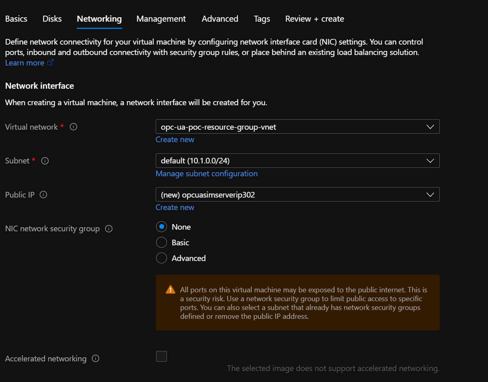
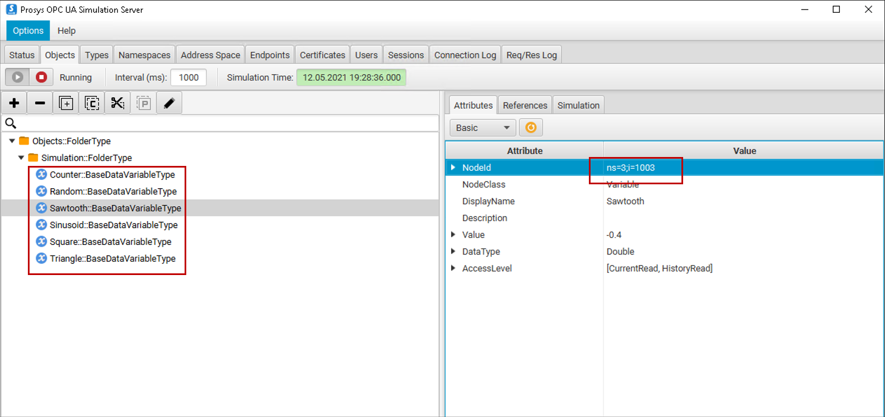
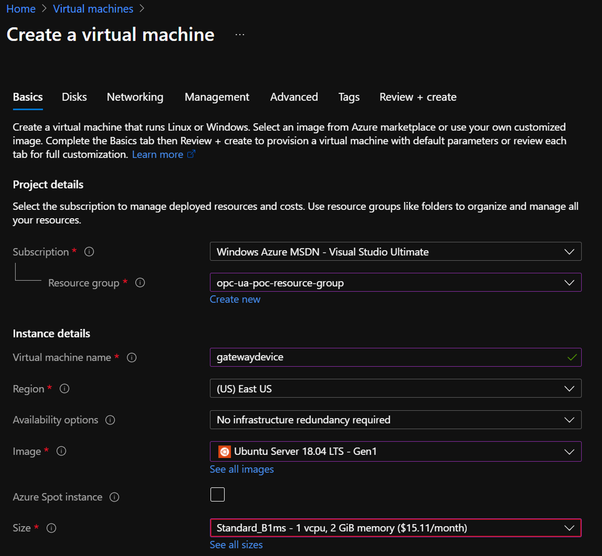
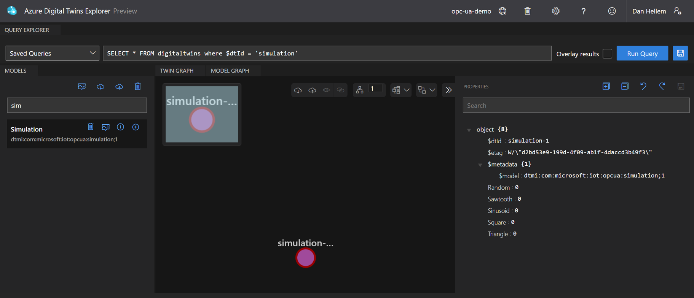
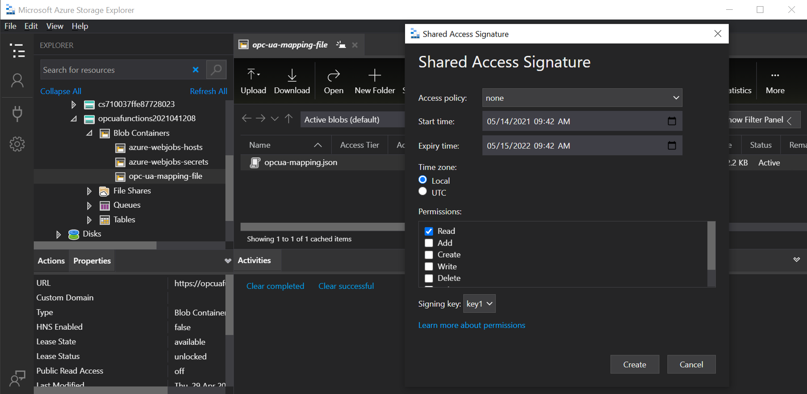
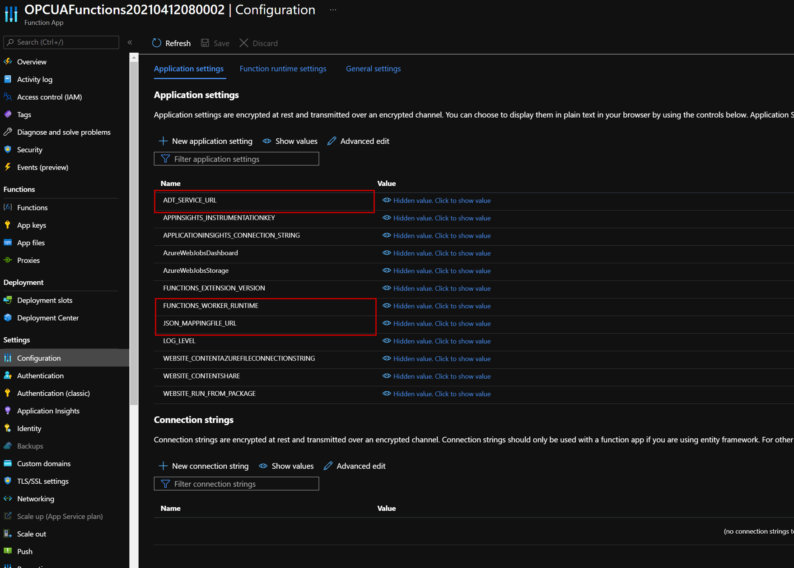

---
# Mandatory fields.
title: How to get OPC UA data into Azure Digital Twins
titleSuffix: Azure Digital Twins
description: Steps to get your Azure OPC UA Data into Azure Digital Twins
author: danhellem
ms.author: dahellem # Microsoft employees only
ms.date: 5/20/2021
ms.topic: how-to
ms.service: digital-twins
# Optional fields. Don't forget to remove # if you need a field.
# ms.custom: can-be-multiple-comma-separated
# ms.reviewer: MSFT-alias-of-reviewer
# manager: MSFT-alias-of-manager-or-PM-counterpart
---

# Get OPC UA data into Azure Digital Twins

Getting OPC UA Server data to flow into Azure Digital Twins is hard. There are multiple components you need to install on different devices, custom code to write, and settings that you need to configure. But it can be done. To help, we put together a proof of concept that connects all these pieces together to get your OPC UA nodes into Azure Digital Twins. We hope this article will provide you the right guidance and tools to build upon for your own solutions.

> [!NOTE]
> This article does not address converting OPC UA nodes into DTDL. It only addresses getting the telemetry from your OPC UA Server into existing Azure Digital Twins. If you are interested in generating DTDL models from OPC UA data, check out the [UANodeSetWebViewer](https://github.com/barnstee/UANodesetWebViewer) and [OPCUA2DTDL](https://github.com/khilscher/OPCUA2DTDL) repos.

## Architecture

TODO: Architecture diagram coming soon

| Component                       | Description                                                                                                                                                |
| ------------------------------- | ---------------------------------------------------------------------------------------------------------------------------------------------------------- |
| ProSys OPC UA Simulation Server | Free OPC UA Server to simulate the OPC UA data                                                                                                             |
| IoT Edge                        | IoT Hub service that gets installed on a local Linux gateway device. It is required for the OPC Publisher module to run and send data to IoT Hub.        |
| OPC Publisher                   | IoT Edge module built by the Azure Industrial IoT team. This module connects to your OPC UA Server and sends the node data into Azure IoT Hub. |
| Azure IoT Hub                   | OPC Publisher sends the OPC UA telemetry into Azure IoT Hub. From there, we can process the data through an Azure Function and into Azure Digital Twins.   |
| Azure Digital Twins             | Azure Digital Twins the platform that enables you to create a digital representation of real-world things, places, business processes, and people.         |
| Azure Function                  | Custom Azure Function is used to process the telemetry flowing in Azure IoT Hub to the proper twins and properties in Azure Digital Twins.               |

> [!TIP]
> All of the files you need for this proof of concept are located in the [Azure Samples GitHub Repo](https://github.com/Azure-Samples/opcua-to-azure-digital-twins). We recommend you clone or download the repo before you get started.

## Setup Edge Components

The first step is getting the devices and software set up on the edge. It includes your OPC UA simulation server, gateway device, and Azure IoT Hub components. The steps to install these components are well documented, but we wanted to step through the together so you can see the whole story. Detailed guidance can be found in the following articles: 

- [Step-by-step guide to installing OPC Publisher on Azure IoT Edge](https://www.linkedin.com/pulse/step-by-step-guide-installing-opc-publisher-azure-iot-kevin-hilscher) 
- [Install IoT Edge on Linux](../iot-edge/how-to-install-iot-edge.md) 
- [OPC Publisher](https://github.com/Azure/iot-edge-opc-publisher)
- [Configure OPC Publisher](../iot-accelerators/howto-opc-publisher-configure.md)

## OPC UA Server

For our proof of concept, and we did not have access to physical devices running a real OPC UA Server. So instead, we installed the free [Prosys OPC UA Simulation Server](https://www.prosysopc.com/products/opc-ua-simulation-server/) on a Windows VM to generate the OPC UA data. If you already have an OPC UA device, or another OPC UA simulation server, you can [skip to the next step](#setup-iot-edge-device).

### Windows 10 virtual machine

The ProSys Software does not require much resources. This Windows 10 VM (see specs below) should do.


Your VM must be reachable over the internet. To keep things simple, you can open all ports and assign the VM a Public IP address. However, this is a security risk, and you may consider better security measures for your environment.



### Install OPC UA simulation software

From your new Windows virtual machine, install the [Prosys OPC UA Simulation Server](https://www.prosysopc.com/products/opc-ua-simulation-server/). Launch once the download and install are completed. It takes a few moments to start the OPC UA server.


Copy the Connection Address (UA TCP) and replace the machine name with the Public IP of your VM. You will need the value for the publishednodes.json file as described later in the article.

```
opc.tcp://{ip address}:53530/OPCUA/SimulationServer
```

For this example, we are going to use the simulation nodes provided by default in the Simulation folder. Each item will have a unique NodeId (`ns=3;i=1003`) value. You will need the NodeId values for both the publishednodes.json and opcua-mapping.json files later in this article.



### Verify success

- ProSys Simulation Server set up and running
- Copied the UA TCP Connection Address (`opc.tcp://{ip address}:53530/OPCUA/SimulationServer`)
- Captured the list of NodeId’s (`ns=3;i=1003`) for the simulated nodes you want published

> [!TIP]
> Follow the “Verify the OPC UA Service is running and reachable” steps [in this article](https://www.linkedin.com/pulse/step-by-step-guide-installing-opc-publisher-azure-iot-kevin-hilscher) if you have trouble later getting OPC Publisher to connect to your OPC UA Server.

## Setup IoT Edge device

Create an Azure IoT Hub instance by following these steps. Creating a free instance is adequate.


After you have created the Azure IoT Hub instance, go to the IoT Edge item in the left navigation and select the “Add an IoT Edge device”.


Once your device is created, copy the primary or secondary connection string value. You will need this later when you set up the edge device.


## Setup gateway device

In order to get your OPC UA Server data into IoT Hub, you need a device that runs IoT Edge with the OPC Publisher module. OPC Publisher will then listen to OPC UA node updates and will publish the telemetry into IoT Hub in a json format.

### Create Ubuntu Server virtual machine

Create an Ubuntu Server virtual machine like the following



> [!TIP]
> The default size “Standard_b1s – vcpu, 1GiB memory ($7.59/month)” is too slow for RDP. Try updating it to the 2 GiB memory for a better RDP experience.

> [!NOTE]
> If you choose to RDP into your Ubuntu VM, you can follow [the instructions here](../virtual-machines/linux/use-remote-desktop.md).

### Install IoT Edge container

Follow the instructions to [Install IoT Edge on Linux](../virtual-machines/linux/use-remote-desktop.md).

Once the installation completes run:

```
admin@gateway:~$ sudo iotedge check
```

This command will run several tests to make sure your installation is ready to go.

### Install OPC Publisher module

The OPC Publisher module now needs to be installed on your gateway device. The easiest way to install the OPC Publisher module is from the [Azure Marketplace](https://azuremarketplace.microsoft.com/marketplace/apps/microsoft_iot.iotedge-opc-publisher) and follow the steps documented in the [GitHub Repo](https://github.com/Azure/iot-edge-opc-publisher).


In the “Container Create Options” make sure you add the following json:


```JSON
{
    "Hostname": "opcpublisher",
    "Cmd": [
        "--pf=./publishednodes.json",
        "--aa"
    ],
    "HostConfig": {
        "Binds": [
            "/iiotedge:/appdata"
        ]
    }
}
```

The create options above should work without any changes, but you may need to adjust the settings if your gateway device differs from our guidance so far.

Follow the prompts to create the module. After about 15 seconds, you can run `iotedge list` on your gateway device. You should now see the OPCPublisher module up and running.


Finally, go to the `/iiotedge` directory and create a `publishednodes.json` file. The Id’s need to match the NodeId’s from the OPC Server. Your file should like something like this:

```JSON
[
    {
        "EndpointUrl": "opc.tcp://20.185.195.172:53530/OPCUA/SimulationServer",
        "UseSecurity": false,
        "OpcNodes": [
            {
                "Id": "ns=3;i=1001"
            },
            {
                "Id": "ns=3;i=1002"
            },
            {
                "Id": "ns=3;i=1003"
            },
            {
                "Id": "ns=3;i=1004"
            },
            {
                "Id": "ns=3;i=1005"
            },
            {
                "Id": "ns=3;i=1006"
            }
        ]
    }
]
```

Save your changes to the publishednodes.json file and run the following command:

```
sudo iotedge logs OPCPublisher -f
```

The commpand will result in the output of the OPC Publisher logs. If everything is configured and running correctly, you will see something like the following:


To monitor the messages flowing into Azure IoT hub, you can use the following command:

```
az iot hub monitor-events -n {iot-hub-instance} -t 0
```

> [!TIP]
> Try using [Azure IoT Explorer](../iot-pnp/howto-use-iot-explorer.md) to monitor IoT Hub messages.

You now have data flowing from an OPC UA Server into IoT Hub. Next up, getting the telemetry data into Azure Digital Twins.

### Verify success

- IoT Hub instance created.
- IoT Edge device provisioned.
- Ubuntu Server VM created.
- IoT Edge installed and on Ubuntu VM.
- OPC Publisher module installed.
- Publishednodes.json file created and configured.
- OPC Publisher module running, and telemetry data is flowing to IoT Hub.

## Setup Azure Digital Twins

Now that we have data flowing from OPC UA Server into Azure IoT Hub, we need to setup and configure Azure Digital Twins. For this example, we are just going to use a single model and a single twin instance to match the properties on the simulation server. To see a more complex scenario, see the chocolate factory example in the [GitHub Repo](https://github.com/Azure-Samples/opcua-to-azure-digital-twins).

### Create Azure Digital Twins instance

[Follow the documentation](./how-to-set-up-instance-portal.md) to deploy a new Azure Digital Twins instance from the Azure portal.

### Upload model & create twin

We recommend using [Azure Digital Twins Explorer](/samples/azure-samples/digital-twins-explorer/digital-twins-explorer) to upload the `simulation` model and create a new twin called “simulation-1”.



> [!TIP]
> If you are not familiar with Azure Digital Twins, visit the [sample scenario](quickstart-azure-digital-twins-explorer.md) documentation to get started.

### Verify success

- Azure Digital Twins instance deployed.
- `Simulation` model uploaded into Azure Digital Twins instance.
- “simulation-1” twin created.

## Publish Azure Function

Now that we have the OPC UA nodes data flowing into IoT Hub, we need to map and save that data to the correct twin and properties in Azure Digital Twins. This is where our Azure Function and opcua-mapping.json file come in.

It works like this:

- An Event Subscription is configured for an Azure Function to process incoming messages into IoT Hub.
- The Azure Function will grab the NodeId for each item and do look up against the items in the opcua-mapping.json file. In this file, you define the twinId and property, for where you want the value of the NodeId saved.
- The Azure Function will then generate the appropriate patch document and will run the twin property updates accordingly.

### Create opcua-mapping.json file

The `opcua-mapping.json` looks like this (see the [GitHub repo](https://github.com/Azure-Samples/opcua-to-azure-digital-twins) for full example):

```JSON
[
    {
        "NodeId": "1025",
        "TwinId": "grinding",
        "Property": "ChasisTemperature",
        "ModelId": "dtmi:com:microsoft:iot:e2e:digital_factory:production_step_grinding;1"
    },
    ...
]
```

| Property | Description                                                          | Required |
| -------- | -------------------------------------------------------------------- | -------- |
| NodeId   | Value from the OPC UA node. For example: ns=3;i={value}              | ✔        |
| TwinId   | TwinId ($dtId) of the twin you want to save the telemetry value for | ✔        |
| Property | Name of the property on the twin to save the telemetry value         | ✔        |
| ModelId  | The modelId to create the twin if the TwinId does not exist         | ✔        |

> [!IMPORTANT]
> You will need to create a mapping entry for each and every NodeId

Now that we have our mapping file, we need to store it in a location that is accessible from the Azure Function. Azure Blob Storage is a good place. You can use [Azure Storage Explorer](https://azure.microsoft.com/features/storage-explorer/) to create your storage container and import the opcua-mapping.json file. Then create a shared access signature and save that url, as you will need it later for the Azure Function.



### Publish Azure Function

#### Step 1
Clone or download this [GitHub repo](https://github.com/Azure-Samples/opcua-to-azure-digital-twins) and open the OPCUAFunctions solution in Visual Studio.

#### Step 2
Follow these steps to [publish the function](how-to-create-azure-function.md?tabs=cli#publish-the-function-app-to-azure) and [setting up security access](how-to-create-azure-function.md?tabs=portal#set-up-security-access-for-the-function-app).

#### Step 3
We need to add some application settings to set up your environment properly. Go to the Azure portal and find your newly created Azure Function. Then click on the “Configuration” section. There are three application settings you need to create.

| Setting              | Description                                                                                          | Required |
| -------------------- | ---------------------------------------------------------------------------------------------------- | -------- |
| ADT_SERVICE_URL      | URL for your Azure Digital Twins instance. Example: `https://example.api.eus.digitaltwins.azure.net` | ✔        |
| JSON_MAPPINGFILE_URL | URL of the shared access signature for the opcua-mapping.json                                        | ✔        |
| LOG_LEVEL            | Log level verbosity. Default is 100. Verbose is 300                                                  |          |



> [!TIP]
> Set the `LOG_LEVEL` application setting on the function to 300 for a more verbose logging experience. 

### Event Subscription

Finally, [follow these instructions](tutorial-end-to-end.md#process-simulated-telemetry-from-an-iot-hub-device) to create an event subscription to connect your newly added function app to IoT Hub. The event subscription is needed so that data can flow from the gateway device into IoT Hub through the function, which then updates the Azure Digital Twins.

Your event subscription should look like the following:


Everything is now installed and running. Data should be flowing from your OPC UA Simulation Server, through Azure IoT Hub, and into your Azure Digital Twins instances. Here are a couple Azure CLI commands that come in handy to monitor the events.

#### Commands

To monitor IoT Hub events
```
az iot hub monitor-events -n {hub-name} -t 0
```

Monitor Azure Function event processing 
```
az webapp log tail –name {function-name} --resource-group {resource-group}
```

### Verify success

* Created and imported opcua-mapping.json file into a blob storage container. 
* Published Azure Function.
* Added three new application settings to the Azure Functions app.
* Event Subscription created.

## Next steps

Read about the supporting tools and processes to help get your OPC UA Server data into Azure Digital Twins:

- [Step-by-step guide to installing OPC Publisher on Azure IoT Edge](https://www.linkedin.com/pulse/step-by-step-guide-installing-opc-publisher-azure-iot-kevin-hilscher) 
- [Install IoT Edge on Linux](../iot-edge/how-to-install-iot-edge.md) 
- [OPC Publisher](https://github.com/Azure/iot-edge-opc-publisher)
- [Configure OPC Publisher](../iot-accelerators/howto-opc-publisher-configure.md)
- [UANodeSetWebViewer](https://github.com/barnstee/UANodesetWebViewer) 
- [OPCUA2DTDL](https://github.com/khilscher/OPCUA2DTDL)