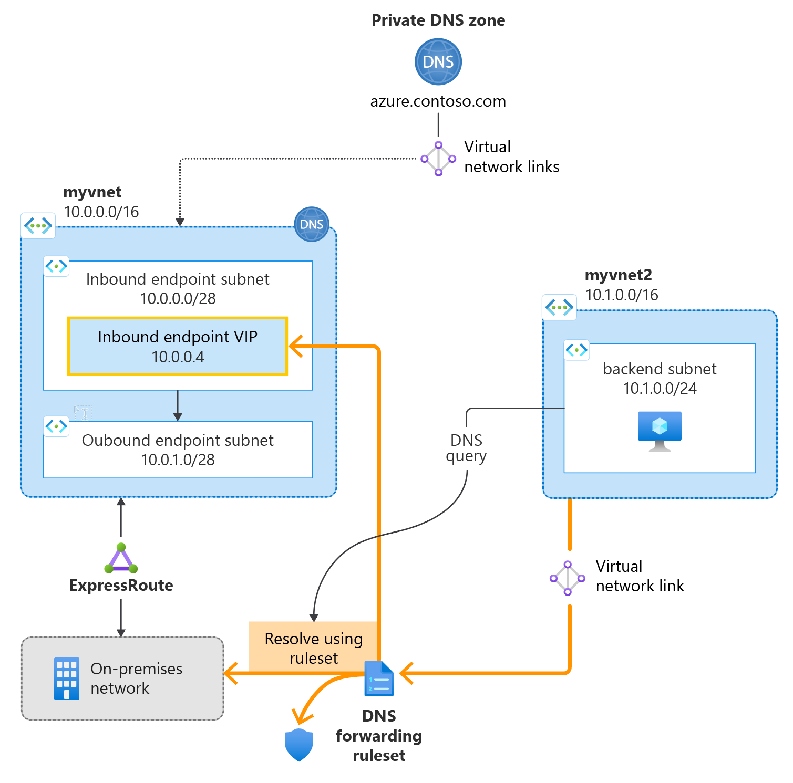

# Quickstart: Create an Azure DNS Private Resolver using Bicep

This quickstart describes how to use Bicep to create Azure DNS Private Resolver.

[!INCLUDE [About Bicep](../../includes/resource-manager-quickstart-bicep-introduction.md)]

The following figure summarizes the general setup used. Subnet address ranges used by the bicep and ARM templates are slightly different than those shown in the figure.



## Prerequisites

If you don't have an Azure subscription, create a [free account](https://azure.microsoft.com/free/?WT.mc_id=A261C142F) before you begin.

## Review the Bicep file

The Bicep file used in this quickstart is from [Azure Quickstart Templates](/samples/azure/azure-quickstart-templates/azure-dns-private-resolver/).

This Bicep file is configured to create a:

- Virtual network
- DNS resolver
- Inbound & outbound endpoints
- Forwarding Rules & rulesets.

:::code language="bicep" source="~/quickstart-templates/quickstarts/microsoft.network/azure-dns-private-resolver/main.bicep":::

Seven resources have been defined in this template:

- [**Microsoft.Network/virtualnetworks**](/azure/templates/microsoft.network/virtualnetworks)
- [**Microsoft.Network/dnsResolvers**](/azure/templates/microsoft.network/dnsresolvers)
- [**Microsoft.Network/dnsResolvers/inboundEndpoints**](/azure/templates/microsoft.network/dnsresolvers/inboundendpoints)
- [**Microsoft.Network/dnsResolvers/outboundEndpoints**](/azure/templates/microsoft.network/dnsresolvers/outboundendpoints)
- [**Microsoft.Network/dnsForwardingRulesets**](/azure/templates/microsoft.network/dnsforwardingrulesets)
- [**Microsoft.Network/dnsForwardingRulesets/forwardingRules**](/azure/templates/microsoft.network/dnsforwardingrulesets/forwardingrules)
- [**Microsoft.Network/dnsForwardingRulesets/virtualNetworkLinks**](/azure/templates/microsoft.network/dnsforwardingrulesets/virtualnetworklinks)

## Deploy the Bicep file

1. Save the Bicep file as **main.bicep** to your local computer.
2. Deploy the Bicep file using either Azure CLI or Azure PowerShell

# [CLI](#tab/CLI)

````azurecli
az group create --name exampleRG --location eastus
az deployment group create --resource-group exampleRG --template-file main.bicep
````

# [PowerShell](#tab/PowerShell)

````azurepowershell
New-AzResourceGroup -Name exampleRG -Location eastus
New-AzResourceGroupDeployment -ResourceGroupName exampleRG -TemplateFile ./main.bicep
````

---

When the deployment finishes, you should see a message indicating the deployment succeeded.

## Validate the deployment

Use the Azure portal, Azure CLI, or Azure PowerShell to list the deployed resources in the resource group.

# [CLI](#tab/CLI)

```azurecli
#Show the DNS resolver
az dns-resolver show --name "sampleDnsResolver" --resource-group "sampleResourceGroup"

#List the inbound endpoint
az dns-resolver inbound-endpoint list --dns-resolver-name "sampleDnsResolver" --resource-group "sampleResourceGroup"

#List the outbound endpoint
az dns-resolver outbound-endpoint list --dns-resolver-name "sampleDnsResolver" --resource-group "sampleResourceGroup"

```
# [PowerShell](#tab/PowerShell)

```azurepowershell
#Show the DNS resolver
Get-AzDnsResolver -Name "sampleDNSResolver" -ResourceGroupName "sampleResourceGroup"

#List the inbound endpoint list
Get-AzDnsResolverInboundEndpoint -DnsResolverName "sampleDnsResolver" -ResourceGroupName "sampleResourceGroup"

#List the outbound endpoint
Get-AzDnsResolverOutboundEndpoint -DnsResolverName "sampleDnsResolver" -ResourceGroupName "sampleResourceGroup"

```
---

## Clean up resources

When no longer needed, use the Azure portal, Azure CLI, or Azure PowerShell to delete the resources in the following order.

### Delete the DNS resolver

# [CLI](#tab/CLI)
````azurecli
#Delete the inbound endpoint
az dns-resolver inbound-endpoint delete --dns-resolver-name "sampleDnsResolver" --name "sampleInboundEndpoint" --resource-group "exampleRG"

#Delete the virtual network link
az dns-resolver vnet-link delete --ruleset-name "sampleDnsForwardingRuleset" --resource- group "exampleRG" --name "sampleVirtualNetworkLink"

#Delete DNS forwarding ruleset
az dns-resolver forwarding-ruleset delete --name "samplednsForwardingRulesetName" --resource-group "exampleRG"

#Delete the outbound endpoint
az dns-resolver outbound-endpoint delete --dns-resolver-name "sampleDnsResolver" --name "sampleOutboundEndpoint" --resource-group "exampleRG"

#Delete the DNS resolver
az dns-resolver delete --name "sampleDnsResolver" --resource-group "exampleRG"
````

# [PowerShell](#tab/PowerShell)
```azurepowershell
#Delete the inbound endpoint
Remove-AzDnsResolverInboundEndpoint -Name myinboundendpoint -DnsResolverName mydnsresolver -ResourceGroupName myresourcegroup

#Delete the virtual network link
Remove-AzDnsForwardingRulesetVirtualNetworkLink -DnsForwardingRulesetName $dnsForwardingRuleset.Name -Name vnetlink -ResourceGroupName myresourcegroup

#Delete the DNS forwarding ruleset
Remove-AzDnsForwardingRuleset -Name $dnsForwardingRuleset.Name -ResourceGroupName myresourcegroup

#Delete the outbound endpoint
Remove-AzDnsResolverOutboundEndpoint -DnsResolverName mydnsresolver -ResourceGroupName myresourcegroup -Name myoutboundendpoint

#Delete the DNS resolver
Remove-AzDnsResolver -Name mydnsresolver -ResourceGroupName myresourcegroup
````
---

## Next steps

In this quickstart, you created a virtual network and DNS private resolver. Now configure name resolution for Azure and on-premises domains
- [Resolve Azure and on-premises domains](private-resolver-hybrid-dns.md)
