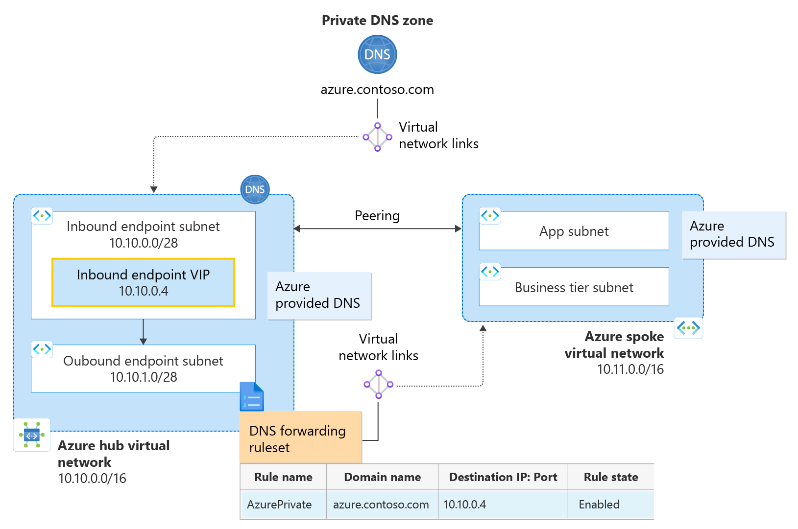

# Private resolver architecture

This article discusses architectural design options that are available to resolve private DNS zones across your network using an Azure DNS Private Resolver. Example configurations are provided with design recommendations for centralized vs distributed DNS resolution in a [hub and spoke VNet topology](/azure/cloud-adoption-framework/ready/azure-best-practices/hub-spoke-network-topology).

- For an overview of the Azure DNS Private Resolver, see [What is Azure DNS Private Resolver](dns-private-resolver-overview.md). 
- For more information about components of the private resolver, see [Azure DNS Private Resolver endpoints and rulesets](private-resolver-endpoints-rulesets.md).

## Options for private zone resolution

A private zone [virtual network link](private-dns-virtual-network-links.md) enables DNS resolution of the private zone in the linked VNet. However, this method has some limitations. For example, you might wish to resolve some DNS records in the private zone differently in different VNets. This problem is solved by using an Azure DNS Private Resolver.

The Azure DNS Private Resolver provides two components that you can use to resolve records in a private zone:
- **Forwarding rulesets** can be linked to a VNet to provide DNS forwarding capabilities. A ruleset containing a rule to forward queries for a private zone to the private resolver inbound endpoint enables resolution of the private zone in any VNet that is linked to the ruleset.
    - To use this option, you must not link the forwarding ruleset to the same VNet where the inbound endpoint is provisioned. This configuration can result in a DNS resolution loop. 
- **Inbound endpoints** can be configured as custom DNS for a VNet.
    - This option requires that you link the VNet where the inbound endpoint is provisioned to the private zone.

The determination of which of these methods to use depends on your network design.  
- The ruleset link design scenario is best suited to a [distributed architecture](#distributed-architecture) where network traffic is spread across your Azure network, and might be unique in some locations. 
- The custom DNS design scenario is best suited to a [centralized architecture](#centralized-architecture) where DNS resolution and network traffic flows mostly to a hub VNet and needs to be controlled from a centrally. These scenarios are discussed in more detail in the next sections.

## Distributed architecture 

Consider the following hub and spoke VNet topology in Azure with a private resolver located in the hub and a ruleset link to the spoke VNet:

**Figure 1**: Azure hub and spoke VNets with ruleset link

- A hub VNet is configured with address space 10.10.0.0/16.
- A spoke VNet is configured with address space 10.11.0.0/16.
- A private DNS zone **azure.contoso.com** is linked to the hub VNet.
- A private resolver is provisioned in the hub VNet.
    - The private resolver has one inbound endpoint with an IP address of **10.10.0.4**.
    - The private resolver has one outbound endpoint and an associated DNS forwarding ruleset.
        - The DNS forwarding ruleset is linked to the spoke VNet.
        - A ruleset rule is configured to forward queries for the private zone to the inbound endpoint.

The virtual network link from the private zone to the Hub VNet enables resources inside the hub VNet to automatically resolve DNS records in **azure.contoso.com** using Azure-provided DNS ([168.63.129.16](../virtual-network/what-is-ip-address-168-63-129-16.md)). The virtual network link from the ruleset to the spoke VNet enables the hub VNet to resolve **azure.contoso.com**. A link from the private zone to the spoke VNet is not required. 

In this example, the spoke VNet only sends queries for azure.contoso.com to the hub. The spoke network uses Azure-provided DNS for all other DNS queries. 

> [!IMPORTANT]
> In this example configuration, the hub VNet must be linked to the private zone, but must **not** be linked to the forwarding ruleset. Linking a forwarding ruleset to the same VNet where the inbound endpoint is provisioned can cause DNS resolution loops.

## Centralized architecture

Consider the following hub and spoke VNet topology with an inbound endpoint provisioned as custom DNS in the spoke VNet:

**Figure 2**: Azure hub and spoke VNets with custom DNS

- A hub VNet is configured with address space 10.10.0.0/16.
- A spoke VNet is configured with address space 10.11.0.0/16.
- A private DNS zone **azure.contoso.com** is linked to the hub VNet.
- A private resolver is located in the hub VNet.
    - The private resolver has one inbound endpoint with an IP address of **10.10.0.4**.
    - The private resolver has one outbound endpoint and DNS forwarding ruleset.
        - In this scenario, the DNS forwarding ruleset doesn't need a rule to forward queries for the private zone to the inbound endpoint.

In this example, the spoke VNet sends all of its DNS traffic to the inbound endpoint. 

## Next steps

* Review components, benefits, and requirements for [Azure DNS Private Resolver](dns-private-resolver-overview.md).
* Learn how to create an Azure DNS Private Resolver by using [Azure PowerShell](./dns-private-resolver-get-started-powershell.md) or [Azure portal](./dns-private-resolver-get-started-portal.md).
* Understand how to [Resolve Azure and on-premises domains](private-resolver-hybrid-dns.md) using the Azure DNS Private Resolver.
* Learn about [Azure DNS Private Resolver endpoints and rulesets](private-resolver-endpoints-rulesets.md).
* Learn how to [Set up DNS failover using private resolvers](tutorial-dns-private-resolver-failover.md)
* Learn about some of the other key [networking capabilities](../networking/fundamentals/networking-overview.md) of Azure.
* [Learn module: Introduction to Azure DNS](/training/modules/intro-to-azure-dns).
