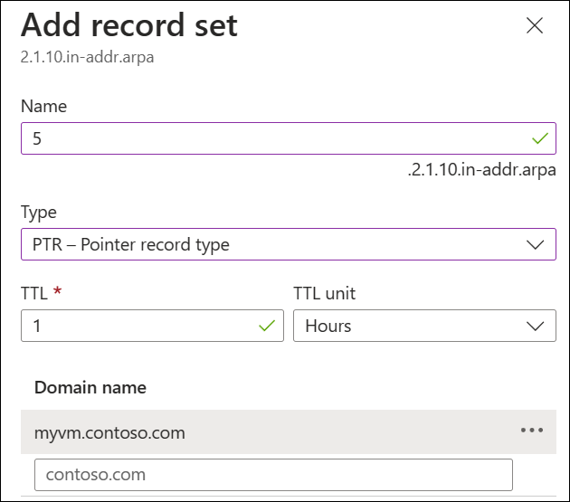
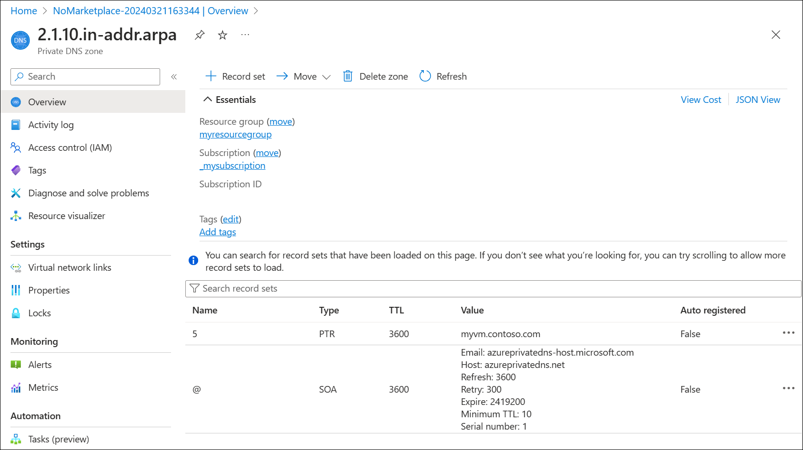
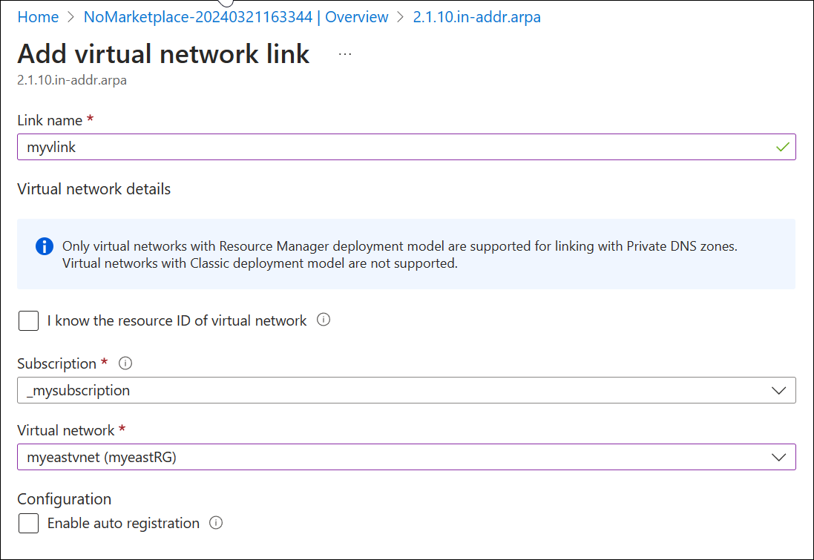

# Create and manage reverse DNS zones in Azure Private DNS

In this article, you learn how to create a private reverse lookup DNS zone and add pointer (PTR) records to the zone using the Azure portal.

## What is reverse DNS?

Reverse DNS enables you to resolve an IP address to a name. As the name *reverse* indicates, this is the opposite process of forward DNS, which resolves names to IP addresses. Reverse DNS zones for IPv4 addresses contain pointer (PTR) records and use the reserved domain name: **in-addr.arpa**. IPv6 reverse DNS zones use the special domain **ip6.arpa**. This article only discusses IPv4 reverse DNS zones.

Reverse DNS zones follow a hierarchical naming pattern. For example: 

- **10.in-addr.arpa** contains all PTR records for IPv4 addresses in the 10.0.0.0/8 address space.
- **1.10.in-addr.arpa** contains all PTR records for IPv4 addresses in the 10.1.0.0/16 address space.
- **2.1.10.in-addr.arpa** contains only PTR records for IPv4 addresses in the 10.1.2.0/24 address space.

To can a PTR record for the IPv4 address 10.1.2.5 in any of these zones by adding the remaining octets for the IPv4 address and providing a ptrdname value. See the following examples:

- 10.in-addr.arpa entry:
  - `5.2.1  IN    PTR     myvm.contoso.com.` 
- 1.10.in-addr.arpa entry:
  - `5.2    IN    PTR     myvm.contoso.com.`
- 2.1.10.in-addr.arpa entry:
  - `5      IN    PTR     myvm.contoso.com.` 

  > [!IMPORTANT]
  > A reverse DNS zone for address space with a longer prefix takes precendence. For example, if all three zones and entries for the IPv4 address 10.1.2.5 exist as shown here, only the entry in the 2.1.10.in-addr.arpa zone will be used. If there is no entry for an IPv4 address in the longer prefix zone (2.1.10.in-addr.arpa), then no reverse DNS entry will be found, even if there are entries in the other zones.

## Requirements and restrictions

- [Autoregistration](private-dns-autoregistration.md) isn't supported for reverse DNS.
- A [virtual network link](private-dns-virtual-network-links.md) from the reverse zone is required to enable DNS resolution of PTR records.
    - Forwarding of DNS queries to a DNS resolver that is linked to the reverse zone can be done.
- Reverse zones must follow the naming guidelines described previously in this article.

## Create a reverse lookup DNS zone

1. Sign in to the [Azure portal](https://portal.azure.com).
2. On the top left-hand side of the screen, select **Create a resource**. Search for and select **Private DNS zones**, then select **+ Create**.
3. On the **Create DNS zone** page, select, or enter the following settings:

    | Setting | Details |
    | --- | --- |
    | **Subscription** | Select your subscription.|
    | **Resource group** | Select or create a new resource group. |
    | **Name** | Enter a name for the DNS zone. In this example, the class C reverse DNS zone name 2.1.10.in-addr.arpa is used.  |
    | **Location** | Select the location for the resource group. The location is already be selected if you're using a previously created resource group. |

    

4. Select **Review create**, and then select **Create** once validation has passed.

## Create a DNS PTR record

1. Select **+ Record set** to open the **Add record set** pane.
2. As described previously in this article, PTR records in a class C reverse DNS zone are single digit entries. In this example, enter the following:

- **Name**: Enter `5`
- **Type**: Select `PTR - Pointer record type`
- **TTL and TTL unit**: Use default values
- **Domain name**: Enter `myvm.contoso.com`

  

3. Select **OK** to create the reverse DNS record.

  

## Add a virtual network link

In order for resources to resolve the reverse DNS zone, you must add a virtual network link pointing to the VNet that contains those resources. You can add multiple virtual network links. In this example, a link is added to the VNet: **myeastvnet** that contains a virtual machine. The virtual machine is then used to verify reverse DNS resolution.

1. Open the private zone overview, and then select **Virtual network links** under **Settings**.
2. Select **+ Add** to open the Add virtual network link page.
3. Enter the following values:

    | Setting | Details |
    | --- | --- |
    | **Link name** | Enter a name for your link. For example: **myvlink**.|
    | **Subscription** | Select your subscription. |
    | **Virtual network** | Choose the virtual network that you wish to link to this private DNS zone.  |
    | **Configuration** | Don't select the checkbox to enable auto registration. Selecting this setting prevents creation of the virtual network link. |

  

4. Select **OK** and verify that the link is now listed on the Virtual network links page.

## Test DNS resolution

1. From a VM in the linked virtual network, open a command line, type nslookup 10.1.2.5 and press ENTER. See the following example:

```PowerShell
C:\>nslookup 10.1.2.5
Server:  UnKnown
Address:  168.63.129.16

Name:    myvm.contoso.com
Address:  10.1.2.5
```

## Next steps

* For more information on reverse DNS, see [reverse DNS lookup on Wikipedia](https://en.wikipedia.org/wiki/Reverse_DNS_lookup).

* Learn how to [manage reverse DNS records for your Azure services](dns-reverse-dns-for-azure-services.md).
