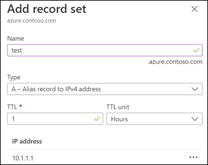
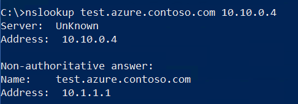
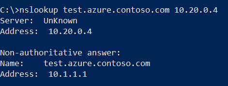
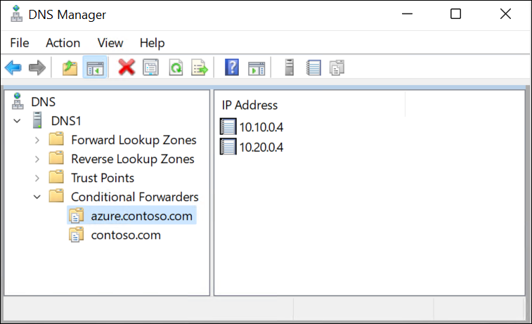
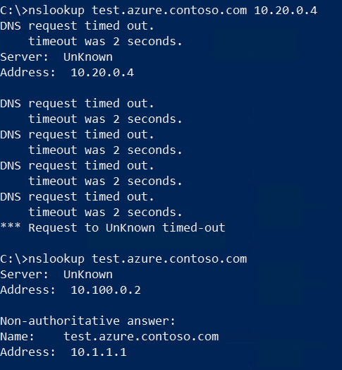

# Tutorial: Set up DNS failover using private resolvers

You can eliminate a single point of failure in your on-premises DNS services by using two or more Azure DNS private resolvers.

When you deploy multiple resolvers across different regions, DNS failover can be enabled by assigning a local resolver as your primary DNS and the resolver in an adjacent region as secondary DNS. 

In this tutorial, you learn how to:

> [!div class="checklist"]
> * Resolve Azure Private DNS zones using on-premises conditional fowarders and Azure DNS private resolvers.
> * Enable on-premises DNS failover for your Azure Private DNS zones.

The following diagram shows the failover scenario discussed in this article.

[  ](./media/tutorial-dns-private-resolver-failover/private-resolver-failover_highres.png#lightbox)

Important architecture elements numbered in the digram are: 
1) On-premises DNS [conditional forwarders](#on-premises-forwarding) that send DNS queries to inbound endpoints.
2) [Inbound endpoints](#inbound-endpoints) that receive DNS queries from outside the virtual network.
3) Outbound endpoints and DNS forwarding rulesets that perform custom processing on DNS queries.

Outbound endpoints and DNS forwarding rulesets are included in the diagram for completeness, but are not in scope for the failover scenario. Rulesets can be used is to resolve on-premises domains from Azure. For more information, see [Azure DNS Private Resolver endpoints and rulesets](private-resolver-endpoints-rulesets.md) and [Resolve Azure and on-premises domains](private-resolver-hybrid-dns.md).

## Prerequisites

- An Azure account with an active subscription. [Create an account for free](https://azure.microsoft.com/free/?WT.mc_id=A261C142F).
- Two [Azure virtual networks](../virtual-network/quick-create-portal.md) in two regions
- A [VPN](../vpn-gateway/tutorial-site-to-site-portal.md) or [ExpressRoute](../expressroute/expressroute-howto-circuit-portal-resource-manager.md) link from on-premises to each virtual network
- An [Azure DNS Private Resolver](dns-private-resolver-get-started-portal.md) in each virtual network
- An Azure [private DNS zone](private-dns-getstarted-portal.md) that is linked to each virtual network
- An on-premises DNS server 

> [!NOTE]
> In this tutorial,`azure.contoso.com` is an Azure private DNS zone. Replace `azure.contoso.com` with your private DNS zone name.

## Sign in to Azure

Sign in to the [Azure portal](https://portal.azure.com).

<a name="inbound-endpoints"></a>

## Determine inbound endpoint IP addresses

Write down the IP addresses assigned to the inbound endpoints of your DNS private resolvers. The IP addresses will be used to configure on-premises DNS forwarders.

In this example, there are two virtual networks in two regions:
- **myeastvnet** is in the East US region, assigned the address space 10.10.0.0/16 
- **mywestvnet** is in the West Central US region, assigned the address space 10.20.0.0/16

1. Search for **DNS Private Resolvers** and select your private resolver from the first region.  For example: **myeastresolver**.
2. Under **Settings**, select **Inbound endpoints** and write down the **IP address** setting. For example: **10.10.0.4**.

    

3. Return to the list of **DNS Private Resolvers** and select a resolver from a different region.  For example: **mywestresolver**.
4. Under **Settings**, select **Inbound endpoints** and write down the **IP address** setting of this resolver. For example: **10.20.0.4**.

## Verify private zone links

To resolve DNS records in an Azure DNS private zone, the zone must be linked to the virtual network.  In this example, the zone `azure.contoso.com` is linked to **myeastvnet** and **mywestvnet**. Links to other vnets can also be present.

1. Search for **Private DNS zones** and select your private zone.  For example: **azure.contoso.com**.
2. Under **Settings**, select **Virtual network links** and verify that the vnets you used for inbound endpoints in the previous procedure are also listed under Virtual network. For example: **myeastvnet** and **mywestvnet**.

    

3. If one or more vnets aren't yet linked, you can add it here by selecting **Add**, providing a **Link name**, choosing your **Subscription**, and then choosing the **Virtual network**.

> [!TIP]
> You can also use peering to resolve records in private DNS zones. For more information, see [Azure DNS Private Resolver endpoints and rulesets](private-resolver-endpoints-rulesets.md).

## Verify Azure DNS resolution

Check that DNS settings for your virtual networks are set to Default (Azure-provided).

1. Search for **Virtual networks** and select the first Vnet.  For example: **myeastvnet**.
2. Under **Settings**, select **DNS servers** and verify that **Default (Azure-provided)** is chosen.
3. Select the next Vnet (ex: **mywestvnet**) and verify that **Default (Azure-provided)** is chosen.

    > [!NOTE]
    > Custom DNS settings can also be made to work, but this is not in scope for the current scenario.

4. Search for **Private DNS zones** and select your private zone name. For example: **azure.contoso.com**.
5. Create a test record in the zone by selecting **+ Record set** and adding a new A record. For example: **test**.

    

5. Open a command prompt using an on-premises client and use nslookup to look up your test record using the first private resolver IP address that you wrote down (ex: 10.10.0.4). See the following example:

    ```cmd
    nslookup test.azure.contoso.com 10.10.0.4
    ```
    The query should return the IP address that you assigned to your test record.
    

6. Repeat this nslookup query using the IP address that you wrote down for the second private resolver (ex: 10.20.0.4).

    

    > [!NOTE]
    > If DNS resolution for the private zone is not working, check that your on-premises links to the Azure Vnets are connected.

<a name="on-premises-forwarding"></a>

## Configure on-premises DNS forwarding

Now that DNS resolution is working from on-premises to Azure using two different Azure DNS Private Resolvers, we can configure forwarding to use both of these addresses.  This will enable redundancy in case one of the connections to Azure is interrupted. The procedure to configure forwarders will depend on the type of DNS server that you're using. The following example uses a Windows Server that is running the DNS Server role service and has an IP address of 10.100.0.2.

   > [!NOTE]
   > The DNS server that you use to configure forwarding should be a server that client devices on your network will use for DNS resolution. If the server you're configuring is not the default, you will need to query it's IP address directly (ex: nslookup test.azure.contoso.com 10.100.0.2) after forwarding is configured.

1. Open an elevated Windows PowerShell prompt and prompt commands. Replace **azure.contoso.com** with the name of your private zone, and replace the IP addresses below with the IP addresses for your private resolvers.

    ```PowerShell
    Add-DnsServerConditionalForwarderZone -Name "azure.contoso.com" -MasterServers 10.20.0.4,10.10.0.4
    ```
2. If preferred, you can also use the DNS console to enter conditional forwarders. See the following example:

    

3. Now that forwarding is in place, issue the same DNS query that you used in the previous procedure. However, this time don't enter a destination IP address for the query. The query will use the client's default DNS server. 

    

## Demonstrate resiliency (optional)

You can now demonstrate that DNS resolution works when one of the connections is broken. 

1. Interrupt connectivity from on-premises to one of your Vnets by disabling or disconnecting the interface. Verify that the connection doesn't automatically reconnect on-demand.
2. Run the nslookup query using the private resolver from the Vnet that is no longer connected and verify that it fails (see below).
3. Run the nslookup query using your default DNS server (configured with forwarders) and verify it still works due to the redundancy you enabled.

    

## Next steps

Review components, benefits, and requirements for Azure DNS Private Resolver, see [What is Azure DNS Private Resolver?](dns-private-resolver-overview.md).

