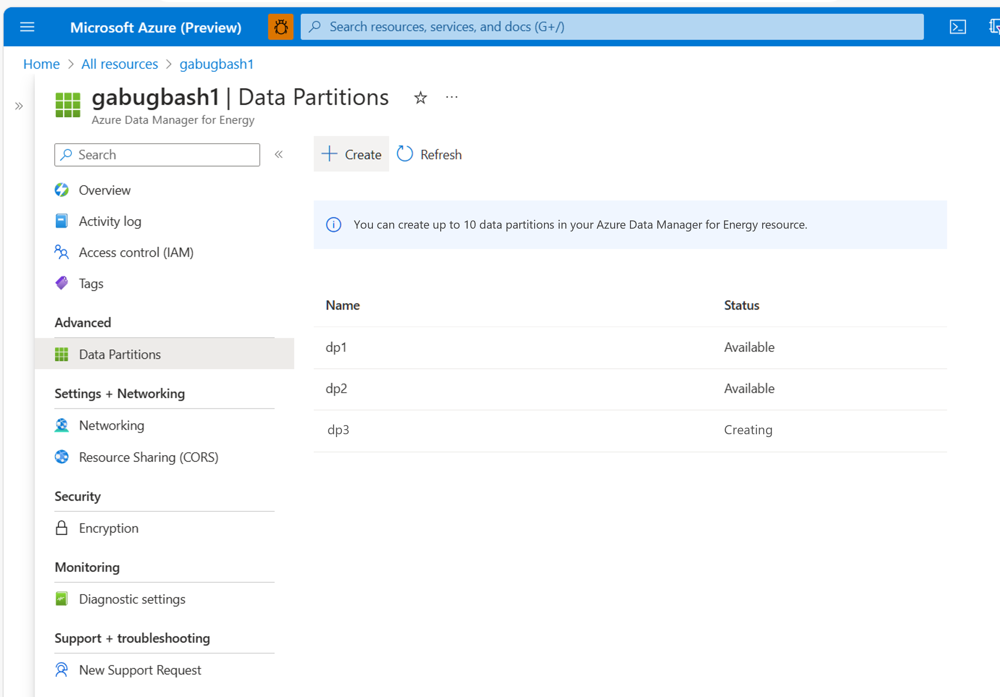

# How to manage data partitions?

[!INCLUDE [preview features callout](./includes/preview/preview-callout.md)]

The article describes how you can add data partitions to an existing Microsoft Energy Data Services (MEDS) instance. The concept of "data partitions" in MEDS is picked from Open Subsurface Data Universe (OSDU&trade;) where single deployment can contain multiple partitions. 

Each partition provides the highest level of data isolation within a single deployment. All access rights are governed at a partition level. Data is separated in a way that allows for the partitions life cycle and deployment to be handled independently. (See [Partition Service](https://community.opengroup.org/osdu/platform/home/-/issues/31) in OSDU&trade;)

> [!NOTE]
> You can create maximum five data partitions in one MEDS instance. In line with the capabilities around data partitions that are available in OSDU&trade;, for now, you can create data partitions but can't delete or rename data existing data partitions. 

## Create a data partition

1. **Open the "Data Partitions" menu-item from left-panel of MEDS overview page.**

    

2. **Select "Create"**

    The page shows a table of all data partitions in your MEDS instance with the status of the data partition next to it. Clicking "Create" option on the top opens a right-pane for next steps.

    

3. **Choose a name for your data partition**

    Each data partition name needs to be - "1-10 characters long and be a combination of lowercase letters, numbers and hyphens only" The data partition name will be prepended with the name of the MEDS instance. Choose a name for your data partition and hit create. Soon as you hit create, the deployment of the underlying data partition resources such as Cosmos DB and Storage Accounts is started. 

    >[!NOTE]
    >It generally takes 15-20 minutes to create a data partition.

    

    If the deployment is successful, the status changes to "created successfully" with or without clicking "Refresh" on top. 

    

## Delete a failed data partition

The data-partition deployment triggered in the previous process might fail in some cases due to issues - quota limits reached, ARM template deployment transient issues, data seeding failures, and failure in connecting to underlying AKS clusters. 

The status of such data partitions shows as "Creation Failed". You can delete these deployments using the "delete" button that shows next to all failed data partition deployments. This deletion will clean up any records created in the backend. You can retry creating the data partitions later. 

## Next steps

You can start loading data in your new data partitions.

> [!div class="nextstepaction"]
> [Load data using manifest ingestion](tutorial-manifest-ingestion.md)
