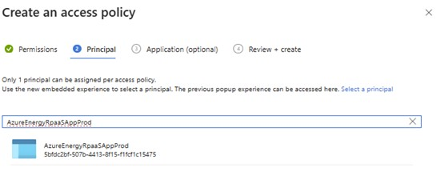

# How to enable External Data Services (EDS) Preview?

External Data Sources (EDS) is a capability in [OSDU&trade;](https://osduforum.org/) that allows data from an [OSDU&trade;](https://osduforum.org/) compliant external data source to be shared with an Azure Data Manager for Energy resource. EDS is designed to pull specified data (metadata) from OSDU-compliant data sources via scheduled jobs while leaving associated dataset files (LAS, SEG-Y, etc.) stored at the external source for retrieval on demand.

See [The OSDU Forum 2Q 2022 Newsletter - EDS](https://osduforum.org/wp-content/uploads/2022/06/The-OSDU-Forum-2Q-2022-Newsletter.pdf) for additional details.  

> [!NOTE]
> OSDU community shipped EDS as a preview feature in M18 Release

> [!IMPORTANT]
> Limit your Identity Provider (IdP) token to read operations only.
>
> Protect your search and delivery wrapper APIs from unauthorized access. As a best practice, ensure only Azure Data Manager for Energy can access data through your wrapper APIs. This helps with data discovery and delivery for EDS Preview.

## Prerequisites

1. Create a new or use an existing key vault to store secrets managed by [OSDU&trade;](https://osduforum.org/) secret service. To learn how to create a key vault with the Azure portal, see  [Quickstart: Create a key vault using the Azure portal](../key-vault/general/quick-create-portal.md).
  
    > [!IMPORTANT]
    > Your key vault must exist in the same tenant and subscription as your Azure Data Manager for Energy resource. 

    > [!TIP]
    > When you create the key vault, select [Enable purge protection (enforce a mandatory retention period for deleted vaults and vault objects)](../key-vault/general/key-vault-recovery.md?tabs=azure-portal#what-are-soft-delete-and-purge-protection).
  
1. In the **Access configuration** tab, under **Permission model** select **Vault access policy**: 
    
1. Give permission to Azure Data Manager for Energy Service Principal (SPN) on key vault (existing or new). How to give access to Azure Data Manager for Energy SPN - [Assign an Azure Key Vault access policy (CLI) | Microsoft Learn](../key-vault/general/assign-access-policy.md?tabs=azure-portal).
    1. Under **Access Policies**, select **Create** to create an access policy: 
        1. In the Permissions tab, select the permissions:
         
        1. Under the Principal selection pane, enter `AzureEnergyRpaaSAppProd`.
          
        1. Review + Create the access policy.

## To enable EDS Preview, create an Azure support request
To enable External Data Source Preview on your Azure Data Manager for Energy, create an Azure support ticket with the following information: 
- Subscription ID 
- Azure Data Manager for Energy developer tier resource name
- Data partition name (the data partition in which EDS needs to be enabled)
- Key Vault name (created in [Prerequisites](#prerequisites)) 

> [!NOTE]
> EDS ingest does not have [multi data partition support](https://community.opengroup.org/osdu/platform/data-flow/ingestion/external-data-sources/core-external-data-workflow/-/issues/51)
> 
> EDS Preview will be enabled only on the Developer Tier. 

We notify you once EDS preview is enabled in your Azure Data Manager for Energy resource.

> [!div class="nextstepaction"]
> [How to register an external data source with Azure Data Manager for Energy?](how-to-register-eds.md)
> [External data services faq](faq-energy-data-services.yml#Energy-Data-Services)