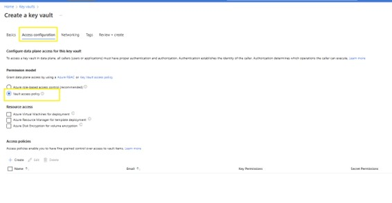

# How to enable External Data Services (EDS) Preview?

External Data Sources (EDS) is a capability in [OSDU&trade;](https://osduforum.org/) that allows data from an [OSDU&trade;](https://osduforum.org/) compliant external data source to be shared with an Azure Data Manager for Energy resource. EDS is designed to pull specified data (metadata) from OSDU-compliant data sources via scheduled jobs while leaving associated dataset files (LAS, SEG-Y, etc.) stored at the external source for retrieval on demand.  

> [!NOTE]
> OSDU community shipped EDS as a preview feature in M18 Release

## Prerequisites

1. Create a new or use an existing key vault to store secrets managed by [OSDU&trade;](https://osduforum.org/) secret service. To learn how to create a key vault with the Azure portal, see  [Quickstart: Create a key vault using the Azure portal](../key-vault/general/quick-create-portal.md).
  
    > [!IMPORTANT]
    > Your key vault must exist in the same tenant and subscription as your Azure Data Manager for Energy resource. 

    > [!TIP]
    > When you create the key vault, select [Enable purge protection (enforce a mandatory retention period for deleted vaults and vault objects)](../key-vault/general/key-vault-recovery.md?tabs=azure-portal#what-are-soft-delete-and-purge-protection).
  
1. In the **Access configuration** tab, under **Permission model** select **Vault access policy**: 
    [](media/how-to-enable-eds/create-a-key-vault.jpg#lightbox)
1. Give permission to Azure Data Manager for Energy Service Principal (SPN) on key vault (existing or new). How to give access to Azure Data Manager for Energy SPN - [Assign an Azure Key Vault access policy (CLI) | Microsoft Learn](../key-vault/general/assign-access-policy.md?tabs=azure-portal).
    1. Under **Access Policies**, select **+ Create** to create an access policy: 
        1. In the Permissions tab, select the permissions:
        [](media/how-to-enable-eds/select-permissions.jpg#lightbox) 
        1. Under the Principal selection pane, enter `AzureEnergyRpaaSAppProd`.
         [](media/how-to-enable-eds/create-an-access-policy.jpg#lightbox) 
        1. Review + Create the access policy.

## To enable EDS Preview, create an Azure support request
To enable External Data Source Preview on your Azure Data Manager for Energy, create an Azure support ticket with the following information: 
- Subscription ID 
- Azure Data Manager for Energy developer tier resource name
- Data partition name (the data partition in which EDS needs to be enabled) 
- Key Vault name (created in [Prerequisites](#prerequisites)) 

> [!NOTE]
> EDS Preview will be enabled only on the Developer Tier. 

We notify you once EDS preview is enabled in your subscription.

## How do I register an External data source with Azure Data Manager for Energy?

### Prerequisites 
1. Download and import API [collection](https://community.opengroup.org/osdu/platform/pre-shipping/-/blob/main/R3-M20/QA_Artifacts_M20/eds_testing_doc/EDS_Ingest_M20_Pre-Shipping_Setup_and_Testing.postman_collection.json?ref_type=heads) and [environment](https://community.opengroup.org/osdu/platform/pre-shipping/-/blob/main/R3-M20/QA_Artifacts_M20/envFilesAndCollections/envFiles/OSDU%20R3%20M20%20RI%20Pre-ship.postman_environment.json?ref_type=heads) files into API test client (like Postman). Make appropriate modifications in environment based on your data source. 
1. Refer **Section 2.2** in [osdu-eds-data-supplier-enablement-guide](https://gitlab.opengroup.org/osdu/r3-program-activities/docs/-/raw/master/R3%20Document%20Snapshot/23-osdu-eds-data-supplier-enablement-guide.pdf) for details on Data source Registration. 
1. Review **Connected Source Registry Entry (CSRE)** and **Connection Source Data Job (CSDJ)** sections in [EDS_Documentation-1.0.docx](https://gitlab.opengroup.org/osdu/subcommittees/ea/projects/extern-data/docs/-/blob/master/Design%20Documents/Training/EDS_Documentation-1.0.docx) to understand the various parameters used in data 
source registration. 
1. To run EDS, the user must be a member of `service.eds.user` entitlements group. Additionally, to access Secret service, the user should be a member of the following entitlements:
    1. `service.secret.viewer` 
    1. `service.secret.editor` 
    1. `service.secret.admin`  

### EDS Fetch and Ingest workflow 
Execute the APIs in the following collections to register your external data source that runs EDS Fetch and Ingest workflow on a schedule: 

1. `001: Pre-req: Validate Schema Registration`
1. `002: Pre-req: Validate Reference Data` 
1. `003: Secret Service` 
1. `004: Pre-req: Add Source Registry` 

After successful data registration, data is regularly fetched from external sources and added to your Azure Data Manager for Energy. 

You can use the Search service to search for your ingested data. 

**Troubleshooting:** 

You could run the below Kusto queries in your Log analytics workspace to identify any issues with Data Source registration. 


```kusto
OEPAirFlowTask 
| where DagName == "eds_ingest"        
| where LogLevel == "ERROR" // ERROR/DEBUG/INFO/WARNING
```

```kusto
OEPAirFlowTask 
| where DagName == "eds_scheduler"        
| where LogLevel == "ERROR" // ERROR/DEBUG/INFO/WARNING
```
### Retrieve bulk data on demand
Use **getRetrievalInstructions** API in `005: Dataset Service collection` to retrieve bulk data from external data source on demand. 

## Known issues
- EDS swagger endpoint on Azure Data Manager for Energy resource doesn't work in the M18 release. Therefore, we suggest you use the API collection provided in [Prerequisites  (1)](#prerequisites-1).
- Below issues are specific to [OSDU&trade;](https://osduforum.org/) M18 release: 
    - EDS ingest DAG results in failures when the data supplier’s wrapper Search service is unavailable. 
    - EDS Dataset service response provides an empty response when data supplier’s Dataset wrapper service is unavailable. 
    - Secret service responds with 5xx HTTP response code instead of 4xx in some cases. For example, 
        - When an application tries to recover a deleted secret, which isn't deleted. 
        - When an application tries to get an invalid deleted secret. 

### Limitations
Some EDS capabilities like **Naturalization, Reverse Naturalization, Reference data mapping** are unavailable in the M18 [OSDU&trade;](https://osduforum.org/) release (available in later releases), and hence unavailable in Azure Data Manager for Energy M18 release. These features will be available once we upgrade to subsequent [OSDU&trade;](https://osduforum.org/) milestone release.

### References

* [EDS documentation 1.0](https://gitlab.opengroup.org/osdu/subcommittees/ea/projects/extern-data/docs/-/blob/master/Design%20Documents/Training/EDS_Documentation-1.0.docx)
* [EDS M18 release notes](https://community.opengroup.org/osdu/governance/project-management-committee/-/wikis/M18-Release-Notes#external-data-services-eds)
* [EDS Postman collection](https://community.opengroup.org/osdu/platform/pre-shipping/-/blob/main/R3-M20/QA_Artifacts_M20/eds_testing_doc/EDS_Ingest_M20_Pre-Shipping_Setup_and_Testing.postman_collection.json?ref_type=heads)
* [EDS supplier enablement guide](https://gitlab.opengroup.org/osdu/r3-program-activities/docs/-/raw/master/R3%20Document%20Snapshot/23-osdu-eds-data-supplier-enablement-guide.pdf)
* [EDS issues](https://community.opengroup.org/osdu/platform/data-flow/ingestion/external-data-sources/core-external-data-workflow/-/issues)