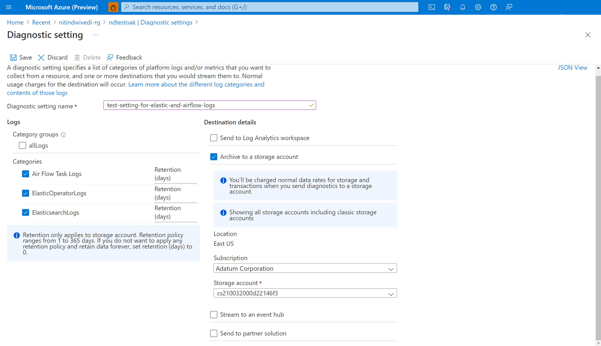
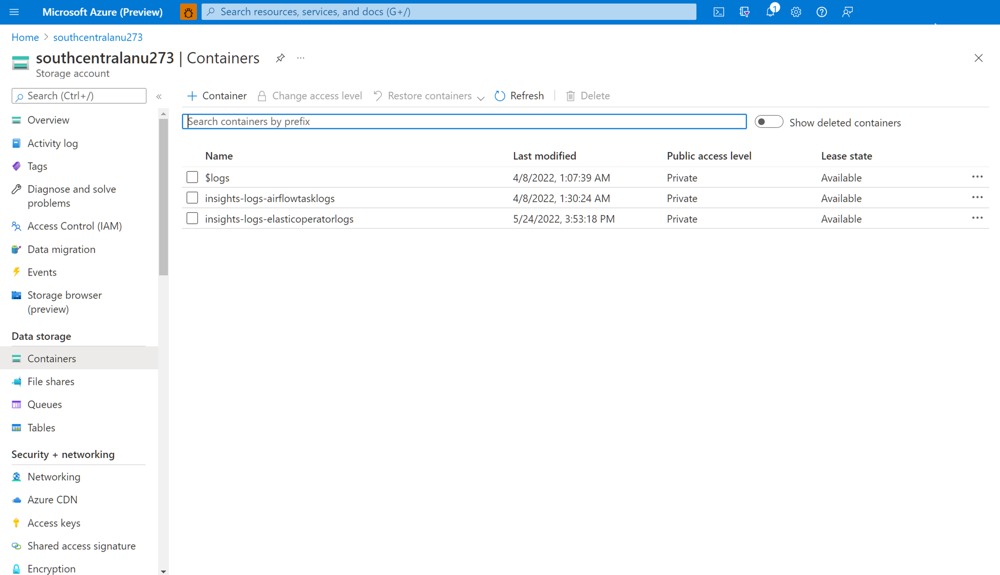
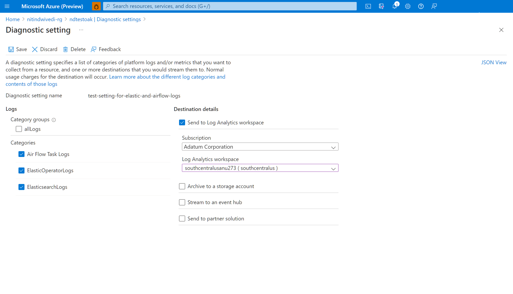
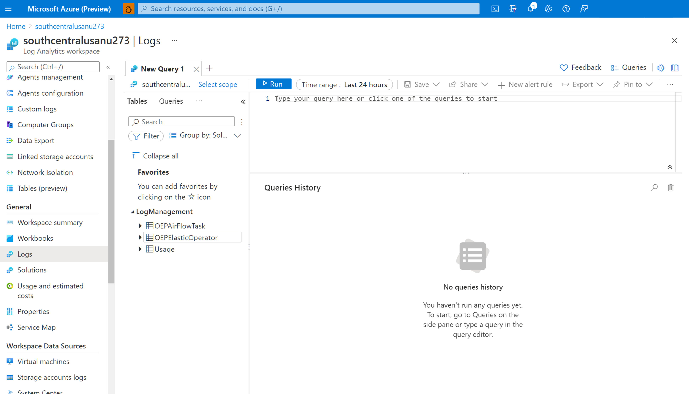

# Integrate airflow logs with Azure Monitor

This article describes how you can start collecting Airflow Logs for your Microsoft Energy Data Services instances into Azure Monitor. This integration feature helps you debug Airflow DAG run failures. 

## Prerequisites

* An existing **Log Analytics Workspace**:
    This workspace will be used to query the Airflow logs using the Kusto Query Language (KQL) query editor in the Log Analytics Workspace. Useful Resource: [Create a log analytics workspace in Azure portal](/articles/azure-monitor/logs/quick-create-workspace.md).

* An existing **storage account**:
    It will be used to store JSON dumps of Airflow logs. The storage account doesn’t have to be in the same subscription as your Log Analytics Workspace. 

## Enabling diagnostic settings to collect logs in a storage account
Every Microsoft Energy Data Services instance comes inbuilt with an Azure Data Factory-managed Airflow instance. We collect Airflow logs for internal troubleshooting and debugging purposes. Airflow logs can be integrated with Azure Monitor in the following ways:

* Storage account
* Log Analytics Workspace

To access logs via any of the above two options, you need to create a Diagnostic Setting. Each Diagnostic Setting has three basic parts:

| Title | Description |
|-|-|
| Name  | This is the name of the diagnostic log. Ensure a unique name is set for each log. |
| Categories | Category of logs to send to each of the destinations. The set of categories will vary for each Azure service. Visit: [Supported Resource Log Categories](/articles/azure-monitor/essentials/resource-logs-categories.md) |
| Destinations | One or more destinations to send the logs. All Azure services share the same set of possible destinations. Each diagnostic setting can define one or more destinations but no more than one destination of a particular type. It should be a storage account, an Event Hub namespace or an Event Hub. |

Follow the following steps to set up Diagnostic Settings:

1. Open Microsoft Energy Data Services' "**Overview**" page
1. Select "**Diagnostic Settings**" from the left panel

    

1. Select "**Add diagnostic setting**"

1. Select "**Airflow Task Logs**" under Logs

1. Select "**Archive to a storage account**"

    

6. Verify the subscription and the storage account to which you want to archive the logs.

## Navigate storage account to download Airflow logs

After a diagnostic setting is created for archiving Airflow task logs into a storage account, you can navigate to the storage account **overview** page. You can then use the "Storage Browser" on the left panel to find the right JSON file that you want to investigate. Browsing through different directories is intuitive as you move from a year to a month to a day. 

1. Navigate through **Containers**, available on the left panel. 

    

2. Open the information pane on the right. It contains a "download" button to save the log file locally. 

1. Downloaded logs can be analyzed in any editor.

## Enabling diagnostic settings to integrate logs with Log Analytics Workspace

You can integrate Airflow logs with Log Analytics Workspace by using **Diagnostic Settings** under the left panel of your Microsoft Energy Data Services instance overview page. 

## Working with the integrated Airflow Logs in Log Analytics Workspace

Data is retrieved from a Log Analytics Workspace using a query written in Kusto Query Language (KQL). A set of precreated queries is available for many Azure services (not available for Airflow at the moment) so that you don't require knowledge of KQL to get started. Visit: [Sample Kusto Queries](/articles/data-explorer/kusto/query/samples?pivots=azuredataexplorer.md)

1. Select Logs from your resource's menu. Log Analytics opens with the **Queries** window that includes prebuilt queries for your resource type.

2. Browse through the available queries. Identify the one to run and select Run. The query is added to the query window and the results are returned.

## Next steps
Now that you're collecting resource logs, create a log query alert to be proactively notified when interesting data is identified in your log data.

> [!div class="nextstepaction"]
> [Create a log query alert for an Azure resource](/articles/azure-monitor/alerts/tutorial-log-alert.md)
