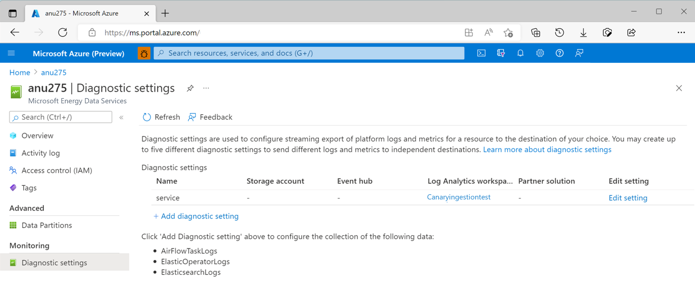
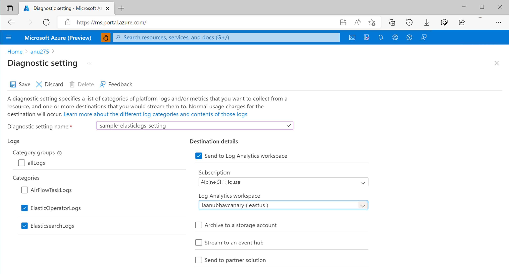
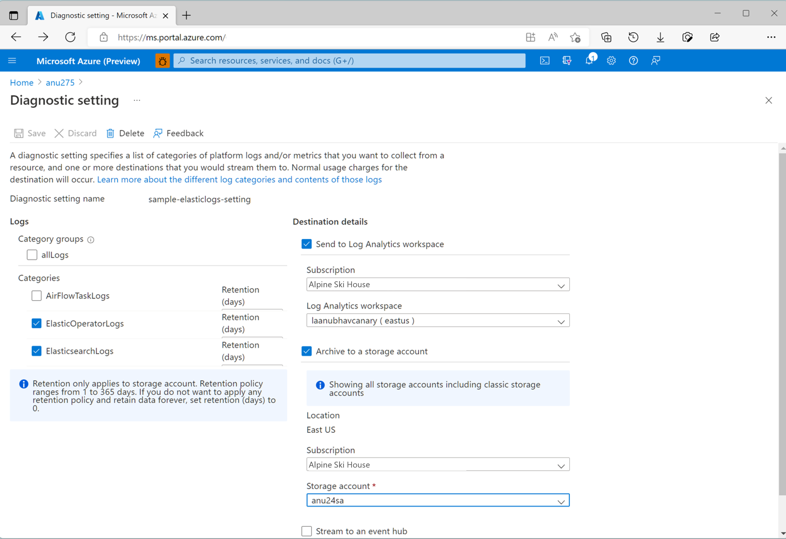
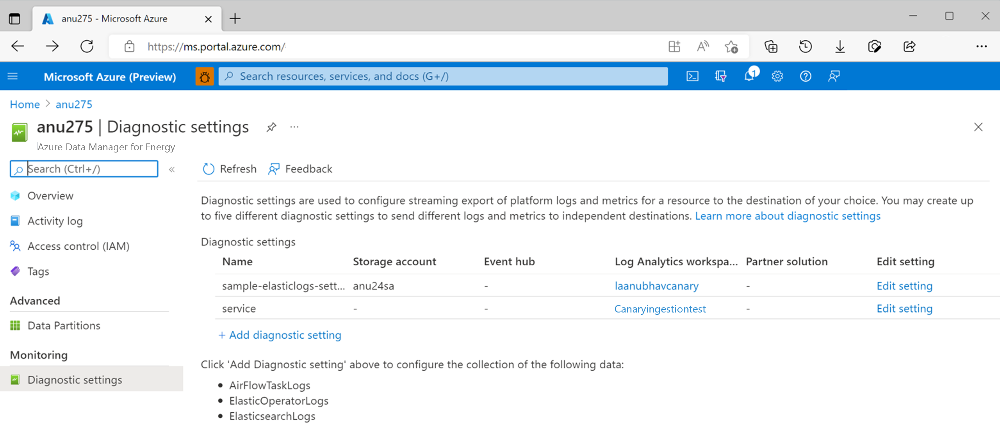
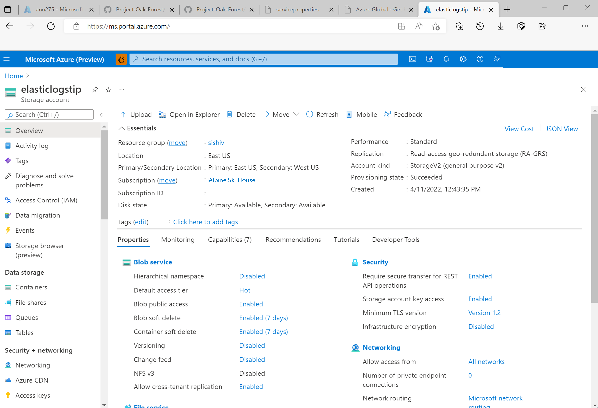
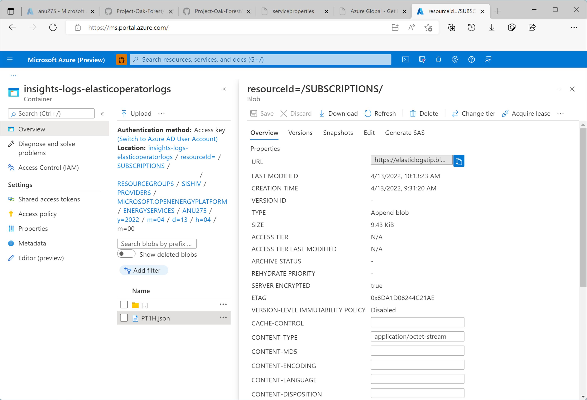

# Integrate elastic logs with Azure Monitor

[!INCLUDE [preview features callout](./includes/preview/preview-callout.md)]

This article describes how you can start collecting Elasticsearch logs for your Microsoft Energy Data Services instances in Azure Monitor. This integration feature is developed to help you debug Elasticsearch related issues inside Azure Monitor. 

## Prerequisites

- You need to have a Log Analytics workspace. It will be used to query the Elasticsearch logs dataset using the Kusto Query Language (KQL) query editor in the Log Analytics workspace. Useful Resource: [Create a log Analytics workspace in Azure portal](/articles/azure-monitor/logs/quick-create-workspace.md)

- You need to have a storage account. It will be used to store JSON dumps of Elasticsearch & Elasticsearch Operator logs. The storage account doesn’t have to be in the same subscription as your Log Analytics workspace. 

## Enabling Diagnostic Settings to collect logs in a storage account & a Log Analytics workspace
Every Microsoft Energy Data Services instance comes inbuilt with a managed Elasticsearch service. We collect Elasticsearch logs for internal troubleshooting and debugging purposes. You can get access to these logs by integrating Elasticsearch logs with Azure Monitor. 

Each diagnostic setting has three basic parts:

| Name      |      Categories | Destinations  |
|-----------|-----------------|---------------|
|Ensure a unique name is set for each log.|Categories of logs to send to each of the destinations. The set of categories will vary for each Azure service. Visit: [Supported Resource Log Categories](/articles/azure-monitor/essentials/resource-logs-categories.md) | One or more destinations to send the logs. All Azure services share the same set of possible destinations. Each diagnostic setting can define one or more destinations but no more than one destination of a particular type. It should be a storage account, an event hub namespace or an event hub.|

We support two destinations for your Elasticsearch logs from Microsoft Energy Data Services instance:

* storage account
* Log Analytics workspace

## Steps to enable diagnostic setting to collect Elasticsearch logs

1. Open *Microsoft Energy Data Services* overview page
1. Select *Diagnostic Settings* from the left panel
  
    

1. Select *Add diagnostic setting*.

1. Select *Elasticsearch logs* and *Elasticsearch Operator logs* under Log categories
 
1. Select *Send to a Log Analytics workspace*

1. Choose Subscription and the Log Analytics workspace Name. You would have created it already as a prerequisite.

  
    

1. Select *Archive to storage account*
1. Choose Subscription and storage account Name. You would have created it already as a prerequisite.
    

1. Select *Save*.

Go back to the Diagnostic Settings page. You would now see a new diagnostic setting created along with the names of the destination storage account and Log Analytics workspace you chose for this setting. 
 

## View Elasticsearch logs in Log Analytics workspace or download them as JSON files using storage account

### How to view & query logs in Log Analytics workspace
The editor in Log Analytics workspace support Kusto (KQL) queries through which you can easily perform complicated queries to extract interesting logs data from the Elasticsearch service running in your Microsoft Energy Data Services instance.
 
 
* Run queries and see Elasticsearch logs in the Log Analytics workspace.

    

* Run queries and see Elasticsearch Operator logs in the Log Analytics workspace.

    

### How to download logs as JSON files from storage account

* The *Containers* menu option in the left panel of your storage account's overview page allows you to browse through the various directories that neatly store your log files. 
    

    
 
* Logs are organized into different folders. Drill down by month, date and time. 

    
 
* Select any JSON file in your containers to view other options. 

    

* Select *Download* option to download the JSON file. Open it in a code editor of your choice. 
 
    

 
## Next steps

After collecting resource logs as explained in this article, there are more capabilities you can explore.

* Create a log query alert to be proactively notified when interesting data is identified in your log data.
    [Create a log query alert for an Azure resource](/articles/azure-monitor/alerts/tutorial-log-alert.md)

* Start collecting logs from other sources such as Airflow in your Microsoft Energy Data Services instance. 
    [How to Integrate Airflow logs with Azure Monitor](how-to-integrate-airflow-logs-with-azure-monitor.md)

