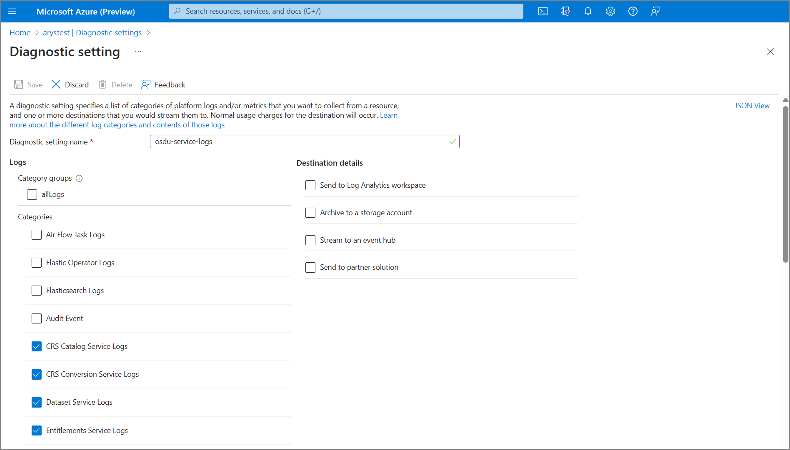

# Integrate OSDU Service Logs with Azure Monitor

In this article, you'll learn how to integrate OSDU service logs with Azure Monitor to take advantage of Log Analytics workspace features for better monitoring and troubleshooting of core and DDMS services offered by OSDU. This feature complements other logs integration features available to users, such as integrating Airflow logs and Elastic logs with Azure Monitor.

## Prerequisites

* An existing **Log Analytics Workspace**.
    This workspace will be used to query the OSDU service logs using the Kusto Query Language (KQL) query editor in the Log Analytics workspace. Useful Resource: [Create a log analytics workspace in Azure portal](../azure-monitor/logs/quick-create-workspace.md).

* An existing **storage account**:
    It will be used to store JSON dumps of OSDU service logs. The storage account doesn’t have to be in the same subscription as your Log Analytics workspace.

## Enabling diagnostic settings for OSDU service logs integration

1. Open Microsoft Azure Data Manager for Energy Preview *Overview* page.
1. Select *Diagnostic Settings* from the left panel.
    
    
    
1. Select *Add diagnostic setting*. Choose a for your diagnostic setting and select the services under Categories that you want to send to your chosen destination. 

    
    

1. Under the Logs section, you can choose one or multiple OSDU services for which you want to create a diagnostic setting. Select *Archive to a storage account* and/or *Send to Log Analytics workspace* as desired.

     
 
1. Verify the subscription, storage account, and Log Analytics workspace to which you want to archive the logs or integrate with.

## Working with OSDU service logs in Log Analytics Workspace

Use Kusto Query Language (KQL) to retrieve desired data on collected OSDU service logs from your Log Analytics Workspace. Logs from multiple services will show up in a common table in the Log Analytics workspace, enabling users to filter data and look for results easily.

## Troubleshooting with OSDU service logs

Having access to OSDU service logs enables users to perform various troubleshooting scenarios:

* Identify errors and issues related to specific services and APIs.
     Examine logs for services like the Workflow Service, Partition Service, or Entitlements Service to quickly identify and resolve any issues in the API calls or service functionality.

* Monitor the performance of individual services.

* Analyze the root cause of failed requests.
* Track user activity and usage patterns for OSDU services.

## Archiving OSDU service logs to storage accounts

Users can archive OSDU service logs to storage accounts and take advantage of Azure Monitor features for logs archival, retention policies, and more:

* Specify the storage account for archiving logs during the diagnostic setting creation process.
* Set retention policies for the archived logs.
* Access the logs in the storage account for additional analysis or long-term storage.

## Next steps

Now that you're collecting OSDU service logs, create a log query alert to be proactively notified when interesting data is identified in your log data.

> [!div class="nextstepaction"]
> [Create a log query alert for an Azure resource](../azure-monitor/alerts/tutorial-log-alert.md)
