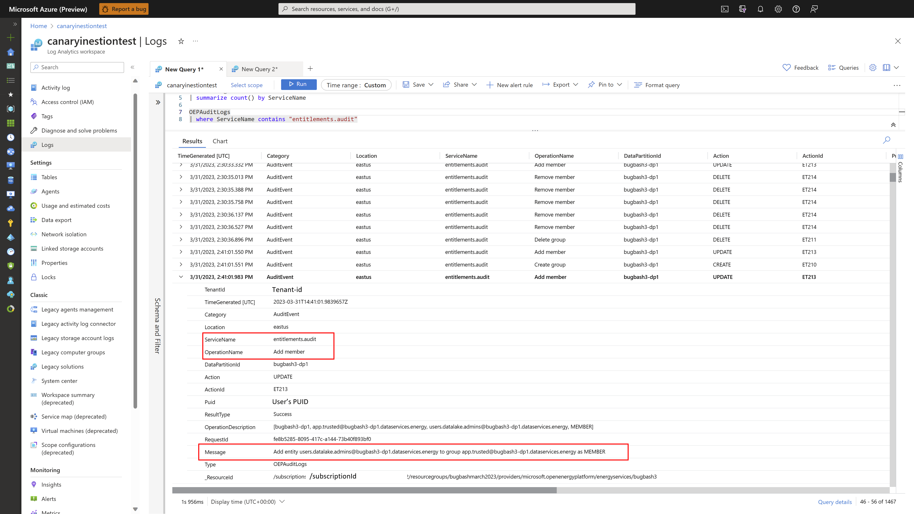
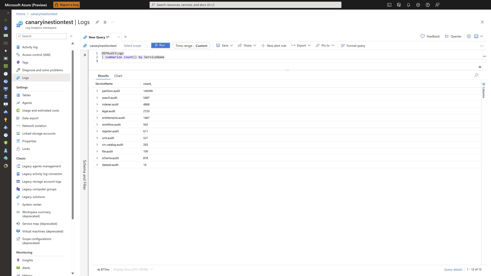

# Manage audit logs  
Audit logs provide auditing trails for data plane APIs on Azure Data Manager for Energy. With audit logs, you can tell:
* Who performed an action
* What was the action
* When was the action performed
* Status of the action

For example, when you “Add a new member” to the ```users.datalake.admins``` entitlement group using entitlements API, you're able to see this information in audit logs. 

[](media/how-to-manage-audit-logs/how-to-manage-audit-logs-4-entilements.png#lightbox)
 
## Enable audit logs
To enable audit logs in diagnostic logging, select your Azure Data Manager for Energy instance in the Azure portal.
* Select the **Activity log** screen, and then select **Diagnostic settings**.
* Select **+ Add diagnostic setting**.
* Enter the Diagnostic settings name.
* Select **Audit Events** as the Category. 

[](media/how-to-manage-audit-logs/how-to-manage-audit-logs-1-audit-event-diagnostic-logs.png#lightbox)

* Select appropriate Destination details for accessing the diagnostic logs. 
 
> [!NOTE]
> It might take up to 15 minutes for the first Logs to show in Log Analytics. 
For information on how to work with diagnostic logs, see [Azure Resource Log documentation.](../azure-monitor/essentials/platform-logs-overview.md)

## Audit log details
The audit logs for Azure Data Manager for Energy service returns the following fields.

|Field Name| 	  Type| 	Description|
|----------|----------|----------------| 
| TenantID |	String |	The tenant of your Azure Data Manager for Energy instance.|
| TimeGenerated | UTC format |	The time of the audit log. |
| Category 	| String | The diagnostic settings category to which the logs belong.|
| Location | 	string | 	Location of the Azure Data Manager for Energy resource.  |
| ServiceName 	| String |  	Name of OSDU service running in Azure Data Manager for Energy. For example: Partition, Search, Indexer, Legal, Entitlements, Workflow, Register, Unit, Crs-catalog, File, Schema, and Dataset |
| OperationName | 	String  |Operation ID or operation name associated to data plane APIs, which emits audit logs for example "Add member" |
| Data partition ID | 	String |  	Data partition ID on which operation is performed. |
| Action  |	String | 	Action refers to the type of operation that is, whether it's create, delete, update etc.|
| ActionID | 	String 	| ID associated with operation. |
| PuID |	String	| ObjectId of the user in Azure AD|
| ResultType |	String 	| Define success or failure of operation | 
| Operation Description	| String |	Provides specific details of the response. These details can include tracing information, such as the symptoms, of the result that are used for further analysis. |
| RequestId | 	 String 	| This is the unique ID associated to the request, which triggered the operation on data plane. |
| Message |	String |	Provides message associated with the success or failure of the operation.|
| ResourceID | 	String | 	The Azure Data Manager for Energy resource ID of the customer under which the audit log belongs. |

## Sample queries

Basic Application Insights queries you can use to explore your log data.

1. Run the following query to group operations by ServiceName:

```sql
OEPAuditLogs
| summarize count() by ServiceName
```

[](media/how-to-manage-audit-logs/how-to-manage-auditlogs-3-allservices.png#lightbox)
 
2. Run the following query to see the 100 most recent logs:

```sql
OEPAuditLogs
| limit 100
```

3. Run the following query to get all the failed results:

```sql
OEPAuditLogs
| where ResultType contains "Failure"
```


## Next steps

Learn about Managed Identity:
> [!div class="nextstepaction"]
> [Managed Identity in Azure Data Manager for Energy Preview](how-to-use-managed-identity.md)


