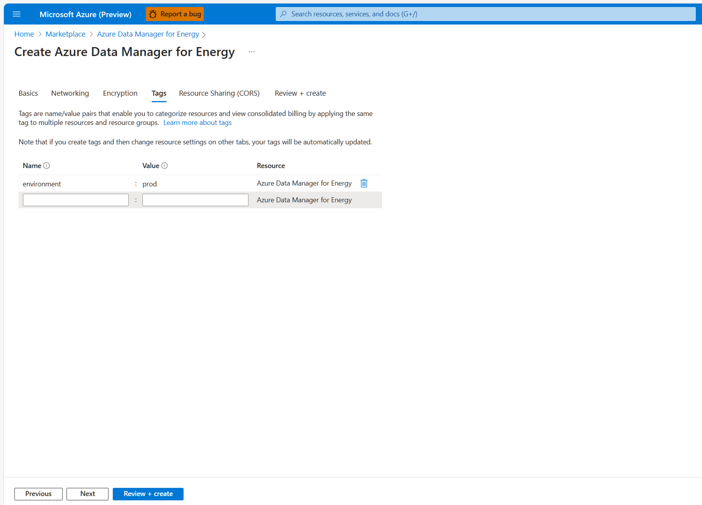

# Quickstart: Create a Microsoft Energy Data Services Preview instance

[!INCLUDE [preview features callout](./includes/preview/preview-callout.md)]

In this quickstart, you'll learn how to create and deploy a Microsoft Energy Data Services instance. 

Microsoft Energy Data Services (or MEDS, in short) is a managed Platform-as-a-service (PaaS) offering from Microsoft that builds on top of the Open Subsurface Data Universe (OSDU) data platform. MEDS lets you ingest, transform, and export subsurface data by letting you connect your consuming in-house or third-party applications.

## Before you start

- The entire setup of Microsoft Energy Data Services instance, including the preparation and installation will take about 50 minutes.

## Prerequisites

| Prerequisite | Details |
| ------------ | ------- |
Active Azure Subscription | You'll need the Azure subscription ID and the region where you want to install Project Oak Forest. Choose one of the regions listed in the Regions supported section.
Application ID | You'll need an application ID (often referred to as "App ID" or a "client ID"). This application ID will be used for authentication to Azure Active Directory and will be associated with your Oak instance. Follow the steps below if you don't have one.

#### Creating an Application ID

1. Log in to the [Azure portal](https://portal.azure.com/?microsoft_azure_marketplace_ItemHideKey=Microsoft_Azure_OpenEnergyPlatformHidden)

1. Navigate to Azure Active Directory and open *App registration* in the left-hand pane.

1. Select *Register a new application*.

1. Add a redirect URI as shown below. 

1. *Save* your application registration. 

1. Add a client secret with the steps laid out in [this documentation](/articles/active-directory/develop/quickstart-register-app.md)

>[!NOTE]
> It might be handy to note your application ID and secret in text editor. You will be using these values throughout this quick-start guide.

## Create a Microsoft energy data services instance

>[!IMPORTANT]
> Please use the link below as it contains a *hidden flag* which is needed to be able to find the 'Project Oak Forest' in the Azure Marketplace.

1. Log in to [Microsoft Azure Marketplace (Hidden items enabled)](https://portal.azure.com/?microsoft_azure_marketplace_ItemHideKey=Microsoft_Azure_OpenEnergyPlatformHidden)

1. Select your account in the top-right corner and switch to the Azure AD tenant where you want to install Microsoft Energy Data Services instance.

1. Go to Azure Marketplace within the portal and search for **Microsoft Energy Data Services** in the Marketplace.

    

1. A new window with an overview of **Microsoft Energy Data Services** appears. Select **Create**.

1. A new window appears. Complete the sign-up process by choosing the correct subscription, resource group, and location to which you want to create an instance of **Microsoft Energy Data Services**.

    Some naming conventions to guide you at this step:

    | Field | Name Validation | 
    | ----- | --------------- |
    Instance name | Only alphanumeric characters are allowed, and the value must be 1-15 characters long.
    Application ID | Enter the valid Application ID that you generated and saved in the last section.
    Data Partition name | Name should be 1-10 char long consisting of lowercase alphanumeric characters and hyphens. It should start with an alphanumeric character and shouldn't contain consecutive hyphens.

    

1. Select **Next: Tags** and enter any tags that you would want to specify. If nothing, this field can be left blank.

    

1. Select Next: **Review + Create**.

1. Once the basic validation tests have been passed, review the Terms and Basic Details. Select **Create** to start the deployment.

    

1. At this stage, you can also download an Azure Resource Manager (ARM) template to use for automated deployments of Microsoft Energy data services in future.  

    

1. Sit back and relax while the deployment happens in the background. Review the details of the instance created.

    

 
## Uninstall

To uninstall a Microsoft Energy Data Services instance, complete the following steps:

1. Sign in to the Azure portal and **delete the resource groups** in which these components are installed.

2. Go to Azure Active Directory & **delete the Azure AD application** linked to the Project Oak Forest installation.

## Next steps

After installing a Microsoft Energy Data Services instance, you can learn about user management on this instance.

- [How to manage users](how-to-manage-users.md)
