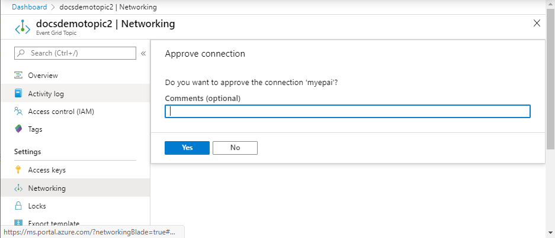
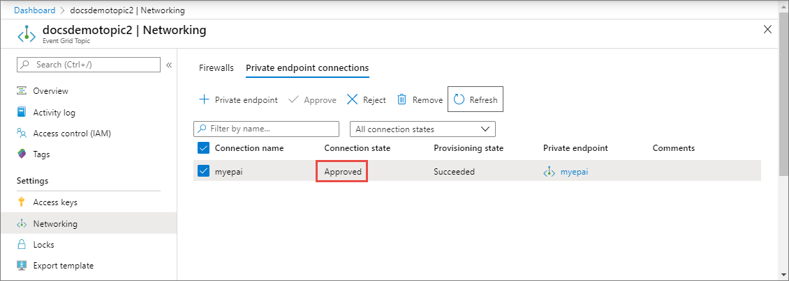
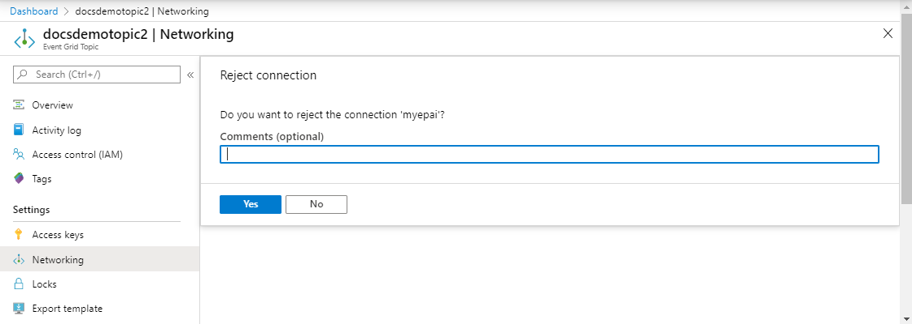
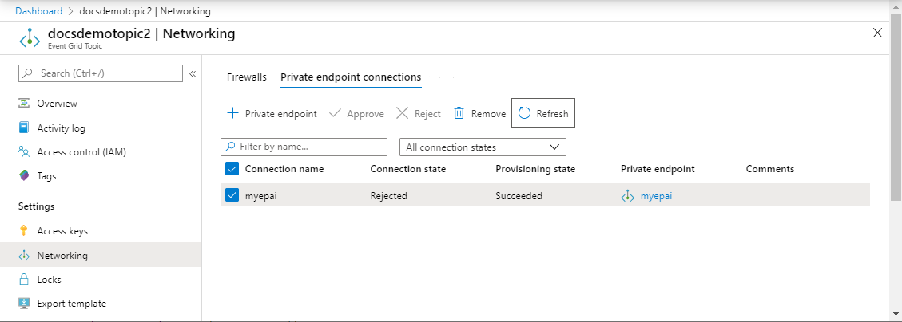

# Configure private endpoints for Azure Event Grid namespaces
You can use [private endpoints](../private-link/private-endpoint-overview.md) to allow ingress of events directly from your virtual network to your custom topics and domains securely over a [private link](../private-link/private-link-overview.md) without going through the public internet. The private endpoint uses an IP address from the VNet address space for your custom topic or domain. For more conceptual information, see [Network security](network-security.md).

This article describes how to configure private endpoints for custom topics or domains.

> [!NOTE]
> Currently, private endpoints aren't supported for system topics.

## Use Azure portal 
This section shows you how to use the Azure portal to create a private endpoint for a topic or a domain.

> [!NOTE]
> The steps shown in this section are mostly for custom topics. You can use similar steps to create private endpoints for **domains**. 

### When creating a new topic

This section shows you how to enable private network access for an Event Grid topic or a domain. For step-by-step instructions to create a new topic, see [Create a custom topic](custom-event-quickstart-portal.md#create-a-custom-topic).

1. On the **Basics** page of the **Create topic** wizard, select **Next: Networking** at the bottom of the page after filling the required fields. 

    :::image type="content" source="./media/configure-firewall/networking-link.png" alt-text="Image showing the selection of Networking link at the bottom of the page. ":::
1. To allow access to the Event Grid topic via a private endpoint, select the **Private access** option. 

    :::image type="content" source="./media/configure-firewall/networking-page-private-access.png" alt-text="Image showing the selection of Private access option on the Networking page of the Create topic wizard. ":::    
1. See the next section for steps to add a private endpoint. 

### For an existing topic
1. Sign in to the [Azure portal](https://portal.azure.com) and navigate to your topic or domain.
2. Switch to the **Networking** tab of your topic page. In the **Public access** tab, select **Private endpoints only**.

    :::image type="content" source="./media/configure-firewall/select-private-endpoints.png" alt-text="Screenshot that shows the Public network access page with Private endpoints only option selected.":::
1. Switch to the **Private endpoint connections** tab, and then select **+ Private endpoint** on the toolbar.

    :::image type="content" source="./media/configure-private-endpoints/add-button.png" alt-text="Screenshot showing the selection of + Private endpoint link on the Private endpoint connection tab.":::
2. On the **Basics** page, follow these steps: 
    1. Select an **Azure subscription** in which you want to create the private endpoint. 
    2. Select an **Azure resource group** for the private endpoint. 
    3. Enter a **name** for the **endpoint**. 
    1. Update the **name** for the **network interface** if needed. 
    1. Select the **region** for the endpoint. Your private endpoint must be in the same region as your virtual network, but can in a different region from the private link resource (in this example, an  Event Grid topic). 
    1. Then, select **Next: Resource >** button at the bottom of the page. 

        :::image type="content" source="./media/configure-private-endpoints/basics-page.png" alt-text="Screenshot showing the Basics page of the Create a private endpoint wizard.":::
3. On the **Resource** page, follow these steps, confirm that **topic** is selected for **Target sub-resource**, and then select **Next: Virtual Network >** button at the bottom of the page. 

    :::image type="content" source="./media/configure-private-endpoints/resource-page.png" alt-text="Screenshot showing the Resource page of the Create a private endpoint wizard.":::
4. On the **Virtual Network** page, you select the subnet in a virtual network to where you want to deploy the private endpoint. 
    1. Select a **virtual network**. Only virtual networks in the currently selected subscription and location are listed in the drop-down list. 
    2. Select a **subnet** in the virtual network you selected. 
    1. Specify whether you want the **IP address** to be allocated statically or dynamically. 
    1. Select an existing **application security group** or create one and then associate with the private endpoint.
    1. Select **Next: DNS >** button at the bottom of the page. 

        :::image type="content" source="./media/configure-private-endpoints/configuration-page.png" alt-text="Screenshot showing the Networking page of the Creating a private endpoint wizard.":::
5. On the **DNS** page, select whether you want the private endpoint to be integrated with a **private DNS zone**, and then select **Next: Tags** at the bottom of the page. 

    :::image type="content" source="./media/configure-private-endpoints/dns-zone-page.png" alt-text="Screenshot showing the DNS page of the Creating a private endpoint wizard."::: 
1. On the **Tags** page, create any tags (names and values) that you want to associate with the private endpoint resource. Then, select **Review + create** button at the bottom of the page. 
1. On the **Review + create**, review all the settings, and select **Create** to create the private endpoint. 

### Manage private link connection

When you create a private endpoint, the connection must be approved. If the resource for which you're creating a private endpoint is in your directory, you can approve the connection request provided you have sufficient permissions. If you're connecting to an Azure resource in another directory, you must wait for the owner of that resource to approve your connection request.

There are four provisioning states:

| Service action | Service consumer private endpoint state | Description |
|--|--|--|
| None | Pending | Connection is created manually and is pending approval from the private Link resource owner. |
| Approve | Approved | Connection was automatically or manually approved and is ready to be used. |
| Reject | Rejected | Connection was rejected by the private link resource owner. |
| Remove | Disconnected | Connection was removed by the private link resource owner, the private endpoint becomes informative and should be deleted for cleanup. |
 
###  How to manage a private endpoint connection
The following sections show you how to approve or reject a private endpoint connection. 

1. Sign in to the [Azure portal](https://portal.azure.com).
1. In the search bar, type in **Event Grid topics** or **Event Grid domains**.
1. Select the **topic** or **domain** that you want to manage.
1. Select the **Networking** tab.
1. If there are any connections that are pending, you'll see a connection listed with **Pending** in the provisioning state. 

### To approve a private endpoint
You can approve a private endpoint that's in the pending state. To approve, follow these steps: 

> [!NOTE]
> The steps shown in this section are mostly for topics. You can use similar steps to approve private endpoints for **domains**. 

1. Select the **private endpoint** you wish to approve, and select **Approve** on the toolbar.

    
1. On the **Approve connection** dialog box, enter a comment (optional), and select **Yes**. 

    
1. Confirm that you see the status of the endpoint as **Approved**. 

    

### To reject a private endpoint
You can reject a private endpoint that's in the pending state or approved state. To reject, follow these steps: 

> [!NOTE]
> The steps shown in this section are for topics. You can use similar steps to reject private endpoints for **domains**. 

1. Select the **private endpoint** you wish to reject, and select **Reject** on the toolbar.

    
1. On the **Reject connection** dialog box, enter a comment (optional), and select **Yes**. 

    
1. Confirm that you see the status of the endpoint as **Rejected**. 

    

    > [!NOTE]
    > You can't approve a private endpoint in the Azure portal once it's rejected. 

## Next steps
To learn about how to configure IP firewall settings, see [Configure IP firewall for Azure Event Grid namespaces](configure-firewall-mqtt.md).
