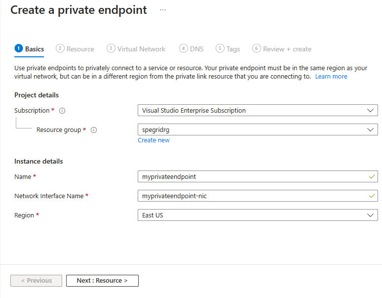
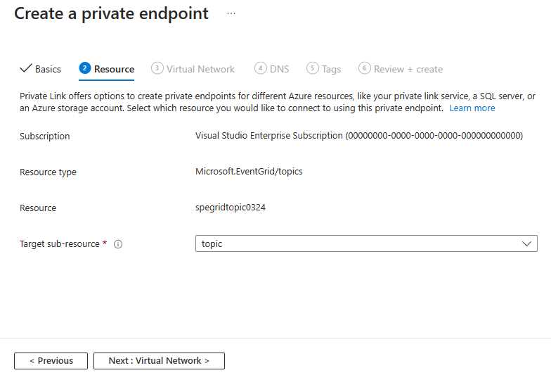
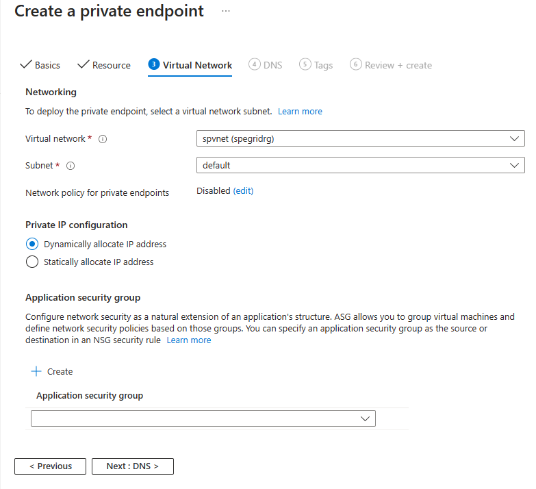
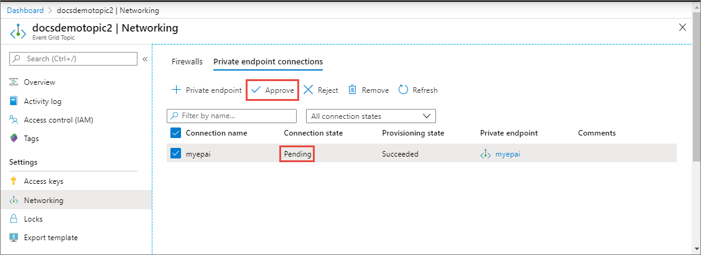
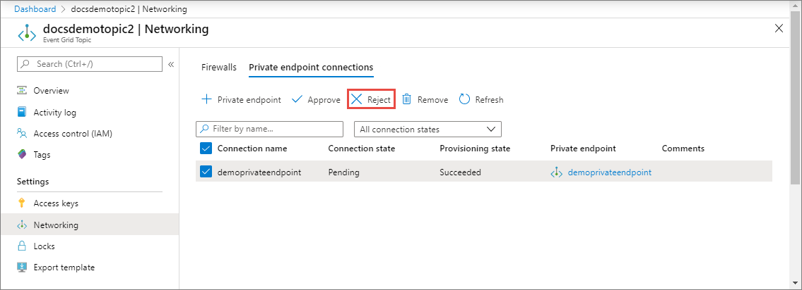

# Configure private endpoints for Azure Event Grid topics or domains
You can use [private endpoints](../private-link/private-endpoint-overview.md) to allow ingress of events directly from your virtual network to your topics and domains securely over a [private link](../private-link/private-link-overview.md) without going through the public internet. The private endpoint uses an IP address from the VNet address space for your topic or domain. For more conceptual information, see [Network security](network-security.md).

This article describes how to configure private endpoints for topics or domains.

## Use Azure portal 
This section shows you how to use the Azure portal to create a private endpoint for a topic or a domain.

> [!NOTE]
> The steps shown in this section are mostly for topics. You can use similar steps to create private endpoints for **domains**. 

### When creating a new topic

This section shows you how to enable private network access for an Event Grid topic or a domain. For step-by-step instructions to create a new topic, see [Create a custom topic](custom-event-quickstart-portal.md#create-a-custom-topic).

1. On the **Basics** page of the **Create topic** wizard, select **Next: Networking** at the bottom of the page after filling the required fields. 

    :::image type="content" source="./media/configure-firewall/networking-link.png" alt-text="Image showing the selection of Networking link at the bottom of the page. ":::
1. To allow access to the Event Grid topic via a private endpoint, select the **Private access** option. 

    :::image type="content" source="./media/configure-firewall/networking-page-private-access.png" alt-text="Image showing the selection of Private access option on the Networking page of the Create topic wizard. ":::    
1. See the next section for steps to add a private endpoint. 

### For an existing topic
1. Sign in to the [Azure portal](https://portal.azure.com) and navigate to your topic or domain.
2. Switch to the **Networking** tab of your topic page. In the **Public access** tab, select **Private endpoints only**.

    :::image type="content" source="./media/configure-firewall/select-private-endpoints.png" alt-text="Screenshot that shows the Public network access page with Private endpoints only option selected.":::
1. Switch to the **Private endpoint connections** tab, and then select **+ Private endpoint** on the toolbar.

    :::image type="content" source="./media/configure-private-endpoints/add-button.png" alt-text="Screenshot showing the selection of + Private endpoint link on the Private endpoint connection tab.":::
2. On the **Basics** page, follow these steps: 
    1. Select an **Azure subscription** in which you want to create the private endpoint. 
    2. Select an **Azure resource group** for the private endpoint. 
    3. Enter a **name** for the endpoint. 
    4. Select the **region** for the endpoint. Your private endpoint must be in the same region as your virtual network, but can in a different region from the private link resource (in this example, an  event grid topic). 
    5. Then, select **Next: Resource >** button at the bottom of the page. 

      
3. On the **Resource** page, follow these steps: 
    1. For connection method, if you select **Connect to an Azure resource in my directory**, follow these steps. This example shows how to connect to an Azure resource in your directory. 
        1. Select the **Azure subscription** in which your **topic/domain** exists. 
        1. For **Resource type**, Select **Microsoft.EventGrid/topics** or **Microsoft.EventGrid/domains** for the **Resource type**.
        2. For **Resource**, select an topic/domain from the drop-down list. 
        3. Confirm that the **Target subresource** is set to **topic** or **domain** (based on the resource type you selected).    
        4. Select **Next: Virtual Network >** button at the bottom of the page. 

            
    2. If you select **Connect to a resource using a resource ID or an alias**, follow these steps:
        1. Enter the ID of the resource. For example: `/subscriptions/<AZURE SUBSCRIPTION ID>/resourceGroups/<RESOURCE GROUP NAME>/providers/Microsoft.EventGrid/topics/<EVENT GRID TOPIC NAME>`.  
        2. For **Resource**, enter **topic** or **domain**. 
        3. (optional) Add a request message. 
        4. Select **Next: Virtual Network >** button at the bottom of the page. 

            
4. On the **Virtual Network** page, you select the subnet in a virtual network to where you want to deploy the private endpoint. 
    1. Select a **virtual network**. Only virtual networks in the currently selected subscription and location are listed in the drop-down list. 
    2. Select a **subnet** in the virtual network you selected. 
    3. Select **Next: Tags >** button at the bottom of the page. 

    
5. On the **Tags** page, create any tags (names and values) that you want to associate with the private endpoint resource. Then, select **Review + create** button at the bottom of the page. 
6. On the **Review + create**, review all the settings, and select **Create** to create the private endpoint. 

### Manage private link connection

When you create a private endpoint, the connection must be approved. If the resource for which you're creating a private endpoint is in your directory, you can approve the connection request provided you have sufficient permissions. If you're connecting to an Azure resource in another directory, you must wait for the owner of that resource to approve your connection request.

There are four provisioning states:

| Service action | Service consumer private endpoint state | Description |
|--|--|--|
| None | Pending | Connection is created manually and is pending approval from the private Link resource owner. |
| Approve | Approved | Connection was automatically or manually approved and is ready to be used. |
| Reject | Rejected | Connection was rejected by the private link resource owner. |
| Remove | Disconnected | Connection was removed by the private link resource owner, the private endpoint becomes informative and should be deleted for cleanup. |
 
###  How to manage a private endpoint connection
The following sections show you how to approve or reject a private endpoint connection. 

1. Sign in to the [Azure portal](https://portal.azure.com).
1. In the search bar, type in **Event Grid topics** or **Event Grid domains**.
1. Select the **topic** or **domain** that you want to manage.
1. Select the **Networking** tab.
1. If there are any connections that are pending, you'll see a connection listed with **Pending** in the provisioning state. 

### To approve a private endpoint
You can approve a private endpoint that's in the pending state. To approve, follow these steps: 

> [!NOTE]
> The steps shown in this section are mostly for topics. You can use similar steps to approve private endpoints for **domains**. 

1. Select the **private endpoint** you wish to approve, and select **Approve** on the toolbar.

    
1. On the **Approve connection** dialog box, enter a comment (optional), and select **Yes**. 

    
1. Confirm that you see the status of the endpoint as **Approved**. 

    

### To reject a private endpoint
You can reject a private endpoint that's in the pending state or approved state. To reject, follow these steps: 

> [!NOTE]
> The steps shown in this section are for topics. You can use similar steps to reject private endpoints for **domains**. 

1. Select the **private endpoint** you wish to reject, and select **Reject** on the toolbar.

    
1. On the **Reject connection** dialog box, enter a comment (optional), and select **Yes**. 

    
1. Confirm that you see the status of the endpoint as **Rejected**. 

    

    > [!NOTE]
    > You can't approve a private endpoint in the Azure portal once it's rejected. 


## Use Azure CLI
To create a private endpoint, use the [az network private-endpoint create](/cli/azure/network/private-endpoint?#az_network_private_endpoint_create) method as shown in the following example:

```azurecli-interactive
az network private-endpoint create \
    --resource-group <RESOURECE GROUP NAME> \
    --name <PRIVATE ENDPOINT NAME> \
    --vnet-name <VIRTUAL NETWORK NAME> \
    --subnet <SUBNET NAME> \
    --private-connection-resource-id "/subscriptions/<SUBSCRIPTION ID>/resourceGroups/<RESOURCE GROUP NAME>/providers/Microsoft.EventGrid/topics/<TOPIC NAME> \
    --connection-name <PRIVATE LINK SERVICE CONNECTION NAME> \
    --location <LOCATION> \
    --group-ids topic
```

For descriptions of the parameters used in the example, see documentation for [az network private-endpoint create](/cli/azure/network/private-endpoint?#az_network_private_endpoint_create). A few points to note in this example are: 

- For `private-connection-resource-id`, specify the resource ID of the **topic** or **domain**. The preceding example uses the type: topic.
- for `group-ids`, specify `topic` or `domain`. In the preceding example, `topic` is used. 

To delete a private endpoint, use the [az network private-endpoint delete](/cli/azure/network/private-endpoint?#az_network_private_endpoint_delete) method as shown in the following example:

```azurecli-interactive
az network private-endpoint delete --resource-group <RESOURECE GROUP NAME> --name <PRIVATE ENDPOINT NAME>
```

> [!NOTE]
> The steps shown in this section are for topics. You can use similar steps to create private endpoints for **domains**. 


### Prerequisites
Update the Azure Event Grid extension for CLI by running the following command: 

```azurecli-interactive
az extension update -n eventgrid
```

If the extension isn't installed, run the following command to install it: 

```azurecli-interactive
az extension add -n eventgrid
```

### Create a private endpoint
To create a private endpoint, use the [az network private-endpoint create](/cli/azure/network/private-endpoint?#az_network_private_endpoint_create) method as shown in the following example:

```azurecli-interactive
az network private-endpoint create \
    --resource-group <RESOURECE GROUP NAME> \
    --name <PRIVATE ENDPOINT NAME> \
    --vnet-name <VIRTUAL NETWORK NAME> \
    --subnet <SUBNET NAME> \
    --private-connection-resource-id "/subscriptions/<SUBSCRIPTION ID>/resourceGroups/<RESOURCE GROUP NAME>/providers/Microsoft.EventGrid/topics/<TOPIC NAME> \
    --connection-name <PRIVATE LINK SERVICE CONNECTION NAME> \
    --location <LOCATION> \
    --group-ids topic
```

For descriptions of the parameters used in the example, see documentation for [az network private-endpoint create](/cli/azure/network/private-endpoint?#az_network_private_endpoint_create). A few points to note in this example are: 

- For `private-connection-resource-id`, specify the resource ID of the **topic** or **domain**. The preceding example uses the type: topic.
- for `group-ids`, specify `topic` or `domain`. In the preceding example, `topic` is used. 

To delete a private endpoint, use the [az network private-endpoint delete](/cli/azure/network/private-endpoint?#az_network_private_endpoint_delete) method as shown in the following example:

```azurecli-interactive
az network private-endpoint delete --resource-group <RESOURECE GROUP NAME> --name <PRIVATE ENDPOINT NAME>
```

> [!NOTE]
> The steps shown in this section are for topics. You can use similar steps to create private endpoints for **domains**. 

#### Sample script
Here's a sample script that creates the following Azure resources:

- Resource group
- Virtual network
- Subnet in the virtual network
- Azure Event Grid topic
- Private endpoint for the topic

> [!NOTE]
> The steps shown in this section are for topics. You can use similar steps to create private endpoints for domains.

```azurecli-interactive
subscriptionID="<AZURE SUBSCRIPTION ID>"
resourceGroupName="<RESOURCE GROUP NAME>"
location="<LOCATION>"
vNetName="<VIRTUAL NETWORK NAME>"
subNetName="<SUBNET NAME>"
topicName = "<TOPIC NAME>"
connectionName="<ENDPOINT CONNECTION NAME>"
endpointName=<ENDPOINT NAME>

# resource ID of the topic. replace <SUBSCRIPTION ID>, <RESOURCE GROUP NAME>, and <TOPIC NAME> 
# topicResourceID="/subscriptions/<SUBSCRIPTION ID>/resourceGroups/<RESOURCE GROUP NAME>/providers/Microsoft.EventGrid/topics/<TOPIC NAME>"

# select subscription
az account set --subscription $subscriptionID

# create resource group
az group create --name $resourceGroupName --location $location

# create vnet 
az network vnet create \
    --resource-group $resourceGroupName \
    --name $vNetName \
    --address-prefix 10.0.0.0/16

# create subnet
az network vnet subnet create \
    --resource-group $resourceGroupName \
    --vnet-name $vNetName \
    --name $subNetName \
    --address-prefixes 10.0.0.0/24

# disable private endpoint network policies for the subnet
az network vnet subnet update \
    --resource-group $resourceGroupName \
    --vnet-name $vNetName \
    --name $subNetName \
    --disable-private-endpoint-network-policies true

# create event grid topic. update <LOCATION>
az eventgrid topic create \
    --resource-group $resourceGroupName \
    --name $topicName \
    --location $location

# verify that the topic was created.
az eventgrid topic show \
    --resource-group $resourceGroupName \
    --name $topicName

# create private endpoint for the topic you created
az network private-endpoint create \
    --resource-group $resourceGroupName \
    --name $endpointName \
    --vnet-name $vNetName \
    --subnet $subNetName \
    --private-connection-resource-id $topicResourceID \
    --connection-name $connectionName \
    --location $location \
    --group-ids topic

# get topic 
az eventgrid topic show \
    --resource-group $resourceGroupName \
    --name $topicName

```

### Approve a private endpoint
The following sample CLI snippet shows you how to approve a private endpoint connection. 

```azurecli-interactive
az eventgrid topic private-endpoint-connection approve \
    --resource-group $resourceGroupName \
    --topic-name $topicName \
    --name  $endpointName \
    --description "connection approved"
```


### Reject a private endpoint
The following sample CLI snippet shows you how to reject a private endpoint connection. 

```azurecli-interactive
az eventgrid topic private-endpoint-connection reject \
    --resource-group $resourceGroupName \
    --topic-name $topicName \
    --name $endpointName \
    --description "Connection rejected"
```

### Disable public network access
By default, public network access is enabled for an Event Grid topic or domain. To allow access via private endpoints only, disable public network access by running the following command:  

```azurecli-interactive
az eventgrid topic update \
    --resource-group $resourceGroupName \
    --name $topicName \
    --public-network-access disabled
```


## Use PowerShell
This section shows you how to create a private endpoint for a topic or domain using PowerShell. Here's a sample script with comments. 

```azurepowershell-interactive

# name of an Azure resource group to be created
$resourceGroupName = "contosorg"

# location where you want the resources to be created
$location ="eastus"

# name of the VNet to be created
$vnetName = "contosovnet"

# name of the subnet to be created in the VNet
$subnetName = "example-privatelinksubnet"

# name of the Event Grid topic to be created
$egridTopicName = "contosotopic"

# name of the private link service connection to be created
$privateLinkServiceConnectionName = "spegridplsconn"

# name of the private endpoint connection to be created
$privateEndpointConnectionName = "spegridpe11"

#

# create resource group
New-AzResourceGroup -Name $resourceGroupName -Location $location

# create virtual network
$virtualNetwork = New-AzVirtualNetwork `
                    -ResourceGroupName $resourceGroupName `
                    -Location $location `
                    -Name $vnetName  `
                    -AddressPrefix 10.0.0.0/16

# create subnet with endpoint network policy disabled
$subnetConfig = Add-AzVirtualNetworkSubnetConfig `
                    -Name $subnetName `
                    -AddressPrefix 10.0.0.0/24 `
                    -PrivateEndpointNetworkPoliciesFlag "Disabled" `
                    -VirtualNetwork $virtualNetwork

# update virtual network
$virtualNetwork | Set-AzVirtualNetwork

# get virtual network (optional)
$virtualNetwork = Get-AzVirtualNetwork `
                    -ResourceGroupName $resourceGroupName `
                    -Name $vnetName 

# create an Event Grid topic with public network access disabled. 
$topic = New-AzEventGridTopic -ResourceGroupName $resourceGroupName -Name $egridTopicName -Location $location -PublicNetworkAccess disabled

# create a private link service connection to the Event Grid topic. 
# For topics, set GroupId to 'topic'. For domains, it's 'domain'
$privateEndpointConnection = New-AzPrivateLinkServiceConnection `
                                -Name "privateLinkServiceConnectionName" `
                                -PrivateLinkServiceId $topic.id `
                                -GroupId "topic"

# get subnet info
$subnet = $virtualNetwork | Select -ExpandProperty subnets `
                             | Where-Object  {$_.Name -eq $subnetName }  

# now, you are ready to create a private endpoint 
$privateEndpoint = New-AzPrivateEndpoint -ResourceGroupName $resourceGroupName  `
                                        -Name privateEndpointConnectionName   `
                                        -Location $location `
                                        -Subnet  $subnet   `
                                        -PrivateLinkServiceConnection $privateEndpointConnection

# verify that the endpoint is created
Get-AzPrivateEndpoint -ResourceGroupName $resourceGroupName  -Name privateEndpointConnectionName  

```


### Approve a private endpoint connection
The following sample PowerShell snippet shows you how to approve a private endpoint. 

> [!NOTE]
> The steps shown in this section are for topics. You can use similar steps to approve private endpoints for **domains**. 

```azurepowershell-interactive

# list all private endpoints for the topic
$topic = Get-AzEventGridTopic -ResourceGroup <RESOURCE GROUP NAME> - Name <TOPIC NAME>
$endpointList = Get-AzPrivateEndpointConnection -PrivateLinkResourceId $topic.Id

# filter the private endpoints using a name
 $pseEndpoint = $endpointList | Where-Object {     $_.Name.StartsWith('<MYENDPOINTNAME>') }

# approve the endpoint connection
Approve-AzPrivateEndpointConnection -ResourceId $pseEndpoint.Id

# get the endpoint connection to verify that it's approved
Get-AzPrivateEndpointConnection -ResourceId $pseEndpoint.Id

```

### Reject a private endpoint connection
The following example shows you how to reject a private endpoint using PowerShell. You can get the GUID for the private endpoint from the result of the previous GET command. 

> [!NOTE]
> The steps shown in this section are for topics. You can use similar steps to reject private endpoints for **domains**. 


```azurepowershell-interactive
# list all private endpoints for the topic
$topic = Get-AzEventGridTopic -ResourceGroup <RESOURCE GROUP NAME> - Name <TOPIC NAME>
$endpointList = Get-AzPrivateEndpointConnection -PrivateLinkResourceId $topic.Id


# filter the private endpoints using a name
 $pseEndpoint = $endpointList | Where-Object {     $_.Name.StartsWith('<MYENDPOINT>') }

# deny or reject the private endpoint connection
Deny-AzPrivateEndpointConnection -ResourceId $pseEndpoint.Id

# get the endpoint connection to verify that it's rejected
Get-AzPrivateEndpointConnection -ResourceId $pseEndpoint.Id

```

You can approve the connection even after it's rejected via API. If you use Azure portal, you can't approve an endpoint that has been rejected. 

## Next steps
* To learn about how to configure IP firewall settings, see [Configure IP firewall for Azure Event Grid topics or domains](configure-firewall.md).
* To troubleshoot network connectivity issues, see [Troubleshoot network connectivity issues](troubleshoot-network-connectivity.md)
