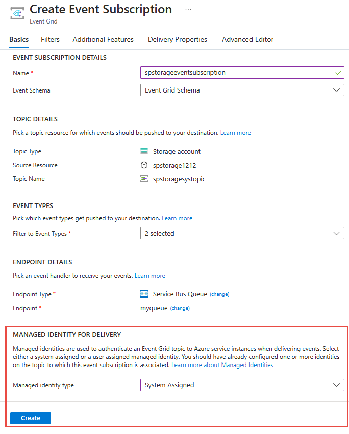
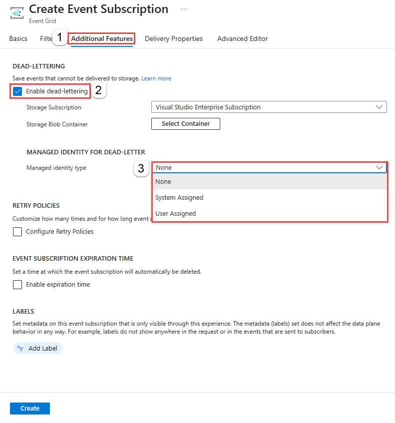
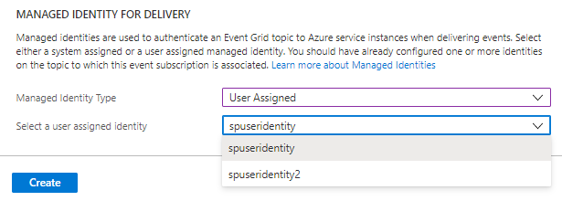

# Event delivery with a managed identity
This article describes how to use a [managed service identity](/entra/identity/managed-identities-azure-resources/overview) for an Azure event grid system topic, custom topic, or domain. Use it to forward events to supported destinations such as Service Bus queues and topics, event hubs, and storage accounts.


## Prerequisites
1. Assign a system-assigned identity or a user-assigned identity to a system topic, a custom topic, or a domain. 
    - For custom topics and domains, see [Enable managed identity for custom topics and domains](enable-identity-custom-topics-domains.md). 
    - For system topics, see [Enable managed identity for system topics](enable-identity-system-topics.md)
1. Add the identity to an appropriate role (for example, Service Bus Data Sender) on the destination (for example, a Service Bus queue). For detailed steps, see [Add identity to Azure roles on destinations](add-identity-roles.md)

    > [!NOTE]
    > Currently, it's not possible to deliver events using [private endpoints](../private-link/private-endpoint-overview.md). For more information, see the [Private endpoints](#private-endpoints) section at the end of this article. 

## Create event subscriptions that use an identity
After you have an event grid custom topic or system topic or domain with a system-managed identity and have added the identity to the appropriate role on the destination, you're ready to create subscriptions that use the identity. 

### Use the Azure portal
When you create an event subscription, you see an option to enable the use of a system-assigned identity or user-assigned identity for an endpoint in the **ENDPOINT DETAILS** section. 

Here's an example of enabling system-assigned identity while creating an event subscription with a Service Bus queue as a destination. 



You can also enable using a system-assigned identity to be used for dead-lettering on the **Additional Features** tab. 



You can also enable a managed identity on an event subscription after it's created. On the **Event Subscription** page for the event subscription, switch to the **Additional Features** tab to see the option. 


If you had enabled user-assigned identities for the topic, you will see user-assigned identity option enabled in the drop-down list for **Manged Identity Type**. If you select **User Assigned** for **Managed Identity Type**, you can then select the user-assigned identity that you want to use to deliver events. 




### Use the Azure CLI - Service Bus queue 
In this section, you learn how to use the Azure CLI to enable the use of a system-assigned identity to deliver events to a Service Bus queue. The identity must be a member of the **Azure Service Bus Data Sender** role. It must also be a member of the **Storage Blob Data Contributor** role on the storage account that's used for dead-lettering. 

#### Define variables
First, specify values for the following variables to be used in the CLI command. 

```azurecli-interactive
subid="<AZURE SUBSCRIPTION ID>"
rg = "<RESOURCE GROUP of EVENT GRID CUSTOM TOPIC>"
topicname = "<EVENT GRID TOPIC NAME>"

# get the service bus queue resource id
queueid=$(az servicebus queue show --namespace-name <SERVICE BUS NAMESPACE NAME> --name <QUEUE NAME> --resource-group <RESOURCE GROUP NAME> --query id --output tsv)
sb_esname = "<Specify a name for the event subscription>" 
```

#### Create an event subscription by using a managed identity for delivery 
This sample command creates an event subscription for an event grid custom topic with an endpoint type set to **Service Bus queue**. 

```azurecli-interactive
az eventgrid event-subscription create  
    --source-resource-id /subscriptions/$subid/resourceGroups/$rg/providers/Microsoft.EventGrid/topics/$topicname
    --delivery-identity-endpoint-type servicebusqueue  
    --delivery-identity systemassigned 
    --delivery-identity-endpoint $queueid
    -n $sb_esname 
```

#### Create an event subscription by using a managed identity for delivery and dead-lettering
This sample command creates an event subscription for an event grid custom topic with an endpoint type set to **Service Bus queue**. It also specifies that the system-managed identity is to be used for dead-lettering. 

```azurecli-interactive
storageid=$(az storage account show --name demoStorage --resource-group gridResourceGroup --query id --output tsv)
deadletterendpoint="$storageid/blobServices/default/containers/<BLOB CONTAINER NAME>"

az eventgrid event-subscription create  
    --source-resource-id /subscriptions/$subid/resourceGroups/$rg/providers/Microsoft.EventGrid/topics/$topicname 
    --delivery-identity-endpoint-type servicebusqueue
    --delivery-identity systemassigned 
    --delivery-identity-endpoint $queueid
    --deadletter-identity-endpoint $deadletterendpoint 
    --deadletter-identity systemassigned 
    -n $sb_esnameq 
```

### Use the Azure CLI - Event Hubs 
In this section, you learn how to use the Azure CLI to enable the use of a system-assigned identity to deliver events to an event hub. The identity must be a member of the **Azure Event Hubs Data Sender** role. It must also be a member of the **Storage Blob Data Contributor** role on the storage account that's used for dead-lettering. 

#### Define variables
```azurecli-interactive
subid="<AZURE SUBSCRIPTION ID>"
rg = "<RESOURCE GROUP of EVENT GRID CUSTOM TOPIC>"
topicname = "<EVENT GRID CUSTOM TOPIC NAME>"

hubid=$(az eventhubs eventhub show --name <EVENT HUB NAME> --namespace-name <NAMESPACE NAME> --resource-group <RESOURCE GROUP NAME> --query id --output tsv)
eh_esname = "<SPECIFY EVENT SUBSCRIPTION NAME>" 
```

#### Create an event subscription by using a managed identity for delivery 
This sample command creates an event subscription for an event grid custom topic with an endpoint type set to **Event Hubs**. 

```azurecli-interactive
az eventgrid event-subscription create  
    --source-resource-id /subscriptions/$subid/resourceGroups/$rg/providers/Microsoft.EventGrid/topics/$topicname 
    --delivery-identity-endpoint-type eventhub 
    --delivery-identity systemassigned 
    --delivery-identity-endpoint $hubid
    -n $sbq_esname 
```

#### Create an event subscription by using a managed identity for delivery + deadletter 
This sample command creates an event subscription for an event grid custom topic with an endpoint type set to **Event Hubs**. It also specifies that the system-managed identity is to be used for dead-lettering. 

```azurecli-interactive
storageid=$(az storage account show --name demoStorage --resource-group gridResourceGroup --query id --output tsv)
deadletterendpoint="$storageid/blobServices/default/containers/<BLOB CONTAINER NAME>"

az eventgrid event-subscription create
    --source-resource-id /subscriptions/$subid/resourceGroups/$rg/providers/Microsoft.EventGrid/topics/$topicname 
    --delivery-identity-endpoint-type servicebusqueue  
    --delivery-identity systemassigned 
    --delivery-identity-endpoint $hubid
    --deadletter-identity-endpoint $eh_deadletterendpoint
    --deadletter-identity systemassigned 
    -n $eh_esname 
```

### Use the Azure CLI - Azure Storage queue 
In this section, you learn how to use the Azure CLI to enable the use of a system-assigned identity to deliver events to an Azure Storage queue. The identity must be a member of the **Storage Queue Data Message Sender** role on the storage account. It must also be a member of the **Storage Blob Data Contributor** role on the storage account that's used for dead-lettering.

#### Define variables  

```azurecli-interactive
subid="<AZURE SUBSCRIPTION ID>"
rg = "<RESOURCE GROUP of EVENT GRID CUSTOM TOPIC>"
topicname = "<EVENT GRID CUSTOM TOPIC NAME>"

# get the storage account resource id
storageid=$(az storage account show --name <STORAGE ACCOUNT NAME> --resource-group <RESOURCE GROUP NAME> --query id --output tsv)

# build the resource id for the queue
queueid="$storageid/queueservices/default/queues/<QUEUE NAME>" 

sa_esname = "<SPECIFY EVENT SUBSCRIPTION NAME>" 
```

#### Create an event subscription by using a managed identity for delivery 

```azurecli-interactive
az eventgrid event-subscription create 
    --source-resource-id /subscriptions/$subid/resourceGroups/$rg/providers/Microsoft.EventGrid/topics/$topicname 
    --delivery-identity-endpoint-type storagequeue  
    --delivery-identity systemassigned 
    --delivery-identity-endpoint $queueid
    -n $sa_esname 
```

#### Create an event subscription by using a managed identity for delivery + deadletter 

```azurecli-interactive
storageid=$(az storage account show --name demoStorage --resource-group gridResourceGroup --query id --output tsv)
deadletterendpoint="$storageid/blobServices/default/containers/<BLOB CONTAINER NAME>"

az eventgrid event-subscription create  
    --source-resource-id /subscriptions/$subid/resourceGroups/$rg/providers/Microsoft.EventGrid/topics/$topicname 
    --delivery-identity-endpoint-type storagequeue  
    --delivery-identity systemassigned 
    --delivery-identity-endpoint $queueid
    --deadletter-identity-endpoint $deadletterendpoint 
    --deadletter-identity systemassigned 
    -n $sa_esname 
```

## Private endpoints
Currently, it's not possible to deliver events using [private endpoints](../private-link/private-endpoint-overview.md). That is, there is no support if you have strict network isolation requirements where your delivered events traffic must not leave the private IP space. 

However, if your requirements call for a secure way to send events using an encrypted channel and a known identity of the sender (in this case, Event Grid) using public IP space, you could deliver events to Event Hubs, Service Bus, or Azure Storage service using an Azure event grid custom topic or a domain with system-managed identity configured as shown in this article. Then, you can use a private link configured in Azure Functions or your webhook deployed on your virtual network to pull events. See the sample: [Connect to private endpoints with Azure Functions](/samples/azure-samples/azure-functions-private-endpoints/connect-to-private-endpoints-with-azure-functions/).

Under this configuration, the traffic goes over the public IP/internet from Event Grid to Event Hubs, Service Bus, or Azure Storage, but the channel can be encrypted and a managed identity of Event Grid is used. If you configure your Azure Functions or webhook deployed to your virtual network to use an Event Hubs, Service Bus, or Azure Storage via private link, that section of the traffic will evidently stay within Azure.


## Next steps
To learn about managed identities, see [What are managed identities for Azure resources](/entra/identity/managed-identities-azure-resources/overview).
