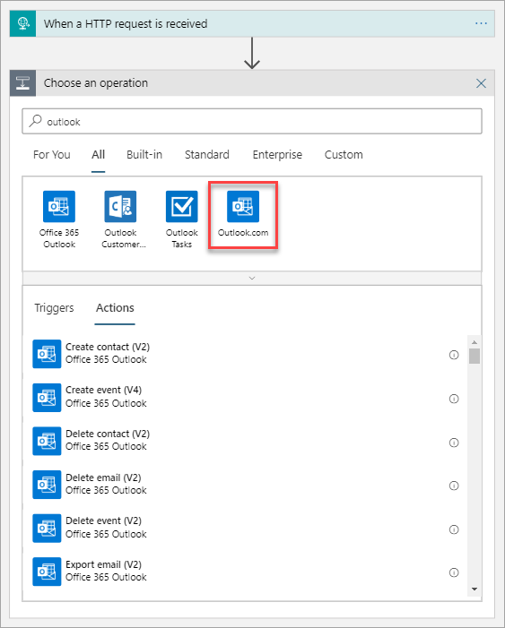
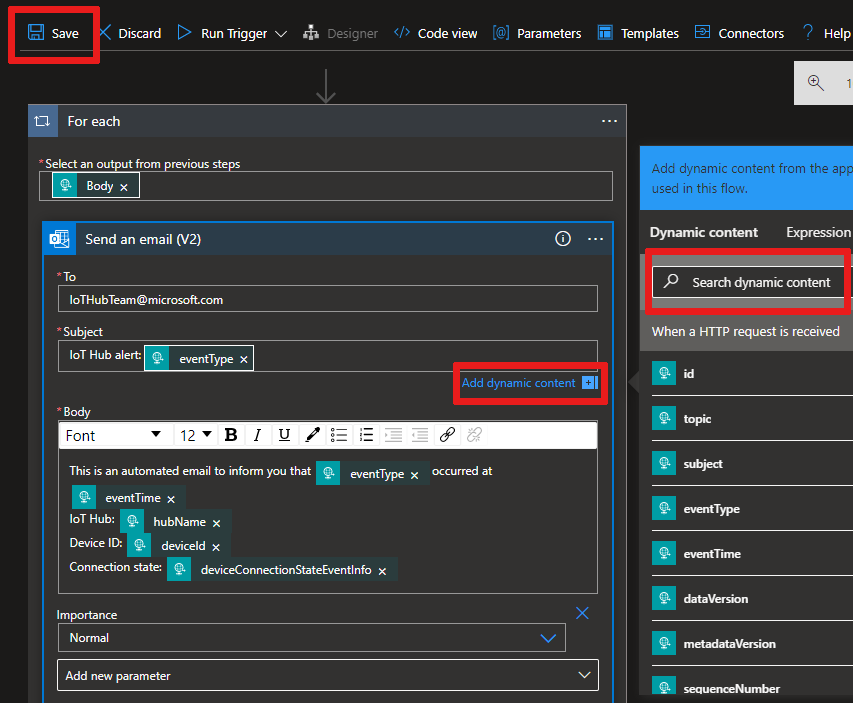

# Tutorial: Send email notifications about Azure IoT Hub events using Event Grid and Logic Apps

Azure Event Grid enables you to react to events in IoT Hub by triggering actions in your downstream business applications.

This article walks through a sample configuration that uses IoT Hub and Event Grid. At the end, you have an Azure logic app set up to send a notification email every time a device connects or disconnects to your IoT hub. Event Grid can be used to get timely notification about critical devices disconnecting. Metrics and Diagnostics can take several (i.e. 20 or more -- though we don't want to put a number on it) minutes to show up in logs/alerts. That might be unacceptable for critical infrastructure.

## Prerequisites

* An active Azure subscription. If you don't have a subscription, you can [create a free Azure account](https://azure.microsoft.com/pricing/free-trial/).

* An email account from any email provider that is supported by Azure Logic Apps, such as Office 365 Outlook or Outlook.com. This email account is used to send the event notifications. 

[!INCLUDE [cloud-shell-try-it.md](../../includes/cloud-shell-try-it.md)]

## Create an IoT hub

You can quickly create a new IoT hub using the Azure Cloud Shell terminal in the portal.

1. Sign in to the [Azure portal](https://portal.azure.com). 

1. On the upper right of the page, select the Cloud Shell button.

   

1. Run the following command to create a new resource group:

   ```azurecli
   az group create --name {your resource group name} --location westus
   ```
    
1. Run the following command to create an IoT hub:

   ```azurecli
   az iot hub create --name {your iot hub name} --resource-group {your resource group name} --sku S1 
   ```

1. Minimize the Cloud Shell terminal. You will return to the shell later in the tutorial.

## Create a logic app

Next, create a logic app and add an HTTP event grid trigger that processes requests from IoT hub. 

### Create a logic app resource

1. In the [Azure portal](https://portal.azure.com), select **Create a resource**, then type "logic app" in the search box and select return. Select **Logic App** from the results.

   

1. On the next screen, select **Create**. 

1. Give your logic app a name that's unique in your subscription, then select the same subscription, resource group, and location as your IoT hub. 

   

1. Select **Review + create**.

1. Verify your settings and then select **Create**.

1. Once the resource is created, select **Go to resource**. 

1. In the Logic Apps Designer, page down to see **Templates**. Choose **Blank Logic App** so that you can build your logic app from scratch.

### Select a trigger

A trigger is a specific event that starts your logic app. For this tutorial, the trigger that sets off the workflow is receiving a request over HTTP.  

1. In the connectors and triggers search bar, type **HTTP**.

1. Scroll through the results and select **Request - When an HTTP request is received** as the trigger. 

   

1. Select **Use sample payload to generate schema**. 

   

1. Paste the *Device connected event schema* JSON into the text box, then select **Done**:

   ```json
     [{  
      "id": "f6bbf8f4-d365-520d-a878-17bf7238abd8",
      "topic": "/SUBSCRIPTIONS/<subscription ID>/RESOURCEGROUPS/<resource group name>/PROVIDERS/MICROSOFT.DEVICES/IOTHUBS/<hub name>",
      "subject": "devices/LogicAppTestDevice",
      "eventType": "Microsoft.Devices.DeviceConnected",
      "eventTime": "2018-06-02T19:17:44.4383997Z",
      "data": {
          "deviceConnectionStateEventInfo": {
            "sequenceNumber":
              "000000000000000001D4132452F67CE200000002000000000000000000000001"
          },
        "hubName": "egtesthub1",
        "deviceId": "LogicAppTestDevice",
        "moduleId" : "DeviceModuleID"
      }, 
      "dataVersion": "1",
      "metadataVersion": "1"
    }]
   ```

   This event publishes when a device is connected to an IoT hub.

> [!NOTE]
> You may receive a pop-up notification that says, **Remember to include a Content-Type header set to application/json in your request.** You can safely ignore this suggestion, and move on to the next section. 

### Create an action

Actions are any steps that occur after the trigger starts the logic app workflow. For this tutorial, the action is to send an email notification from your email provider. 

1. Select **New step**. This opens a window to **Choose an action**.

1. Search for **Outlook**.

1. Based on your email provider, find and select the matching connector. This tutorial uses **Outlook.com**. The steps for other email providers are similar. 

   

1. Select the **Send an email (V2)** action. 

1. Select **Sign in** and sign in to your email account. Select **Yes** to let the app access your info.

1. Build your email template. 

   * **To**: Enter the email address to receive the notification emails. For this tutorial, use an email account that you can access for testing. 

   * **Subject**: Fill in the text for the subject. When you click on the Subject text box, you can select dynamic content to include. For example, this tutorial uses `IoT Hub alert: {eventType}`. If you can't see Dynamic content, select the **Add dynamic content** hyperlink -- this toggles it on and off.

   * **Body**: Write the text for your email. Select JSON properties from the selector tool to include dynamic content based on event data. If you can't see the Dynamic content, select the **Add dynamic content** hyperlink under the **Body** text box. If it doesn't show you the fields you want, click *more* in the Dynamic content screen to include the fields from the previous action.

   Your email template may look like this example:

   

1. Select **Save** in the Logic Apps Designer.  

### Copy the HTTP URL

Before you leave the Logic Apps Designer, copy the URL that your logic apps is listening to for a trigger. You use this URL to configure Event Grid. 

1. Expand the **When a HTTP request is received** trigger configuration box by clicking on it. 

1. Copy the value of **HTTP POST URL** by selecting the copy button next to it. 

   

1. Save this URL so that you can refer to it in the next section. 

## Configure subscription for IoT Hub events

In this section, you configure your IoT Hub to publish events as they occur. 

1. In the Azure portal, navigate to your IoT hub. You can do this by selecting **Resource groups**, then select the resource group for this tutorial, and then select your IoT hub from the list of resources.

1. Select **Events**.

   

1. Select **Event subscription**. 

   

1. Create the event subscription with the following values: 

   1. In the **EVENT SUBSCRIPTION DETAILS** section:
      1. Provide a **name** for the event subscription. 
      2. Select **Event Grid Schema** for **Event Schema**. 
   2. In the **TOPIC DETAILS** section:
      1. Confirm that the **Topic type** is set to **IoT Hub**. 
      2. Confirm that the name of the IoT hub is set as the value for the **Source Resource** field. 
      3. Enter a name for the **system topic** that will be created for you. To learn about system topics, see [Overview of system topics](system-topics.md).
   3. In the **EVENT TYPES** section:
      1. Select the **Filter to Event Types** drop-down.
      1. Deselect  the **Device Created** and **Device Deleted** checkboxes, leaving only the **Device Connected** and **Device Disconnected** checkboxes selected.

         
   
   4. In the **ENDPOINT DETAILS** section: 
       1. Select **Endpoint Type** as **Web Hook**.
       2. Click **select an endpoint**, paste the URL that you copied from your logic app, and confirm selection.

         

         When you're done, the pane should look like the following example: 

         

1.  Select **Create**.

## Simulate a new device connecting and sending telemetry

Test your logic app by quickly simulating a device connection using the Azure CLI. 

1. Select the Cloud Shell button to re-open your terminal.

1. Run the following command to create a simulated device identity:
    
     ```azurecli 
    az iot hub device-identity create --device-id simDevice --hub-name {YourIoTHubName}
    ```

1. Run the following command to simulate connecting your device to IoT Hub and sending telemetry:

    ```azurecli
    az iot device simulate -d simDevice -n {YourIoTHubName}
    ```

1. When the simulated device connects to IoT Hub, you will receive an email notifying you of a "DeviceConnected" event.

1. When the simulation completes, you will receive an email notifying you of a "DeviceDisconnected" event. 

    

## Clean up resources

This tutorial used resources that incur charges on your Azure subscription. When you're finished trying out the tutorial and testing your results, disable or delete resources that you don't want to keep. 

To delete all of the resources created in this tutorial, delete the resource group. 

1. Select **Resource groups**, then select the resource group you created for this tutorial.

2. On the Resource group pane, select **Delete resource group**. You are prompted to enter the resource group name, and then you can delete it. All of the resources contained therein are also removed.

## Next steps

* Learn more about [Reacting to IoT Hub events by using Event Grid to trigger actions](../iot-hub/iot-hub-event-grid.md).
* [Learn how to order device connected and disconnected events](../iot-hub/iot-hub-how-to-order-connection-state-events.md)
* Learn about what else you can do with [Event Grid](overview.md).

For a complete list of supported Logic App connectors, see the 

> [!div class="nextstepaction"]
> [Connectors overview](/connectors/).