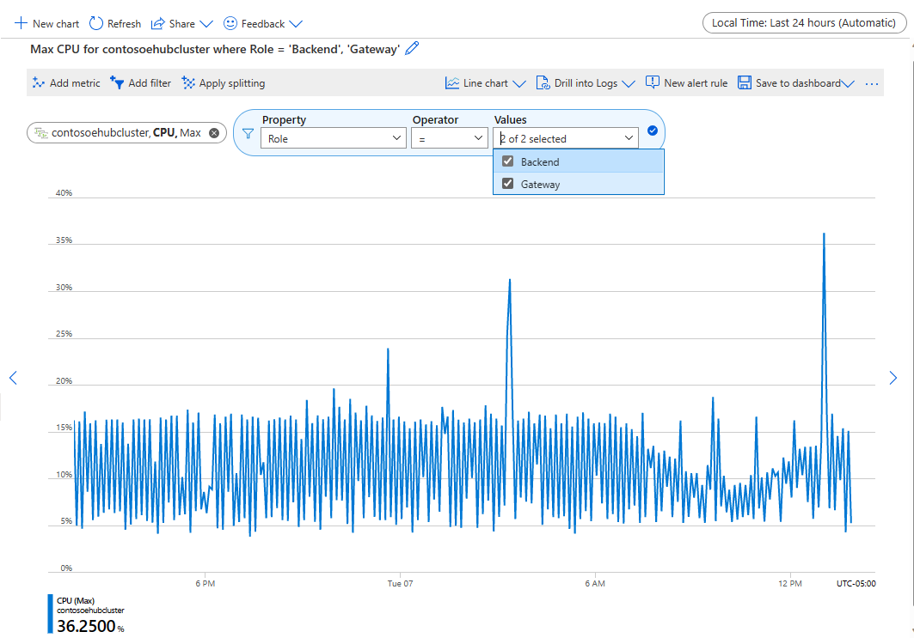

### What can I achieve with a cluster?

For an Event Hubs cluster, how much you can ingest and stream depends on various factors such as your producers, consumers, the rate at which you're ingesting and processing, and much more. 

The following table shows the benchmark results that we achieved during our testing:

| Payload shape | Receivers | Ingress bandwidth| Ingress messages | Egress bandwidth | Egress messages | Total TUs | TUs per CU |
| ------------- | --------- | ---------------- | ------------------ | ----------------- | ------------------- | --------- | ---------- |
| Batches of 100x1KB | 2 | 400 MB/sec | 400k messages/sec | 800 MB/sec | 800k messages/sec | 400 TUs | 100 TUs | 
| Batches of 10x10KB | 2 | 666 MB/sec | 66.6k messages/sec | 1.33 GB/sec | 133k messages/sec | 666 TUs | 166 TUs |
| Batches of 6x32KB | 1 | 1.05 GB/sec | 34k messages / sec | 1.05 GB/sec | 34k messages/sec | 1000 TUs | 250 TUs |

In the testing, the following criteria was used:

- A dedicated-tier Event Hubs cluster with four capacity units (CUs) was used. 
- The event hub used for ingestion had 200 partitions. 
- The data that was ingested was received by two receiver applications receiving from all partitions.

### Can I scale up/down my cluster?

After creation, clusters are billed for a minimum of 4 hours of usage. In the Preview release of the self-serve experience, you can submit a [support request](https://portal.azure.com/#create/Microsoft.Support) to the Event Hubs team under **Technical** > **Quota** > **Request to Scale Up or Scale Down Dedicated Cluster** to scale your cluster up or down. It may take up to 7 days to complete the request to scale down your cluster. 

### When to scale my dedicated cluster? 

As scaling the dedicated clusters requires submitting a support request, it's important to determine when to scale up your dedicated cluster proactively. 

CPU consumption is the key indicator of the resource consumption of your dedicated cluster. When the overall CPU consumption is reaching 70% (without observing any abnormal conditions such as high number of server errors or low successful requests), that means your cluster is moving towards its maximum capacity.  Therefore you can use this as an indicator to consider whether you need to scale up your dedicated cluster or not.

To monitor the CPU usage of the dedicated cluster you need to follow these steps. 
- In the metrics blade of your Event Hubs Dedicated cluster, add a new metric in the Event Hubs as shown below. 

- Select `CPU` as the metrics and use the `Max` as the aggregation. 
- Then add a filter for the property type `Role`, use the equal operator and select all three values(`SBSAdmin`, `SBSFE`, `SBSEH`) from the dropdown.  

Then you can monitor this metic to determine when you should scale your dedicated cluster. 
You can also set up [alerts](../azure-monitor/alerts/alerts-overview.md) against this metric to get notified when CPU usage reaches the thresholds you set.  

### How does Geo-DR work with my cluster?

You can geo-pair a namespace under a Dedicated-tier cluster with another namespace under a Dedicated-tier cluster. We don't encourage pairing a dedicated-tier namespace with a namespace in our standard offering because the throughput limit will be incompatible and result in errors. 

### Can I migrate my Standard namespaces to belong to a Dedicated-tier cluster?
We don't currently support an automated migration process for migrating your event hubs data from a Standard namespace to a Dedicated one. 
