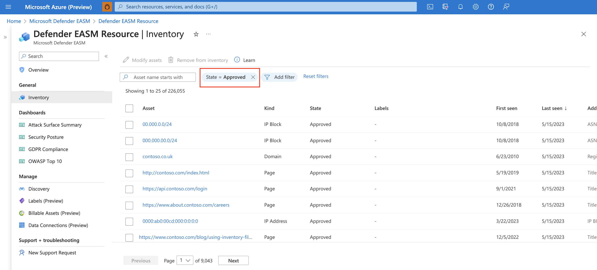
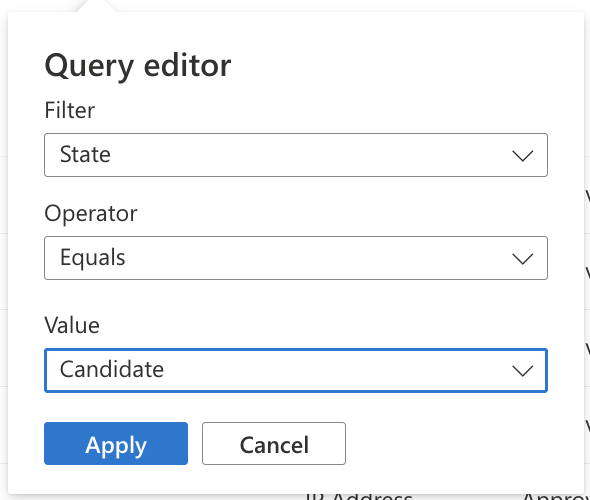
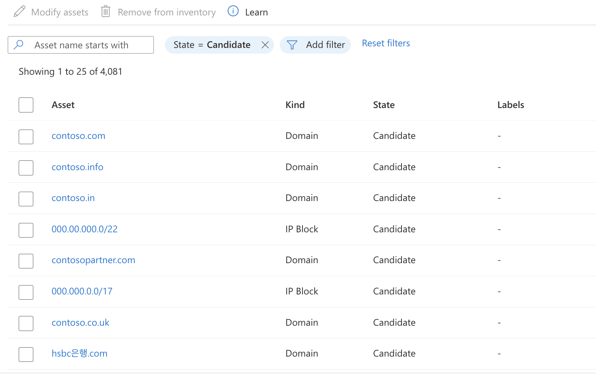

# Defender EASM inventory filters overview

This article outlines the filter functionality available in Microsoft Defender External Attack Surface Management (Defender EASM), helping users surface specific subsets of inventory assets based on selected parameters.  This documentation section outlines each filter and operator and provides guidance on input options that yield the best results.  

## How it works 

Inventory filters allow users to access a specific subset of data that meets their search parameters. A user can apply as many filters as they need to obtain the desired results.  

By default, the Inventory screen displays only Approved Inventory assets, hiding any assets in an alternative state. This filter can be removed if a user wishes to view assets in a different state (for instance: Candidate, Dependency, Requires Investigation). Removing the Approved Inventory filter is useful when a user needs to review potential new assets, investigate a third-party dependency issue or simply needs a complete view of all potential owned assets when conducting a search.  

Defender EASM offers a wide variety of filters to obtain results of differing levels of granularity.  Some filters allow you to select value options from a dropdown, whereas others require the manual entry of the desired value.  

## Operators

Inventory filters can be used with the following operators. Some operators are not available for every filter; some operators are hidden if they are not logically applicable to the specific filter. 

|       Operator                 |                                                                                                                               Description                                                                                                                           |
|--------------------------------|:------------------------------------------------------------------------------------------------------------------------------------------------------------------------------------------------------------------------------------------------------------------- |
|     `Equals`                     |   Returns results that exactly match the search value.  This filter only returns results for one value at a time. For filters that populate a drop-down list of options, only one option can be selected at a time. To select multiple values, see “in” operator.   |
|     `Not Equals`                 |   Returns results where the field does not exactly match the search value.                                                                                                                                                                                          |
|     `Starts with`                |   Returns results where the field starts with the search value.                                                                                                                                                                                                     |
|     `Does not start with`        |   Returns results where the field does not start with the search value.                                                                                                                                                                                             |
|     `Matches`                    |   Returns results where a tokenized term in the field exactly matches the search value.                                                                                                                                                                             |
|     `Does not match`             |   Returns results where a tokenized term in the field does not exactly matches the search value.                                                                                                                                                                    |
|     `In`                         |   Returns results where the field exactly matches one of the search values. For drop-down lists, multiple options can be selected.                                                                                                                                  |
|     `Not In`                     |   Returns results where the field does not exactly match any of the search values. Multiple options can be selected, and manually inputted fields exclude results that match an exact value.                                                                   |
|     `Starts with in`             |   Returns results where the field starts with one of the search values.                                                                                                                                                                                             |
|     `Does not start with in`     |   Returns results where the field does not start with any of the search values.                                                                                                                                                                                     |
|     `Matches in`                 |   Returns results where a tokenized term in the field exactly matches one of the search values.                                                                                                                                                                     |
|     `Does not match in`          |   Returns results where a tokenized term in the field does not exactly match any of the search values.                                                                                                                                                              |
|      `Contains`                   |   Returns results where the field content contains the search value.                                                                                                                                                                                                |
|     `Does Not Contain`           |   Returns results where the field content does not contain the search value.                                                                                                                                                                                        |
|     `Contains in`                |   Returns results where the field content contains one of the search values.                                                                                                                                                                                        |
|     `Does Not Contain In`        |   Returns results where a tokenized term in the field content does not contain any of the search values.                                                                                                                                                        |
|     `Empty`                      |   Returns assets that do not return any value for the specified filter.                                                                                                                                                                                             |
|     `Not Empty`                  |   Returns all assets that return a value for the specified filter, regardless of the value.                                                                                                                                                                         |
|     `Greater Than or Equal To`   |   Returns results that are greater than or equal to a numerical value. This includes dates.                                                                                                                                                                         |
|     `Between`                    |   Returns results within a numerical range. This includes date ranges.                                                                                                                                                                                              |

## Common filters

These filters apply to all kinds of assets within inventory. These filters can be used when searching for a wider range of assets.  For a list of filters for specific kinds of assets, see the “Next steps” section.  

 ### Defined value filters 
 The following filters provide a drop-down list of options to select. The available values are pre-defined.  

 |       Filter name           |     Description                                                                                                               |     Selectable values                                                     |     Available operators                                      |
|-----------------------------|-------------------------------------------------------------------------------------------------------------------------------|---------------------------------------------------------------------------|--------------------------------------------------------------|
|     Kind                    |   Filters by specific web property types that comprise your inventory.                                                        |   ASN, Contact, Domain, Host, IP Address, IP Block, Page, SSL Cert        |   `Equals` `Not Equals` `In` `Not In` `Empty` `Not Empty`           |
|     State                   |   The state assigned to assets to distinguish their relevance to your organization and how Defender EASM monitors them.       |   Approved, Candidate, Dependency, Monitor only, Requires investigation   |                                                              |
|     Removed from Inventory  |   The method with which an asset was removed from inventory.                                                                  |   Archived, Dismissed                                                     |                                                              |
|     Created At              |   Filters by the date that an asset was created in your inventory.                                                            |   Date range via calendar dropdown                                        |   `Greater Than or Equal To` `Less Than or Equal To` `Between`   |
|     First Seen              |   Filters by the date that an asset was first observed by the Defender EASM detection system.    | Date range via calendar dropdown |                             |                                                                           |                                                              |
|     Last Seen               |   Filters by the date that an asset was last observed by the Defender EASM detection system.     | Date range via calendar dropdown                              |                                                                           |                                                              |
|     Labels               |   Filters for labels manually applied to inventory assets.                  |    Accepts free-form responses, but also offers a dropdown of labels available in your Defender EASM resource.                                                           |
|     Updated At              |   Filters by the date that asset data was last updated in inventory.        | Date range via calendar dropdown                                                  |                                                                           |                                                              |
|     Wildcard                |   A wildcard DNS record answers DNS requests for subdomains that have not already been defined. For example:  *.contoso.com   |   True, False                                                             |   `Equals` `Not Equals`                                         |

### Free form filters 

The following filters require that the user manually enters the value with which they want to search. Many of these values are case-sensitive.  

|       Filter name  |     Description                                                      |     Value format                                                                                                                                           |     Applicable operators                                                                                                                                                                                                                            |
|--------------------|----------------------------------------------------------------------|------------------------------------------------------------------------------------------------------------------------------------------------------------|-----------------------------------------------------------------------------------------------------------------------------------------------------------------------------------------------------------------------------------------------------|
|     UUID           |   The universally unique identifier assigned to a particular asset.  |   acabe677-f0c6-4807-ab4e-3a59d9e66b22                                                                                                                     |   `Equals` `Not Equals` `In` `Not In`                                                                                                                                                                                                                    |
|     Name           |   The name of an asset.                                              |   Must align to the format of the asset name as listed in Inventory. For instance, a host would appear as “mail.contoso.com” or an IP as “192.168.92.73”.  |   `Equals` `Not Equals` `Starts with` `Does not start with` `In` `Not In` `Starts with in` `Does not start with in`                                                                                                                                          |
|     External ID    |   An identifier provided by a third party.                           |   Typically a numerical value.                                                                                                                             |   `Equals` `Not Equals` `Starts with` `Does not start with` `Matches` `Does not match` `In` `Not In` `Starts with in` `Does not start with in` `Matches in` `Does not match in` `Contains` `Does Not Contain` `Contains In` `Does Not Contain In` `Empty` `Not Empty`  |

## Filtering for assets outside of your approved inventory 

By default, the inventory list view only displays assets in the "Approved Inventory" state. However, you can remove this default filter to discover assets that are not a part of your inventory, and can apply additional filters to uncover specific unapproved assets of interest. This feature is useful when you want to add a specific asset to your inventory without using it as a discovery seed, or when you need to unearth assets that have been dismissed or placed in another asset state. 

1. Select **Inventory** on the left-hand navigation bar to view your inventory. 

2. To remove the Approved Inventory filter, select the "X" next to the **State = Approved** filter. This will expand your inventory list to include assets in other states (e.g. Dismissed). 

3.  Identify the asset(s) you'd want to find and how to best surface them using the inventory filters. You may wish to review all assets in the "Candidate" state, adding any assets within your organization's purview to "Approved Inventory". 

4. Instead, you may need to find a single specific asset that you wish to add to Approved Inventory. To discover a specific asset, apply a filter searching for the name. 

4. Once your inventory list contains the unapproved assets that you were searching for, you can modify the assets. For more information on updating assets, see the [Modifying inventory assets](https://learn.microsoft.com/azure/external-attack-surface-management/labeling-inventory-assets) article. 

## Next Steps 

[Understanding asset details](understanding-asset-details.md)
