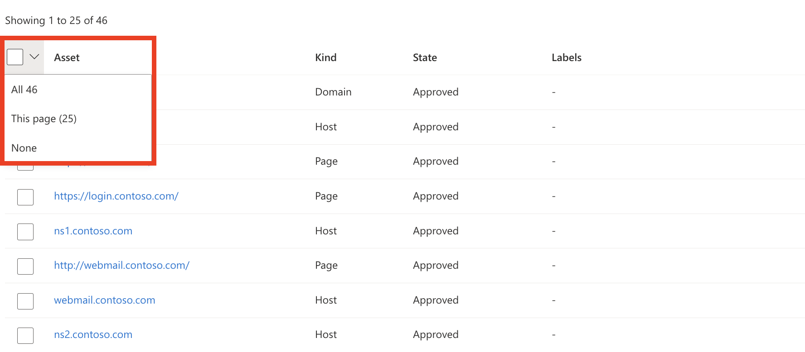
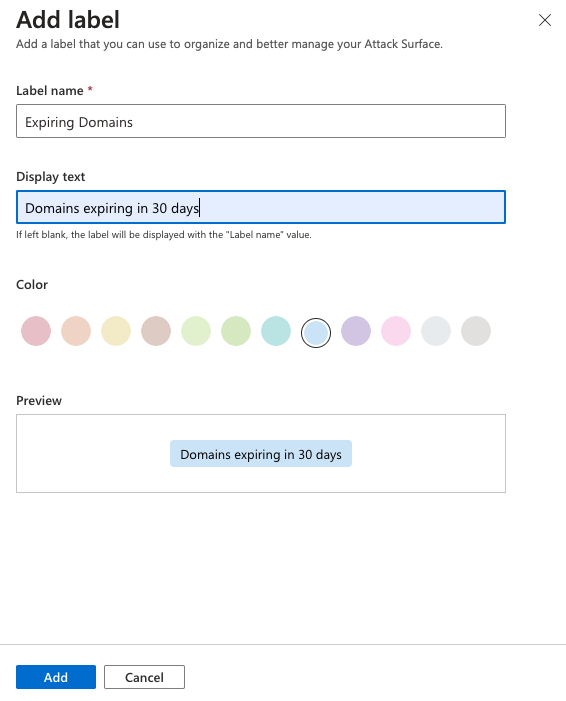
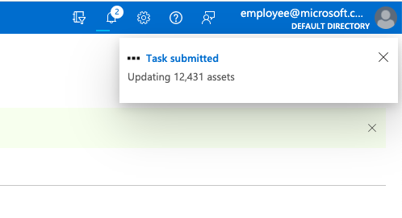
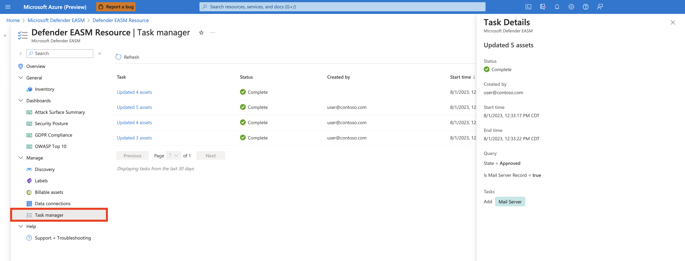

# Modify inventory assets

This article outlines how to modify inventory assets. You can change the state of an asset or apply labels to help apply context and use inventory data. This article describes how to modify a single asset or multiple assets and track any updates with the Task Manager.

## Label assets

Labels help you organize your attack surface and apply business context in a customizable way. You can apply any text label to a subset of assets to group assets and make better use of your inventory. Customers commonly categorize assets that:  

- Have recently come under your organization's ownership through a merger or acquisition.
- Require compliance monitoring.
- Are owned by a specific business unit in their organization.
- Are affected by a specific vulnerability that requires mitigation.
- Relate to a particular brand owned by the organization.
- Were added to your inventory within a specific time range.

Labels are freeform text fields, so you can create a label for any use case that applies to your organization.

## Apply labels and modify asset states

You can apply labels or modify asset states from both the inventory list and asset details pages. You can make changes to a single asset from the asset details page, or multiple assets from the inventory list page. The following sections describe how to apply changes from the two inventory views depending on your use case.

### Inventory list page  

You should modify assets from the inventory list page if you want to update numerous assets at once. This process also allows you to refine your asset list based on filter parameters, helping you identify assets that should be categorized with the desired label or state change. To modify assets from this page:  

1. On the pane on the left of your Defender EASM resource, select **Inventory**.  

1. Apply filters to produce your intended results. In this example, we're looking for domains expiring within 30 days that require renewal. The applied label helps you more quickly access any expiring domains to simplify the remediation process. You can apply as many filters as necessary to obtain the specific results that are needed. For more information on filters, see [Inventory filters overview](inventory-filters.md).

   

1. After your inventory list is filtered, select the dropdown by checkbox next to the **Asset** table header. This dropdown gives you the option to select all results that match your query, the results on that specific page (up to 25), or "none" which clears all assets. You can also choose to select only specific results on the page by selecting the individual check marks next to each asset.

   

1. Select **Modify assets**.

1. This action opens a new **Modify Assets** pane on the right side of your screen. From this screen, you can quickly change the state of the selected assets. For this example, we'll create a new label. Select **Create a new label**.

1. Determine the label name and display text values. The label name cannot be changed after you initially create the label, but the display text can be edited at a later time. The label name is used to query for the label in the product interface or via API, so edits are disabled to ensure these queries work properly. To edit a label name, you need to delete the original label and create a new one.  

   Select a color for your new label and select **Add**. This action takes you back to the **Modify Assets** screen.

   

1. Apply your new label to the assets. Click inside the **Add labels** text box to view a full list of available labels. Or you can type inside the box to search by keyword. After you select the labels you want to apply, select **Update**.

   

1. Allow a few moments for the labels to be applied. You will immediately see a notification that confirms the update is in progress. Once complete, you'll see a "Completed" notification The page automatically refreshes and displays your asset list with the labels visible. A banner at the top of the screen confirms that your labels were applied.  

   

### Asset details page

You can also modify a single asset from the asset details page. This option is ideal for situations when assets need to be thoroughly reviewed before a label or state change is applied.  

1. On the pane on the left of your Defender EASM resource, select **Inventory**.

1. Select the specific asset you want to modify to open the asset details page.

1. On this page, select **Modify asset**.

   

1. Follow steps 5 to 7 as listed in the "Inventory list page" section.  

1. The asset details page refreshes and displays the newly applied label or state change and a banner that indicates the asset was successfully updated.  

## Modify, remove, or delete labels

Users can remove a label from an asset by accessing the same **Modify asset** pane from either the inventory list or asset details view. From the Inventory list view, you can select multiple assets at once and then add or remove the desired label in one action.  

To modify the label itself or delete a label from the system, access the main Labels management page.  

1. On the pane on the left of your Defender EASM resource, select **Labels (Preview)**.

   

   This page displays all the labels within your Defender EASM inventory. Labels on this page might exist in the system but not be actively applied to any assets. You can also add new labels from this page.  

1. To edit a label, select the pencil icon in the **Actions** column of the label you want to edit.  This action opens the pane on the right that allows you to modify the name or color of a label. Once done, select **Update**.  

1. To remove a label, select the trash can icon from the **Actions** column of the label you want to delete. You're asked to confirm the removal of this label. Select **Remove Label**.  

   

The **Labels** page automatically refreshes. The label is removed from the list and also removed from any assets that had the label applied. A banner appears to confirm the removal.

## Task manager and notifications

After a task is submitted, a notification confirms that the update is in progress. From any page in Azure, select the notification (bell) icon to see more information about recent tasks.

The Defender EASM system can take seconds to update a handful of assets or minutes to update thousands. You can use the Task Manager to check on the status of any modification tasks in progress. This section outlines how to access the Task Manager and use it to better understand the completion of submitted updates.

1. On the pane on the left of your Defender EASM resource, select **Task Manager**.

   

1. This page displays all your recent tasks and their status. Tasks are listed as **Completed**, **Failed**, or **In Progress**. A completion percentage and progress bar also appears. To see more details about a specific task, select the task name. A pane opens on the right that provides more information.

1. Select **Refresh** to see the latest status of all items in the Task Manager.

## Filter for labels

After you've labeled assets in your inventory, you can use inventory filters to retrieve a list of all assets with a specific label applied.  

1. On the pane on the left of your Defender EASM resource, select **Inventory**.  

1. Select **Add filter**.  

1. Select **Labels** from the Common filter section. Select an operator and choose a label from the dropdown list of options. The following example is searching for a single label, but you can use the **In** operator to search for multiple labels. For more information on filters, see the [Inventory filters overview](inventory-filters.md).

   

1. Select **Apply**. The Inventory list page reloads and displays all assets that match your criteria.  

## Next steps  

- [Inventory filters overview](inventory-filters.md)
- [Understanding inventory assets](understanding-inventory-assets.md)
- [Understanding asset details](understanding-asset-details.md)