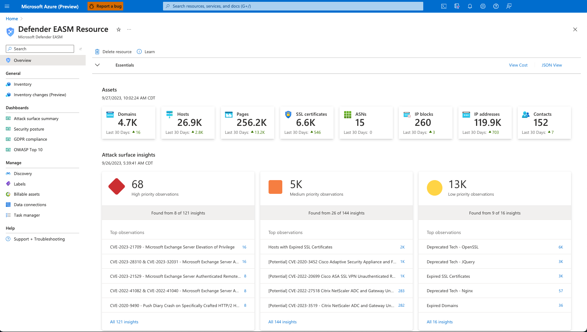
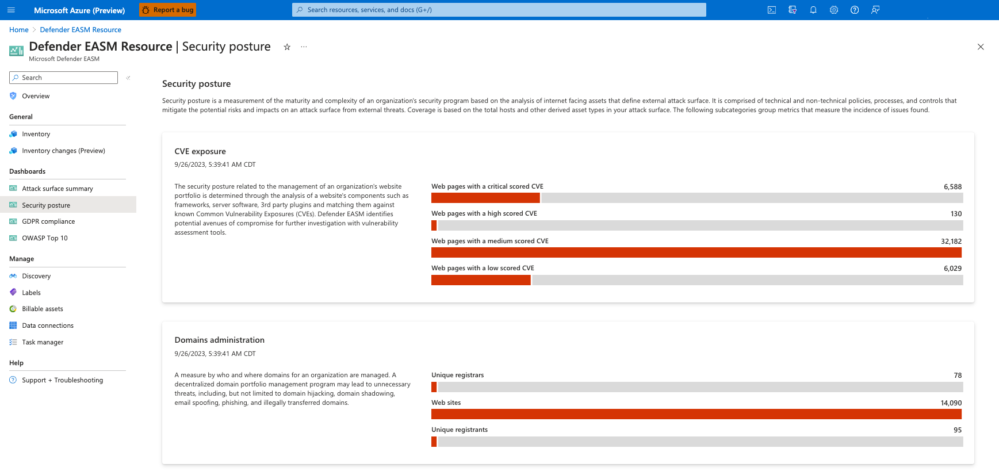
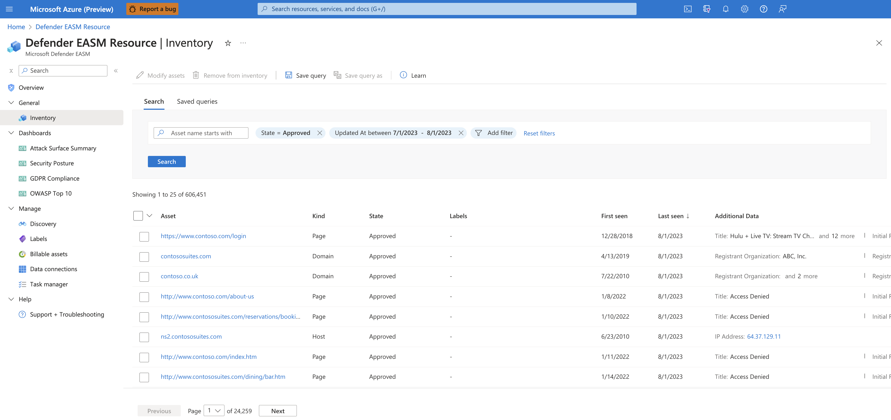

# Defender EASM Overview

*Microsoft Defender External Attack Surface Management (Defender EASM)* continuously discovers and maps your digital attack surface to provide an external view of your online infrastructure. This visibility enables security and IT teams to identify unknowns, prioritize risk, eliminate threats, and extend vulnerability and exposure control beyond the firewall. Attack Surface Insights are generated by leveraging vulnerability and infrastructure data to showcase the key areas of concern for your organization.

## Discovery and inventory

Microsoft's proprietary discovery technology recursively searches for infrastructure with observed connections to known legitimate assets to make inferences about that infrastructure's relationship to the organization and uncover previously unknown and unmonitored properties. These known legitimate assets are called discovery “seeds”; Defender EASM first discovers strong connections to these selected entities, recursing to unveil more connections and ultimately compile your Attack Surface.

Defender EASM includes the discovery of the following kinds of assets:

- Domains
- Hostnames
- Web Pages
- IP Blocks
- IP Addresses
- ASNs
- SSL Certificates
- WHOIS Contacts

Discovered assets are indexed and classified in your Defender EASM Inventory, providing a dynamic record of all web infrastructure under the organization's management. Assets are categorized as recent (currently active) or historic, and can include web applications, third party dependencies, and other asset connections.

## Dashboards

Defender EASM provides a series of dashboards that help users quickly understand their online infrastructure and any key risks to their organization. These dashboards are designed to provide insight on specific areas of risk, including vulnerabilities, compliance, and security hygiene. These insights help customers quickly address the components of their attack surface that pose the greatest risk to their organization.

## Managing assets

Customers can filter their inventory to surface the specific insights they care about most. Filtering offers a level of flexibility and customization that enables users to access a specific subset of assets. This allows you to leverage Defender EASM data according to your specific use case, whether searching for assets that connect to deprecating infrastructure or identifying new cloud resources.

## User permissions 

Users that have been assigned either Owner or Contributor roles can create, delete, and edit Defender EASM resources and the inventory assets within it. These roles can utilize all capabilities offered in the platform. Users that have been assigned the Reader role are able to view Defender EASM data, but are unable to create, delete or edit inventory assets or the resource itself.  

## Data residency, availability and privacy

Microsoft Defender External Attack Surface Management contains both global data and customer-specific data. The underlying internet data is global Microsoft data; labels applied by customers are considered customer data. All customer data is stored in the region of the customer’s choosing.

For security purposes, Microsoft collects users' IP addresses when they log in. This data is stored for up to 30 days but may be stored longer if needed to investigate potential fraudulent or malicious use of the product.

In the case of a region down scenario, only the customers in the affected region will experience downtime.

The Microsoft compliance framework requires that all customer data be deleted within 180 days of that organization no longer being a customer of Microsoft.  This also includes storage of customer data in offline locations, such as database backups. Once a resource is deleted, it cannot be restored by our teams.  The customer data will be retained in our data stores for 75 days, however the actual resource cannot be restored.  After the 75 day period, customer data will be permanently deleted.  

## Next Steps

- [Deploying the EASM Azure resource](deploying-the-defender-easm-azure-resource.md)
- [Understanding inventory assets](understanding-inventory-assets.md)
- [What is discovery?](what-is-discovery.md)
