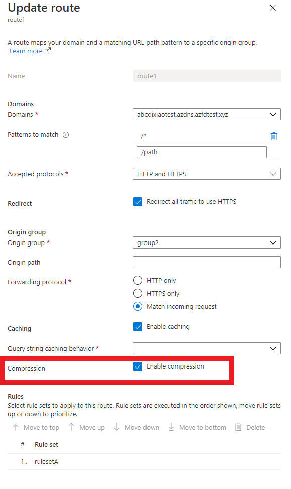

# Troubleshooting Azure Front Door Standard/Premium file compression

> [!Note]
> This documentation is for Azure Front Door Standard/Premium (Preview). Looking for information on Azure Front Door? View [here](../front-door-overview.md).

This article helps you troubleshoot issues when using Azure Front Door Standard/Premium file compression.

> [!IMPORTANT]
> Azure Front Door Standard/Premium (Preview) is currently in public preview.
> This preview version is provided without a service level agreement, and it's not recommended for production workloads. Certain features might not be supported or might have constrained capabilities.
> For more information, see [Supplemental Terms of Use for Microsoft Azure Previews](https://azure.microsoft.com/support/legal/preview-supplemental-terms/).

## Symptom

Compression for your route is enabled, but files are being returned uncompressed.

> [!TIP]
> To check whether your files are being returned compressed, you need to use a tool like [Fiddler](https://www.telerik.com/fiddler) or your browser's [developer tools](https://developer.microsoft.com/microsoft-edge/platform/documentation/f12-devtools-guide/).  Check the HTTP response headers returned with your cached CDN content.  If there is a header named `Content-Encoding` with a value of **gzip**, **bzip2**, or **deflate**, your content is compressed.
> 
> 
> 

## Cause

There are several possible causes, including:

* The requested content isn't eligible for compression.
* Compression isn't enabled for the requested file type.
* The HTTP request didn't include a header requesting a valid compression type.
* Origin is sending chunked content.

## Troubleshooting steps

> [!TIP]
> As with deploying new endpoints, AFD configuration changes take some time to propagate through the network.  Usually, changes are applied within 90 minutes.  If this is the first time you've set up compression for your CDN endpoint, you should consider waiting 1-2 hours to be sure the compression settings have propagated to the POPs. 
> 

### Verify the request

First, we should double check on the request. You can use your browser's **[developer tools](https://developer.microsoft.com/microsoft-edge/platform/documentation/f12-devtools-guide/)** to view the requests being made.

* Verify the request is being sent to your endpoint URL,`<endpointname>.z01.azurefd.net`, and not your origin.
* Verify the request contains an **Accept-Encoding** header, and the value for that header contains **gzip**, **deflate**, or **bzip2**.

### Verify compression settings

Navigate to your endpoint in the [Azure portal](https://portal.azure.com) and select the **Configure** button in the Routes panel. Verify compression is **enabled**.

### Check the request at the origin server for a **Via** header

The **Via** HTTP header indicates to the web server that the request is being passed by a proxy server.  Microsoft IIS web servers by default don't compress responses when the request contains a **Via** header.  To override this behavior, do the following:

* **IIS 6**: Set HcNoCompressionForProxies="FALSE" in the IIS Metabase properties. For for information, see [IIS 6 Compression](/previous-versions/iis/6.0-sdk/ms525390(v=vs.90)).
* **IIS 7 and up**: Set both **noCompressionForHttp10** and **noCompressionForProxies** to *False* in the server configuration. For more information, see, [HTTP Compression](https://www.iis.net/configreference/system.webserver/httpcompression).
