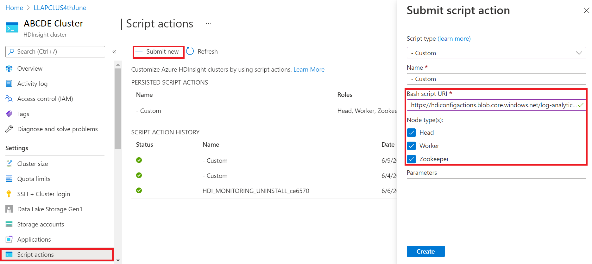

# Azure HDInsight release notes

This article provides information about the **most recent** Azure HDInsight release updates. For information on earlier releases, see [HDInsight Release Notes Archive](hdinsight-release-notes-archive.md).

## Summary

Azure HDInsight is one of the most popular services among enterprise customers for open-source analytics on Azure.
If you would like to subscribe on release notes, watch releases on [this GitHub repository](https://github.com/hdinsight/release-notes/releases).

## Release date: 07/28/2022

This release applies to HDInsight 4.0.  HDInsight release is made available to all regions over several days.

HDInsight uses safe deployment practices which involve gradual region deployment. It may take up to ten business days for a new release or a new version to be available in all regions.


 
## New Feature

**Attach external disks in HDI Hadoop/Spark clusters.**

HDInsight cluster comes with pre-defined disk space based on SKU. This space may not be sufficient in large job scenarios. 

This  new feature allows to add more disks in cluster which will be used as node manager local directory. Add number of disks to worker nodes during HIVE and Spark cluster creation, while the  selected disks will be part of node manager’s local directories.

> [!NOTE]
> The added disks are only configured for node manager local directories.
> 

For more details [see here](/azure/hdinsight/hdinsight-hadoop-provision-linux-clusters#configuration--pricing )

 
## Fixed

#### **Log analytics**

Log Analytics integrated with Azure HDInsight running OMS version 13 requires an upgrade to OMS version 14 to apply the latest security updates.
Customers using older version of cluster with OMS version 13 need to install OMS version 14 to meet the security requirements. (How to check current version & Install 14) 

**How to check your current OMS version**

1. Login to the cluster using SSH.
1. Run the following command in your SSH Client.

```
sudo /opt/omi/bin/ominiserver/ --version
```


**How to upgrade your OMS version from 13 to 14**



1. Login to the [Azure Portal](https://portal.azure.com/) 
1. From the resource group select the HDInsight cluster resource 
1. Click **Script actions** 
1. From **Submit script action** panel, choose **Script type** as custom 
1. Paste the following link in the Bash script URL box
https://hdiconfigactions.blob.core.windows.net/log-analytics-patch/OMSUPGRADE14.1/omsagent-vulnerability-fix-1.14.12-0.sh 
3. Select **Node type(s)**
4. Click **Create** 
5. Verify the successful installation of the patch using the following steps:  

  1. Login to the cluster using SSH.
  1. Run the following command in your SSH Client.

  ```
  sudo /opt/omi/bin/ominiserver/ --version
  ```

### Other bug fixes
1. Yarn log’s CLI failed to retrieve the logs if any TFile is corrupt or empty. 
2. Resolved invalid service principal details error while getting the OAuth token from Azure Active Directory.
3. Improved cluster creation reliability when 100+ worked nodes are configured.

### Open source bug fixes

#### TEZ bug fixes

|Bug Fixes|Apache JIRA|
|---|---|
|Upgrade protobuf dependency to 3.x|[TEZ-4363](https://issues.apache.org/jira/browse/TEZ-4363)|
|Upgrade async from 2.3.0 to 2.6.4 to fix the vulnerability|[TEZ-4422](https://issues.apache.org/jira/browse/TEZ-4422)|
|Upgrade minimist version from 0.0.8 to 1.2.6 to fix the vulnerability|[TEZ-4423](https://issues.apache.org/jira/browse/TEZ-4423)|
|Upgrade json-schema from 0.2.3 to 0.4.0 to fix the vulnerability|[TEZ-4424](https://issues.apache.org/jira/browse/TEZ-4424)|
|Upgrade jsonpointer version from 4.0.1 to 4.1.0|[TEZ-4425](https://issues.apache.org/jira/browse/TEZ-4425)|
|Upgrade cryptiles version from 2.0.5 to 4.1.2 to fix vulnerability|[TEZ-4426](https://issues.apache.org/jira/browse/TEZ-4426)|
|Upgrade lodash.merge version to 4.6.2 to fix vulnerability|[TEZ-4427](https://issues.apache.org/jira/browse/TEZ-4427)|

#### Hive bug fixes

|Bug Fixes|Apache JIRA|
|---|---|
|Upgrade DataNucleus dependency to 5.2|[HIVE-23363](https://issues.apache.org/jira/browse/HIVE-23363)|
|ITestDbTxnManager is broken after HIVE-24120 fix.|[HIVE-25516](https://issues.apache.org/jira/browse/HIVE-25516)|
| Upgrade DataNucleus dependency to 5.2.8| [HIVE-26082](https://issues.apache.org/jira/browse/HIVE-26082)|
|Perf optimizations in ORC split-generation| [HIVE-21457](https://issues.apache.org/jira/browse/HIVE-21457)|
|Avoid reading table as ACID when table name is starting with "delta", but table is not transactional and BI Split Strategy is used| [HIVE-22582](https://issues.apache.org/jira/browse/HIVE-22582)|
|Remove an FS#exists call from AcidUtils#getLogicalLength|[HIVE-23533](https://issues.apache.org/jira/browse/HIVE-23533)|
|Vectorized OrcAcidRowBatchReader.computeOffset and bucket optimization|[HIVE-17917](https://issues.apache.org/jira/browse/HIVE-17917)|

### Known issues

Hive version 3.1.2 open source which is compatible on HDInsight; but  this release shows the Hive version as 3.1.0 in some places. However, there is no impact on the functionality, despite the Hive version is displayed as 3.1.0.
