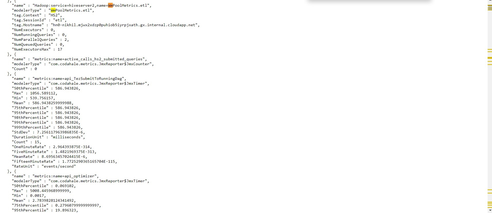

# Troubleshoot Hive Workload Management Issues

Workload Management (WLM) is available to the customers starting HDInsight 4.0 clusters. 
Use the resources below to help debug issues related to WLM feature.

## WLM Metrics

WLM Metrics can be accessed directly via HS2Interactive UI under the Metrics Dump Tab. <br>


Example metrics published by WLM for a given pool in a resource plan.
```
    "name" : "Hadoop:service=hiveserver2,name=WmPoolMetrics.etl",
    "modelerType" : "WmPoolMetrics.etl",
    "tag.Context" : "HS2",
    "tag.SessionId" : "etl",
    "tag.Hostname" : "hn0-c2b-ll.cu1cgjaim53urggr4psrgczloa.cx.internal.cloudapp.net",
    "NumExecutors" : 10,
    "NumRunningQueries" : 2,
    "NumParallelQueries" : 3,
    "NumQueuedQueries" : 0,
    "NumExecutorsMax" : 10
```

For ESP clusters as HS2Interactive UI is unavailable (a known issue), we can get the same metrics on grafana. <br>
The metrics name follows the below patterns:
```
default.General.WM_<pool>_numExecutors
default.General.WM_<pool>_numExecutorsMax
default.General.WM_<pool>_numRunningQueries
default.General.WM_<pool>_numParallelQueries
default.General.WM_<pool>_numQueuedQueries
```
Replace `<pool>` with respective pool name to get the metrics in grafana. 


Note: Make sure hiveserver2 component is selected in the above filters and component name.

<br>

## Get WLM Resource Plan and Plan entities
#### To get all resource plans on the cluster:
```
SHOW RESOURCE PLANS;
```

#### To get definition of a given resource plan
```
SHOW RESOURCE PLAN <plan_name>;
```

## Get WLM entities information from metastore database
> Note: Only applicable for custom hive metastore database

WLM entities information can also be viewed from following tables in Hive Metastore database 

* **WM_RESOURCEPLANS** (NAME string, STATUS string, QUERY_PARALLELISM int, DEFAULT_POOL_PATH string)
* **WM_POOLS** (RP_NAME string, PATH string, ALLOC_FRACTION double, QUERY_PARALLELISM int, SCHEDULING_POLICY string)
* **WM_MAPPINGS** (RP_NAME string, ENTITY_TYPE string, ENTITY_NAME string, POOL_PATH string, ORDERING int)
* **WM_TRIGGERS** (RP_NAME string, NAME string, TRIGGER_EXPRESSION string, ACTION_EXPRESSION string)
* **WM_POOLS_TO_TRIGGERS** (RP_NAME string, POOL_PATH string, TRIGGER_NAME string)

<br>

## WLM Feature Characteristics
### **Lifecycle of Tez AMs in WLM Enabled Clusters**
In contrast to default LLAP clusters, WLM enabled clusters have another set of Tez AMs. These Tez AMs are scheduled to run in `wm` queue if *hive.server2.tez.interactive.queue=wm* is set in hive configs. <br>
These Tez AMs spawn up when WLM is activated based on the sum of QUERY_PARALLELISM of all the pools defined in the resource plan. <br>
When we disable the Workload Management in the cluster, these Tez AMs are automatically KILLED.
`{ DISABLE WORKLOAD MANAGEMENT; }`

### **Resource contention**
In WLM enabled LLAP cluster, resources are shared among queries based on resource plan configuration. The resource sharing sometimes leads to query slowness.
Some tunings can be done to resource plan to reduce the resource contention that happens within a pool. For example `scheduling_policy` can be defined as either `fair`, which guarantees an equal share of resources on the cluster to each query that is assigned to the pool; or `fifo`, which guarantees all resources to the first query that comes to the pool.<br>
Following example shows how to set scheduling policy for a pool named `etl` in the resource plan `wlm_basic`:
```
ALTER POOL wlm_basic.etl SET SCHEDULING_POLICY = fair;
```
One can also set the scheduling policy while creating the pool:
```
CREATE POOL wlm_basic.default WITH ALLOC_FRACTION = 0.5, QUERY_PARALLELISM = 2, SCHEDULING_POLICY = fifo;
```

### **Query Failures for some specific use cases**
Running queries in WLM can get killed automatically for following cases:
1. When Move Trigger is applied to a query and destination pool that doesn't have any Tez AMs available, then query is killed instead. <br>
The above is a design limitation of WLM feature. You can work around this feature by increasing the `QUERY_PARALLELISM` property for the destination pool so that even for maximum load scenario, the queries submitted to the cluster can be supported by this pool. Also, tune the `wm` queue size to accommodate this change. <br>
2. When WLM is disabled, all the inflight queries will fail with following exception pattern:
```
FAILED: Execution Error, return code 1 from org.apache.hadoop.hive.ql.exec.tez.TezTask. Dag received [DAG_TERMINATE, DAG_KILL] in RUNNING state.
```
3. When a WLM Tez AM is manually killed, then some of the queries may fail with following pattern. <br/>These queries should run without any issues on resubmission.
```
java.util.concurrent.CancellationException: Task was cancelled.
	at com.google.common.util.concurrent.AbstractFuture.cancellationExceptionWithCause(AbstractFuture.java:1349) ~[guava-28.0-jre.jar:?]
	at com.google.common.util.concurrent.AbstractFuture.getDoneValue(AbstractFuture.java:550) ~[guava-28.0-jre.jar:?]
	at com.google.common.util.concurrent.AbstractFuture.get(AbstractFuture.java:513) ~[guava-28.0-jre.jar:?]
	at com.google.common.util.concurrent.AbstractFuture$TrustedFuture.get(AbstractFuture.java:90) ~[guava-28.0-jre.jar:?]
	at com.google.common.util.concurrent.Uninterruptibles.getUninterruptibly(Uninterruptibles.java:237) ~[guava-28.0-jre.jar:?]
	at com.google.common.util.concurrent.Futures.getDone(Futures.java:1064) ~[guava-28.0-jre.jar:?]
	at com.google.common.util.concurrent.Futures$CallbackListener.run(Futures.java:1013) ~[guava-28.0-jre.jar:?]
	at com.google.common.util.concurrent.DirectExecutor.execute(DirectExecutor.java:30) ~[guava-28.0-jre.jar:?]
	at com.google.common.util.concurrent.AbstractFuture.executeListener(AbstractFuture.java:1137) ~[guava-28.0-jre.jar:?]
	at com.google.common.util.concurrent.AbstractFuture.complete(AbstractFuture.java:957) ~[guava-28.0-jre.jar:?]
	at com.google.common.util.concurrent.AbstractFuture.cancel(AbstractFuture.java:611) ~[guava-28.0-jre.jar:?]
	at com.google.common.util.concurrent.AbstractFuture$TrustedFuture.cancel(AbstractFuture.java:118) ~[guava-28.0-jre.jar:?]
	at org.apache.hadoop.hive.ql.exec.tez.WmTezSession$TimeoutRunnable.run(WmTezSession.java:264) ~[hive-exec-3.1.3.4.1.3.6.jar:3.1.3.4.1.3.6]
	at java.util.concurrent.Executors$RunnableAdapter.call(Executors.java:511) [?:1.8.0_275]
	at java.util.concurrent.FutureTask.run(FutureTask.java:266) [?:1.8.0_275]
	at java.util.concurrent.ScheduledThreadPoolExecutor$ScheduledFutureTask.access$201(ScheduledThreadPoolExecutor.java:180) ~[?:1.8.0_275]
	at java.util.concurrent.ScheduledThreadPoolExecutor$ScheduledFutureTask.run(ScheduledThreadPoolExecutor.java:293) ~[?:1.8.0_275]
	at java.util.concurrent.ThreadPoolExecutor.runWorker(ThreadPoolExecutor.java:1149) [?:1.8.0_275]
	at java.util.concurrent.ThreadPoolExecutor$Worker.run(ThreadPoolExecutor.java:624) [?:1.8.0_275]
	at java.lang.Thread.run(Thread.java:748) [?:1.8.0_275]
```

## Known Issues
1. Spark jobs submitted via [Hive Warehouse Connector (HWC)](apache-hive-warehouse-connector.md) can experience intermittent failures if target LLAP cluster has WLM feature enabled. <br>
To avoid the above issues, Customer can have two LLAP Clusters, one with WLM enabled and other without WLM.
The customer then can use HWC to connect their Spark cluster to the LLAP cluster without WLM.

2. The `DISABLE WORKLOAD MANAGEMENT;` command hangs for a long time sometimes. <br>
Cancel the command and check the resource plans status with following command:
`SHOW RESOURCE PLANS;`
Check if an active resource plan is available before running `DISABLE WORKLOAD MANAGEMENT` command again; <br>

3. Some of Tez AM can keep on running and doesn't go away with `DISABLE WORKLOAD MANAGEMENT` command or HS2 restart. <br>
Kill these Tez AMs via `yarn UI` or `yarn console application` after disabling workload management.
