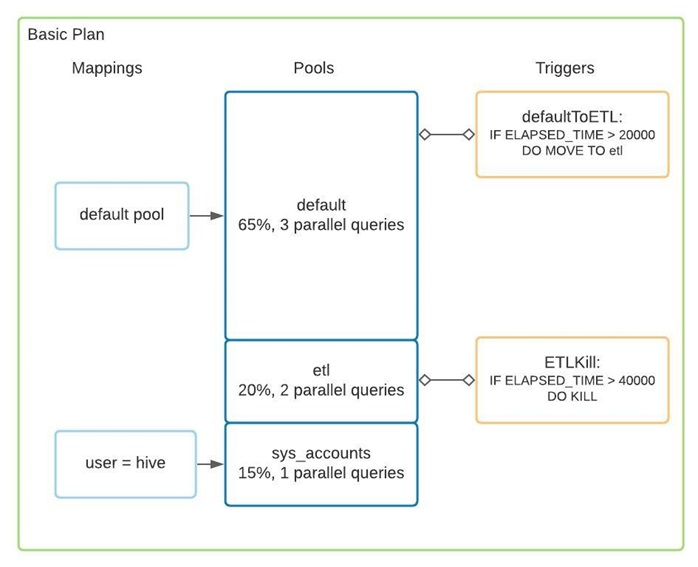

# Hive Workload Management Commands

### WLM Commands Summary

| Name                         | Brief Description                                                         |
|------------------------------|---------------------------------------------------------------------------|
| CREATE MAPPING               | Routes queries to a resource pool.                                        |
| CREATE POOL                  | Creates and adds a query pool for a resource plan.                        |
| CREATE RESOURCE PLAN         | Creates a resource plan                                                   |
| CREATE TRIGGER               | Establishes and adds a trigger to a resource plan.                        |
| SHOW RESOURCE PLAN           | Lists plan contents.                                                      |
| SHOW RESOURCE PLANS          | Lists all resource plans.                                                 |
| ALTER MAPPING                | Changes the routing of queries to a resource pool.                        |
| ALTER POOL                   | Modifies query pool properties, adds triggers, and removes triggers.      |
| ALTER RESOURCE PLAN          | Enables, disables, activates, validates, or changes a plan.               |
| ALTER TRIGGER                | Adds a trigger to or removes a trigger from a resource pool.              |
| REPLACE RESOURCE PLAN WITH   | Replaces the contents of one resource plan with the contents of another.  |
| DISABLE WORKLOAD MANAGEMENT  | Deactivates the existing resource plan.                                   |
| DROP MAPPING                 | Removes a mapping from a resource plan.                                   |
| DROP POOL                    | Removes a query pool from a resource plan.                                |
| DROP RESOURCE PLAN           | Deletes a resource plan.                                                  |
| DROP TRIGGER                 | Deletes a trigger from a resource plan.                                   |

<br> 

### How to create a basic resource plan



#### Commands to create the resource plan
```
# CREATE RESOURCE PLAN
CREATE RESOURCE PLAN demo_plan;

# CREATE POOLS
ALTER POOL demo_plan.default SET ALLOC_FRACTION = 0.65, QUERY_PARALLELISM = 2;
CREATE POOL demo_plan.etl WITH ALLOC_FRACTION = 0.20, QUERY_PARALLELISM = 2;
CREATE POOL demo_plan.sys_accounts WITH ALLOC_FRACTION = 0.15, QUERY_PARALLELISM = 1;

# CREATE MAPPING
CREATE USER MAPPING 'hive' IN demo_plan TO sys_accounts WITH ORDER 1;
 
# CREATE TRIGGERS
CREATE TRIGGER demo_plan.defaultToETL WHEN  ELAPSED_TIME > 20000 DO MOVE TO etl;
ALTER TRIGGER demo_plan.defaultToETL ADD TO POOL default;
CREATE TRIGGER demo_plan.ETLKill  WHEN ELAPSED_TIME > 40000 DO KILL;
ALTER TRIGGER demo_plan.ETLKill ADD TO POOL etl;
```

#### Commands to enable, disable, or drop the resource plan
```
# VALIDATE PLAN
ALTER RESOURCE PLAN demo_plan VALIDATE;

# ENABLE PLAN
ALTER RESOURCE PLAN demo_plan ENABLE;

#  ACTIVATE PLAN
ALTER RESOURCE PLAN demo_plan ACTIVATE;

#SHOW RESOURCE PLAN
SHOW RESOURCE PLANS;
SHOW RESOURCE PLAN demo_plan;

# DISABLE PLAN
-- In case plan is in active state first run:
-- DISABLE WORKLOAD MANAGEMENT;
ALTER RESOURCE PLAN demo_plan DISABLE;

# DROP RESOURCE PLAN
DROP RESOURCE PLAN demo_plan;
```

### References:
* [Cloudera Hive Workload Management Commands Summary](https://docs.cloudera.com/HDPDocuments/HDP3/HDP-3.1.5/hive-workload-commands/content/hive_workload_management_command_summary.html)
