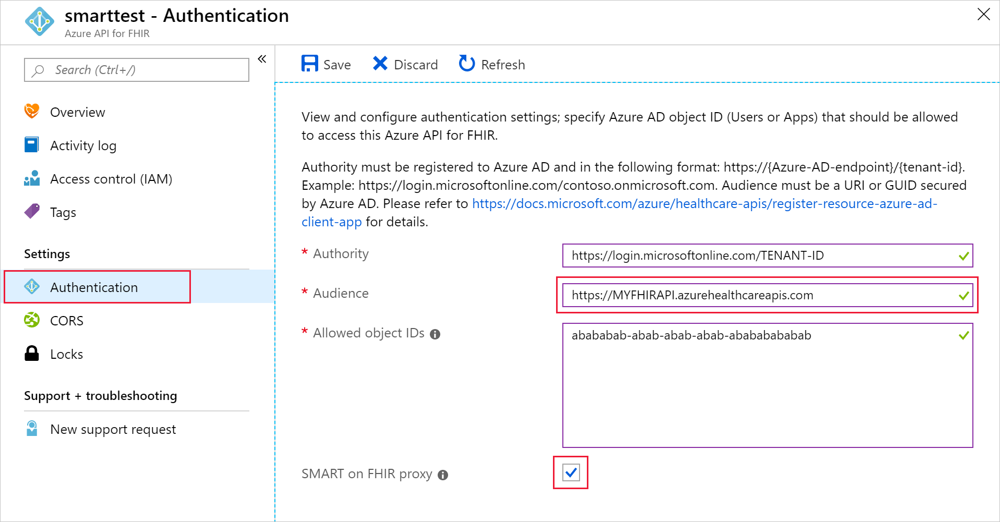
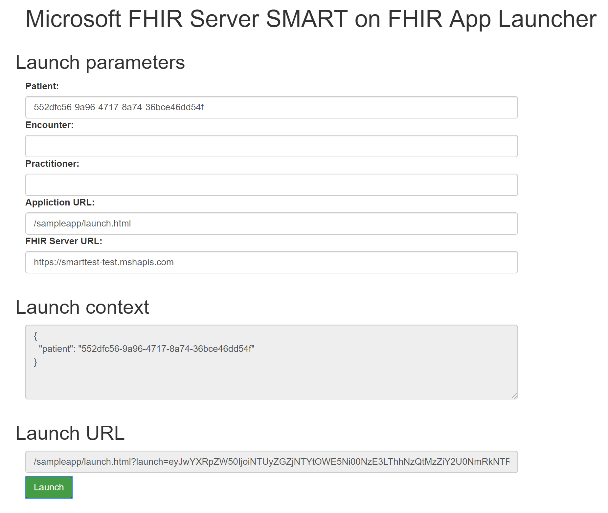

# SMART on FHIR Overview

[SMART on FHIR](https://docs.smarthealthit.org/) is a set of open specifications to integrate partner applications with FHIR servers and electronic medical records systems that have Fast Healthcare Interoperability Resources (FHIR&#174;) interfaces. One of the main purposes of the specifications is to describe how an application should discover authentication endpoints for an FHIR server and start an authentication sequence. 

Authentication is based on OAuth2. But because SMART on FHIR uses parameter naming conventions that aren’t immediately compatible with Azure Active Directory (Azure AD), the Azure API for FHIR has a built-in Azure AD SMART on FHIR proxy that enables a subset of the SMART on FHIR launch sequences. Specifically, the proxy enables the [EHR launch sequence](https://hl7.org/fhir/smart-app-launch/#ehr-launch-sequence).

Below tutorial describes how to use the proxy to enable SMART on FHIR applications with Azure API for FHIR.

## Tutorial: SMART on FHIR proxy
**Prerequisites**

- An instance of the Azure API for FHIR
- [.NET Core 2.2](https://dotnet.microsoft.com/download/dotnet-core/2.2)

## Configure Azure AD registrations

SMART on FHIR requires that `Audience` has an identifier URI equal to the URI of the FHIR service. The standard configuration of the Azure API for FHIR uses an `Audience` value of `https://azurehealthcareapis.com`. However, you can also set a value matching the specific URL of your FHIR service (for example `https://MYFHIRAPI.azurehealthcareapis.com`). This is required when working with the SMART on FHIR proxy.

You'll also need a client application registration. Most SMART on FHIR applications are single-page JavaScript applications. So you should follow the instructions for configuring a [public client application in Azure AD](register-public-azure-ad-client-app.md).

After you complete these steps, you should have:

- A FHIR server with the audience set to `https://MYFHIRAPI.azurehealthcareapis.com`, where `MYFHIRAPI` is the name of your Azure API for FHIR instance.
- A public client application registration. Make a note of the application ID for this client application.

### Set admin consent for your app

To use SMART on FHIR, you must first authenticate and authorize the app. The first time you use SMART on FHIR, you also must get administrative consent to let the app access your FHIR resources.

If you don't have an ownership role in the app, contact the app owner and ask them to grant admin consent for you in the app. 

If you do have administrative privileges, complete the following steps to grant admin consent to yourself directly. (You also can grant admin consent to yourself later when you're prompted in the app.) You can complete the same steps to add other users as owners, so they can view and edit this app registration.

To add yourself or another user as owner of an app:

1. In the Azure portal, go to Azure Active Directory.
1. In the left menu, select **App Registration**.
1. Search for the app registration you created, and then select it.
1. In the left menu, under **Manage**, select **Owners**.
1. Select **Add owners**, and then add yourself or the user you want to have admin consent.
1. Select **Save**.

## Enable the SMART on FHIR proxy

Enable the SMART on FHIR proxy in the **Authentication** settings for your Azure API for FHIR instance by selecting the **SMART on FHIR proxy** check box:



## Enable CORS

Because most SMART on FHIR applications are single-page JavaScript apps, you need to [enable cross-origin resource sharing (CORS)](configure-cross-origin-resource-sharing.md) for the Azure API for FHIR:


## Configure the reply URL

The SMART on FHIR proxy acts as an intermediary between the SMART on FHIR app and Azure AD. The authentication reply (the authentication code) must go to the SMART on FHIR proxy instead of the app itself. The proxy then forwards the reply to the app. 

Because of this two-step relay of the authentication code, you need to set the reply URL (callback) for your Azure AD client application to a URL that is a combination of the reply URL for the SMART on FHIR proxy and the reply URL for the SMART on FHIR app. The combined reply URL takes this form:

```http
https://MYFHIRAPI.azurehealthcareapis.com/AadSmartOnFhirProxy/callback/aHR0cHM6Ly9sb2NhbGhvc3Q6NTAwMS9zYW1wbGVhcHAvaW5kZXguaHRtbA
```

In that reply, `aHR0cHM6Ly9sb2NhbGhvc3Q6NTAwMS9zYW1wbGVhcHAvaW5kZXguaHRtbA` is a URL-safe, base64-encoded version of the reply URL for the SMART on FHIR app. For the SMART on FHIR app launcher, when the app is running locally, the reply URL is `https://localhost:5001/sampleapp/index.html`. 

You can generate the combined reply URL by using a script like this:

```PowerShell
$replyUrl = "https://localhost:5001/sampleapp/index.html"
$fhirServerUrl = "https://MYFHIRAPI.azurewebsites.net"
$bytes = [System.Text.Encoding]::UTF8.GetBytes($ReplyUrl)
$encodedText = [Convert]::ToBase64String($bytes)
$encodedText = $encodedText.TrimEnd('=');
$encodedText = $encodedText.Replace('/','_');
$encodedText = $encodedText.Replace('+','-');

$newReplyUrl = $FhirServerUrl.TrimEnd('/') + "/AadSmartOnFhirProxy/callback/" + $encodedText
```

Add the reply URL to the public client application that you created earlier for Azure AD:


## Get a test patient

To test the Azure API for FHIR and the SMART on FHIR proxy, you'll need to have at least one patient in the database. If you've not interacted with the API yet, and you don't have data in the database, see [Access the FHIR service using Postman](./../fhir/use-postman.md) to load a patient. Make a note of the ID of a specific patient.

## Download the SMART on FHIR app launcher

The open-source [FHIR Server for Azure repository](https://github.com/Microsoft/fhir-server) includes a simple SMART on FHIR app launcher and a sample SMART on FHIR app. In this tutorial, use this SMART on FHIR launcher locally to test the setup.

You can clone the GitHub repository and go to the application by using these commands:

```PowerShell
git clone https://github.com/Microsoft/fhir-server
cd fhir-server/samples/apps/SmartLauncher
```

The application needs a few configuration settings, which you can set in `appsettings.json`:

```json
{
    "FhirServerUrl": "https://MYFHIRAPI.azurehealthcareapis.com",
    "ClientId": "APP-ID",
    "DefaultSmartAppUrl": "/sampleapp/launch.html"
}
```

We recommend that you use the `dotnet user-secrets` feature:

```PowerShell
dotnet user-secrets set FhirServerUrl https://MYFHIRAPI.azurehealthcareapis.com
dotnet user-secrets set ClientId <APP-ID>
```

Use this command to run the application:

```PowerShell
dotnet run
```

## Test the SMART on FHIR proxy

After you start the SMART on FHIR app launcher, you can point your browser to `https://localhost:5001`, where you should see the following screen:



When you enter **Patient**, **Encounter**, or **Practitioner** information, you'll notice that the **Launch context** is updated. When you're using the Azure API for FHIR, the launch context is simply a JSON document that contains information about patient, practitioner, and more. This launch context is base64 encoded and passed to the SMART on FHIR app as the `launch` query parameter. According to the SMART on FHIR specification, this variable is opaque to the SMART on FHIR app and passed on to the identity provider. 

The SMART on FHIR proxy uses this information to populate fields in the token response. The SMART on FHIR app *can* use these fields to control which patient it requests data for and how it renders the application on the screen. The SMART on FHIR proxy supports the following fields:

* `patient`
* `encounter`
* `practitioner`
* `need_patient_banner`
* `smart_style_url`

These fields are meant to provide guidance to the app, but they don't convey any security information. A SMART on FHIR application can ignore them.

Notice that the SMART on FHIR app launcher updates the **Launch URL** information at the bottom of the page. Select **Launch** to start the sample app, and you should see something like this sample:


Inspect the token response to see how the launch context fields are passed on to the app.

## Next steps

In this tutorial, you've configured the Azure Active Directory SMART on FHIR proxy. To explore the use of SMART on FHIR applications with the Azure API for FHIR and the open-source FHIR Server for Azure, go to the repository of FHIR server samples on GitHub:

>[!div class="nextstepaction"]
>[FHIR server samples](https://github.com/Microsoft/fhir-server-samples)

FHIR&#174; is a registered trademark of [HL7](https://hl7.org/fhir/) and is used with the permission of HL7.
