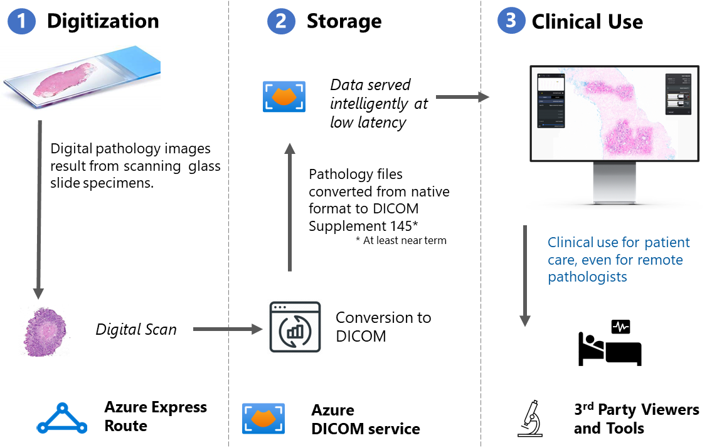

# Digital Pathology using DICOM service

 ## Overview

`Pathology` is a branch of medical science primarily concerning the cause, origin, and nature of disease. It involves the examination of tissues, organs, bodily fluids, and autopsies in order to study and diagnose disease.
Historically biopsies of tissues are stored in glass slides and investigated under microscope. This creates challenges when clinicians and pathologists need to share information for consultations and diagnosis as well as for research.  

Digital imaging is becoming increasingly popular in the field of pathology as a way to support sharing images outside the lab, training AI/ML models, and for long term storage. This transformation is fueled by the commercial availability of instruments for digitizing microscope slides.

Today, digital pathology scanners generally output imaging into proprietary formats. This complicates sharing and AI/ML model training, blunting many of the advantages of digitization. To ease this transformation, many organizations are beginning to convert [Whole Slide Imaging (WSI)](https://dicom.nema.org/Dicom/DICOMWSI/) digital slides to DICOM-standard format. Once these images are in DICOM format, these images can be stored in commercially available PACS systems, where they can be managed using tools and processes that have been perfected over decades by radiologists.

## DICOM Service for Digital Pathology 

DICOM service supports unique digital pathology requirements like:

1. Scale and performance needed to upload pathology DICOM instances that are multiple GBs in size.
2. Fast frame access to allow the web viewer to pan and zoom DICOM pathology images smoothly with no lags or blurriness.
3. A cost effective way to store images long-term post diagnosis for archival and research use.

## End to End reference solution


### Digitization

Although the [DICOM standard now supports whole-slide images (WSI)](https://dicom.nema.org/dicom/dicomwsi/), many acquisition scanners don't capture images in the DICOM format. The DICOM service only supports images in the DICOM format, therefore a format conversion is required for WSI in other formats. Several commercial and open-source solutions exist to perform these format conversions.

Here are samples open source tools to build your own converter:

- [Orthanc - DICOM Server (orthanc-server.com)](https://www.orthanc-server.com/static.php?page=wsi)
- [OpenSlide](https://github.com/openslide/openslide)


### Storage

Each converted WSI results in a DICOM series with multiple instances. We recommend uploading each instance as a single part POST for better performance.

[Prerequisites](dicomweb-standard-apis-curl.md#prerequisites)

```cmd
curl -X POST \
    -H "Content-Type: application/dicom" \
    -H "Authorization: Bearer {token}" \
    -H "Accept: application/dicom+json" \
{service-url}/{version}/studies \
    --data-binary {dcmFile}.dcm
```

We have tested supporting <b>tens of GBs upload in few seconds</b>. 

### Retrieving

Viewers retrieve tiles that are stored as frames in a DICOM instance. Each DICOM instance can contain multiple frames. We recommend using parallel single part GET frame for better performance.

 [Prerequisites](dicomweb-standard-apis-curl.md#prerequisites)

```cmd
curl -X GET \
    -H "Authorization: Bearer {token}" \
    -H "Accept: application/octet-stream; transfer-syntax=*" \
{service-url}/{version}/studies/{studyInstanceUid}/series/{seriesInstanceUid}/instances/{sopInstanceUid}/frames/{frameNumber} \
    --output {fileName}
```

We have tested supporting <b>download of 60Kb tile in around 60-70ms</b> from client.

### Viewers

We recommend using any WSI Viewer that can be configured with a DICOMWeb service and OIDC Authentication. 

Sample Open source viewer

- [Slim (MGB)](https://github.com/herrmannlab/slim)

Follow the [CORS guidelines](configure-cross-origin-resource-sharing.md) if the Viewer directly interacts with the DICOM service


## Recommended ISVs

Reach out to dicom-support@microsoft.com if you want to work with our partner ISVs that provides E2E solution and support.

## Next steps

For more information about DICOM service, see

>[!div class="nextstepaction"]
>[Deploy DICOM service to Azure](deploy-dicom-services-in-azure.md)

>[!div class="nextstepaction"]
>[Using DICOMweb&trade;Standard APIs with DICOM service](dicomweb-standard-apis-with-dicom-services.md)