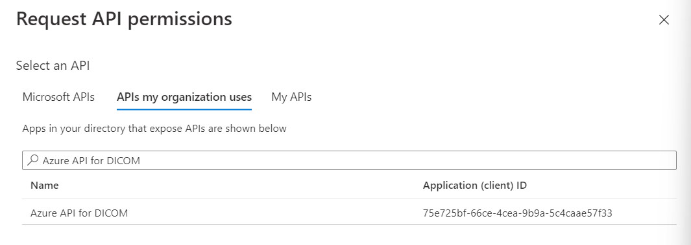

# Register a client application for the DICOM service in Microsoft Entra ID

In this article, you'll learn how to register a client application for the DICOM service. You can find more information on [Register an application with the Microsoft identity platform](../../active-directory/develop/quickstart-register-app.md).

## Register a new application

1. In the [Azure portal](https://portal.azure.com), select **Microsoft Entra ID**.
2. Select **App registrations**.

3. Select **New registration**.
4. For Supported account types, select **Accounts in this organization directory only**. Leave the other options as is.

5. Select **Register**.

## Application ID (client ID)

After registering a new application, you can find the application (client) ID and Directory (tenant) ID from the overview menu option. Make a note of the values for use later.

## Authentication setting: confidential vs. public

Select **Authentication** to review the settings. The default value for **Allow public client flows** is "No".

If you keep this default value, the application registration is a **confidential client application** and a certificate or secret is required.

If you change the default value to "Yes" for the "Allow public client flows" option in the advanced setting, the application registration is a **public client application** and a certificate or secret isn't required. The "Yes" value is useful when you want to use the client application in your mobile app or a JavaScript app where you don't want to store any secrets.

For tools that require a redirect URL, select **Add a platform** to configure the platform.

>[!NOTE]
>
>For Postman, select **Mobile and desktop applications**. Enter "https://www.getpostman.com/oauth2/callback" in the **Custom redirect URIs** section. Select the **Configure** button to save the setting.

## Certificates & secrets

Select **Certificates & Secrets** and select **New Client Secret**.

Add and then copy the secret value.

Optionally, you can upload a certificate (public key) and use the Certificate ID, a GUID value associated with the certificate. For testing purposes, you can create a self-signed certificate using tools such as the PowerShell command line, `New-SelfSignedCertificate`, and then export the certificate from the certificate store.

## API permissions

The following steps are required for the DICOM service. In addition, user access permissions or role assignments for the Azure Health Data Services are managed through RBAC. For more details, visit [Configure Azure RBAC for Azure Health Data Services](./../configure-azure-rbac.md).

1. Select the **API permissions** blade.

   

2. Select **Add a permission**.

   Add a permission to the DICOM service by searching for **Azure API for DICOM** under **APIs my organization** uses.

   

   The search result for Azure API for DICOM will only return if you've already deployed the DICOM service in the workspace.

   If you're referencing a different resource application, select your DICOM API Resource Application Registration that you created previously under **APIs my organization**.

3. Select scopes (permissions) that the confidential client application will ask for on behalf of a user. Select **Dicom.ReadWrite**, and then select **Add permissions**.

   

Your application registration is now complete.

## Next steps

In this article, you learned how to register a client application for the DICOM service in the Microsoft Entra ID. Additionally, you learned how to add a secret and API permissions to Azure Health Data Services. For more information about DICOM service, see

>[!div class="nextstepaction"]
>[Overview of the DICOM service](dicom-services-overview.md)
