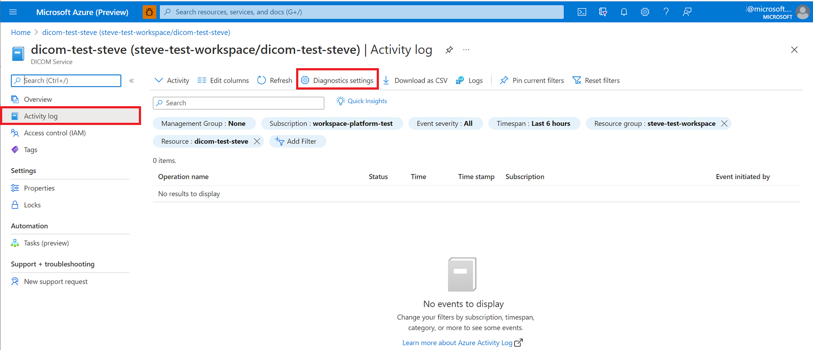

# Enable Diagnostic Logging in the DICOM service

In this article, you will learn how to enable diagnostic logging in Azure API for FHIR and be able to review some sample queries for these logs. Access to diagnostic logs is essential for any healthcare service where compliance with regulatory requirements (such as HIPAA) is a must. The feature in DICOM service enables diagnostic logs is the [Diagnostic settings](../../azure-monitor/essentials/diagnostic-settings.md) in the Azure portal. 

## Enable audit logs

1. To enable diagnostic logging DICOM service, select your DICOM service in the Azure portal 
2. Select the **Activity log** blade, and then select **Diagnostic settings**.

   [  ](media/dicom-activity-log.png#lightbox)

3. Select **+ Add diagnostic setting**.

   [  ](media/add-diagnostic-settings.png#lightbox)

4. Enter the **Diagnostic settings name**.

   [  ](media/configure-diagnostic-settings.png#lightbox)

5. Select the **Category** and **Destination** details for accessing the diagnostic logs.

   * **Send to Log Analytics workspace** in the Azure Monitor. You’ll need to create your Logs Analytics workspace before you can select this option. For more information about the platform logs, see [Overview of Azure platform logs](../../azure-monitor/essentials/platform-logs-overview.md).
   * **Archive to a storage account** for auditing or manual inspection. The storage account you want to use needs to be already created.
   * **Stream to an event hub** for ingestion by a third-party service or custom analytic solution. You’ll need to create an event hub namespace and event hub policy before you can configure this step.
   * **Send to partner solution** that you are working with as partner organization in Azure. For information about potential partner integrations, see [Azure partner solutions documentation](../../partner-solutions/overview.md)

     For information about supported metrics, see [Supported metrics with Azure Monitor](.././../azure-monitor/essentials/metrics-supported.md).

6. Select **Save**.


   > [!Note] 
   > It might take up to 15 minutes for the first Logs to show in Log Analytics. Also, if the DICOM service is moved from one resource group or subscription to another, update the settings once the move is complete. 
 
   For information on how to work with diagnostic logs, see [Azure Resource Log documentation](../../azure-monitor/essentials/platform-logs-overview.md)

## Audit log details

The DICOM service returns the following fields in the audit log: 

|Field Name  |Type  |Notes  |
|---------|---------|---------|
|correlationId|String|Correlation ID
|category|String|Log Category (We currently have 'AuditLogs') 
|operationName|String|Describes the type of operation (e.g., Retrieve, Store, Query, etc.) 
|time|DateTime|Date and time of the event. 
|resourceId|String| Azure path to the resource.
|identity|Dynamic|A generic property bag containing identity information (currently does not apply to DICOM).
|callerIpAddress|String|The caller's IP address.
|Location|String|The location of the server that processed the request.
|uri|String|The request URI.
|resultType|String| The available values currently are Started, Succeeded, or Failed.
|resultSignature|Int|The HTTP Status Code (e.g., 200)
|properties|String|Describes the properties including resource type, resource name, subscription ID, audit action, etc.
|type|String|Type of log (it's always MicrosoftHealthcareApisAuditLog in this case).
|Level|String|Log level (Informational, Error).
|operationVersion|String| Currently empty. Will be utilized to show api version.


## Sample queries

Below are a few basic Application Insights queries you can use to explore your log data.

Run the following query to see the **100 most recent** logs:

```Application Insights
MicrosoftHealthcareApisAuditLogs
| limit 100
```

Run the following query to group operations by **DICOM Resource Type**:

```Application Insights
MicrosoftHealthcareApisAuditLogs 
| summarize count() by FhirResourceType
```

Run the following query to get all the **failed results**

```Application Insights
MicrosoftHealthcareApisAuditLogs 
| where ResultType == "Failed" 
```

## Conclusion

Having access to diagnostic logs is essential for monitoring a service and providing compliance reports. The DICOM service allows you to do these actions through diagnostic logs. 
 
FHIR is the registered trademark of HL7 and is used with the permission of HL7.

## Next steps
In this article, you learned how to enable audit logs for the DICOM service. For information about the Azure activity log, see
 
>[!div class="nextstepaction"]
>[Azure Activity Log event schema](.././../azure-monitor/essentials/activity-log-schema.md)