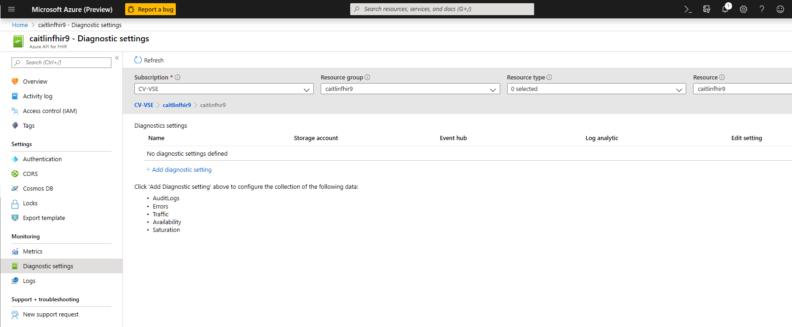

# Enable Diagnostic Logging in Azure API for FHIR

In this article, you will learn how to enable diagnostic logging in Azure API for FHIR and be able to review some sample queries for these logs. Access to diagnostic logs is essential for any healthcare service where compliance with regulatory requirements (such as HIPAA) is a must. The feature in Azure API for FHIR that enables diagnostic logs is the [**Diagnostic settings**](../azure-monitor/platform/diagnostic-settings.md) in the Azure portal. 

## Enable audit logs
1. To enable diagnostic logging in Azure API for FHIR, select your Azure API for FHIR service in the Azure portal 
2. Navigate to **Diagnostic settings** 
 

3. Select **+ Add diagnostic setting**

4. Enter a name for the setting

5. Select the method you want to use to access your diagnostic logs:

    1. **Archive to a storage account** for auditing or manual inspection. The storage account you want to use needs to be already created.
    2. **Stream to event hub** for ingestion by a third-party service or custom analytic solution. You will need to create an event hub namespace and event hub policy before you can configure this step.
    3. **Stream to the Log Analytics** workspace in Azure Monitor. You will need to create your Logs Analytics Workspace before you can select this option.

6. Select **AuditLogs** and/or **AllMetrics**. The metrics include service name, availability, data size, total latency, total requests, total trrors and timestamp.

   :::image type="content" source="media/diagnostic-logging/fhirdiagnosticsetting.png" alt-text="Diagnostic Setting" lightbox="media/diagnostic-logging/fhirdiagnosticsetting.png":::

7. Select **Save**


> [!Note] 
> It might take up to 15 minutes for the first Logs to show in Log Analytics.  
 
For more information on how to work with diagnostic logs, please refer to the [Azure Resource Log documentation](../azure-monitor/platform/platform-logs-overview.md)

## Audit log details
At this time, the Azure API for FHIR service returns the following fields in the audit log: 

|Field Name  |Type  |Notes  |
|---------|---------|---------|
|CallerIdentity|Dynamic|A generic property bag containing identity information
|CallerIdentityIssuer|String|Issuer 
|CallerIdentityObjectId|String|Object_Id 
|CallerIPAddress|String|The caller’s IP address 
|CorrelationId|String| Correlation ID
|FhirResourceType|String|The resource type for which the operation was executed
|LogCategory|String|The log category (we are currently returning ‘AuditLogs’ LogCategory)
|Location|String|The location of the server that processed the request (e.g., South Central US)
|OperationDuration|Int|The time it took to complete this request in seconds
|OperationName|String| Describes the type of operation (e.g. update, search-type)
|RequestUri|String|The request URI 
|ResultType|String|The available values currently are **Started**, **Succeeded**, or **Failed**
|StatusCode|Int|The HTTP status code. (e.g., 200) 
|TimeGenerated|DateTime|Date and time of the event|
|Properties|String| Describes the properties of the fhirResourceType
|SourceSystem|String| Source System (always Azure in this case)
|TenantId|String|Tenant ID
|Type|String|Type of log (always MicrosoftHealthcareApisAuditLog in this case)
|_ResourceId|String|Details about the resource

## Sample queries

Here are a few basic Application Insights queries you can use to explore your log data.

Run this query to see the **100 most recent** logs:

```Application Insights
MicrosoftHealthcareApisAuditLogs
| limit 100
```

Run this query to group operations by **FHIR Resource Type**:

```Application Insights
MicrosoftHealthcareApisAuditLogs 
| summarize count() by FhirResourceType
```

Run this query to get all the **failed results**

```Application Insights
MicrosoftHealthcareApisAuditLogs 
| where ResultType == "Failed" 
```

## Conclusion 
Having access to diagnostic logs is essential for monitoring a service and providing compliance reports. Azure API for FHIR allows you to do these actions through diagnostic logs. 
 
FHIR is the registered trademark of HL7 and is used with the permission of HL7.

## Next steps
In this article, you learned how to enable Audit Logs for Azure API for FHIR. Next, learn about other additional settings you can configure in the Azure API for FHIR
 
>[!div class="nextstepaction"]
>[Additional Settings](azure-api-for-fhir-additional-settings.md)
