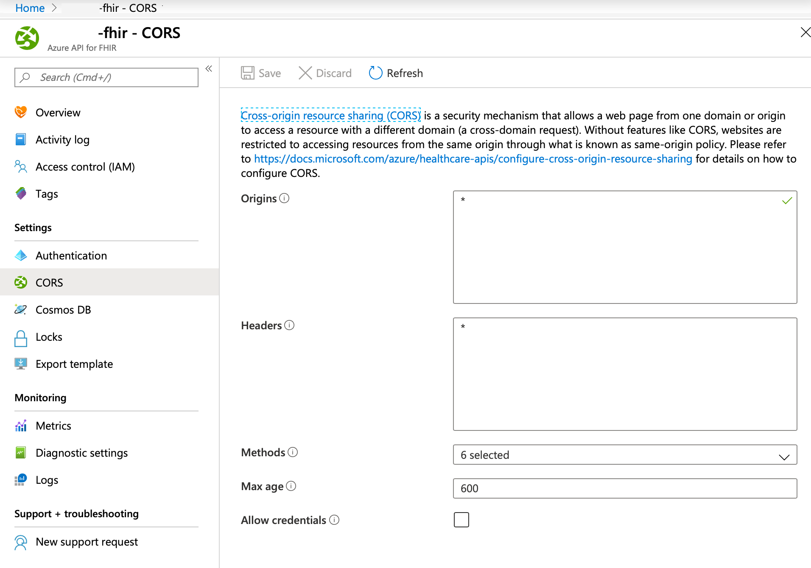

# Configure cross-origin resource sharing in FHIR service

> [!IMPORTANT]
> Azure Healthcare APIs is currently in PREVIEW. The [Supplemental Terms of Use for Microsoft Azure Previews](https://azure.microsoft.com/support/legal/preview-supplemental-terms/) include additional legal terms that apply to Azure features that are in beta, preview, or otherwise not yet released into general availability.

The FHIR service in the Azure Healthcare APIs (here by called the FHIR service) supports [cross-origin resource sharing (CORS)](https://wikipedia.org/wiki/Cross-Origin_Resource_Sharing). CORS allows you to configure settings so that applications from one domain (origin) can access resources from a different domain, known as a cross-domain request.

CORS is often used in a single-page app that must call a RESTful API to a different domain.

To configure a CORS setting in the FHIR service, specify the following settings:

- **Origins (Access-Control-Allow-Origin)**. A list of domains allowed to make cross-origin requests to the FHIR service. Each domain (origin) must be entered in a separate line. You can enter an asterisk (*) to allow calls from any domain, but we don't recommend it because it's a security risk.

- **Headers (Access-Control-Allow-Headers)**. A list of headers that the origin request will contain. To allow all headers, enter an asterisk (*).

- **Methods (Access-Control-Allow-Methods)**. The allowed methods (PUT, GET, POST, and so on) in an API call. Choose **Select all** for all methods.

- **Max age (Access-Control-Max-Age)**. The value in seconds to cache preflight request results for Access-Control-Allow-Headers and Access-Control-Allow-Methods.

- **Allow credentials (Access-Control-Allow-Credentials)**. CORS requests normally don’t include cookies to prevent [cross-site request forgery (CSRF)](https://en.wikipedia.org/wiki/Cross-site_request_forgery) attacks. If you select this setting, the request can be made to include credentials, such as cookies. You can't configure this setting if you already set Origins with an asterisk (*).

>[!NOTE]
>You can't specify different settings for different domain origins. All settings (**Headers**, **Methods**, **Max age**, and **Allow credentials**) apply to all origins specified in the Origins setting.