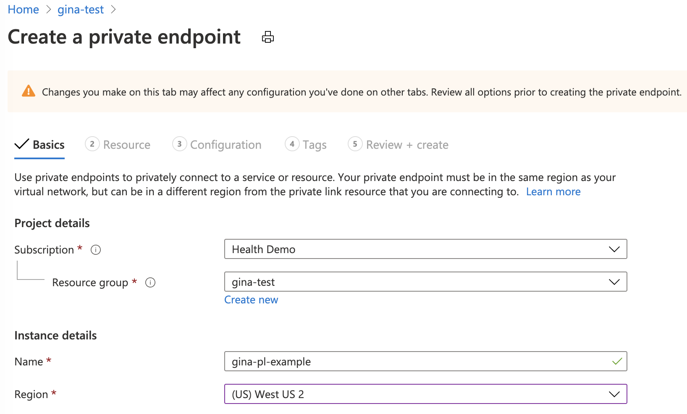
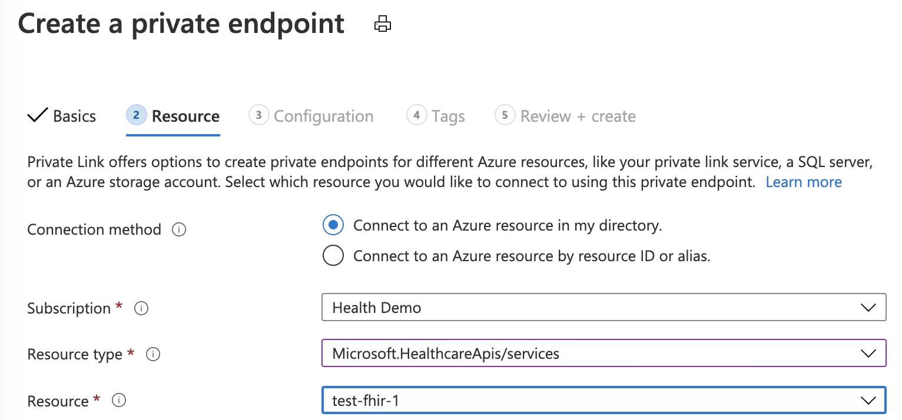

# Configure private link

Private link enables you to access Azure API for FHIR over a private endpoint, which is a network interface that connects you privately and securely using a private IP address from your virtual network. With Private Link, you can access our services securely from your VNet as a first party service without having to go through a public Domain Name System (DNS). This article describes how to create, test, and manage your private endpoint for Azure API for FHIR.

>[!Note]
>Neither Private Link nor Azure API for FHIR can be moved from one resource group or subscription to another once Private Link is enabled. To make a move, delete the Private Link first, then move Azure API for FHIR. Create a new Private Link once the move is complete. Assess potential security ramifications before deleting Private Link.
>
>If exporting audit logs and metrics is enabled for Azure API for FHIR, update the export setting through **Diagnostic Settings** from the portal.

## Prerequisites

Before creating a private endpoint, there are some Azure resources that you'll need to create first:

- Resource Group – The Azure resource group that will contain the virtual network and private endpoint.
- Azure API for FHIR – The FHIR resource you would like to put behind a private endpoint.
- Virtual Network – The VNet to which your client services and Private Endpoint will be connected.

For more information, see [Private Link Documentation](../../private-link/index.yml).

## Disable public network access

Creating a private endpoint for your FHIR resource doesn't automatically disable public traffic to it. To do this, you'll have to update your FHIR resource to set a new “Public access” property from “Enabled” to “Disabled”. Be careful when disabling public network access as all requests to your FHIR service that are not coming from a properly configured private endpoint will be denied. Only traffic from your private endpoints will be allowed.

## Create private endpoint

To create a private endpoint, a developer with Role-based access control (RBAC) permissions on the FHIR resource can use the Azure portal, [Azure PowerShell](../../private-link/create-private-endpoint-powershell.md), or [Azure CLI](../../private-link/create-private-endpoint-cli.md). This article will guide you through the steps on using Azure portal. Using the Azure portal is recommended as it automates the creation and configuration of the Private DNS Zone. For more information, see [Private Link Quick Start Guides](../../private-link/create-private-endpoint-portal.md).

There are two ways to create a private endpoint. Auto Approval flow allows a user that has RBAC permissions on the FHIR resource to create a private endpoint without a need for approval. Manual Approval flow allows a user without permissions on the FHIR resource to request a private endpoint to be approved by owners of the FHIR resource.

### Auto approval

Ensure the region for the new private endpoint is the same as the region for your virtual network. The region for your FHIR resource can be different.

For the resource type, search and select **Microsoft.HealthcareApis/services**. For the resource, select the FHIR resource. For target sub-resource, select **FHIR**.

If you do not have an existing Private DNS Zone set up, select **(New)privatelink.azurehealthcareapis.com**. If you already have your Private DNS Zone configured, you can select it from the list. It must be in the format of **privatelink.azurehealthcareapis.com**.

After the deployment is complete, you can go back to **Private endpoint connections** tab of which you'll notice **Approved** as the connection state.

### Manual Approval

For manual approval, select the second option under Resource, "Connect to an Azure resource by resource ID or alias". For Target sub-resource, enter "fhir" as in Auto Approval.

After the deployment is complete, you can go back to "Private endpoint connections" tab, on which you can Approve, Reject, or Remove your connection.

## Test private endpoint

To ensure that your FHIR server is not receiving public traffic after disabling public network access, select the /metadata endpoint for your server from your computer. You should receive a 403 Forbidden. 

> [!NOTE]
> It can take up to 5 minutes after updating the public network access flag before public traffic is blocked.

To ensure your private endpoint can send traffic to your server:

1. Create a virtual machine (VM) that is connected to the virtual network and subnet your private endpoint is configured on. To ensure your traffic from the VM is only using the private network, disable the outbound internet traffic using the network security group (NSG) rule.
2. RDP into the VM.
3. Access your FHIR server’s /metadata endpoint from the VM. You should receive the capability statement as a response.

## Manage private endpoint

### View

Private endpoints and the associated network interface controller (NIC) are visible in Azure portal from the resource group they were created in.

### Delete

Private endpoints can only be deleted from the Azure portal from the **Overview** blade or by selecting the **Remove** option under the **Networking Private endpoint connections** tab. Selecting **Remove** will delete the private endpoint and the associated NIC. If you delete all private endpoints to the FHIR resource and the public network, access is disabled and no request will make it to your FHIR server.

