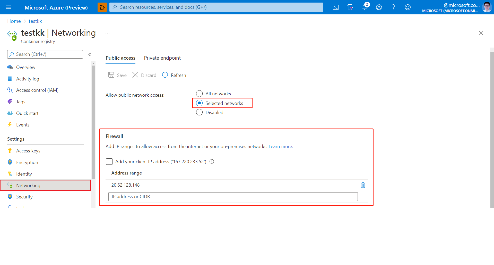
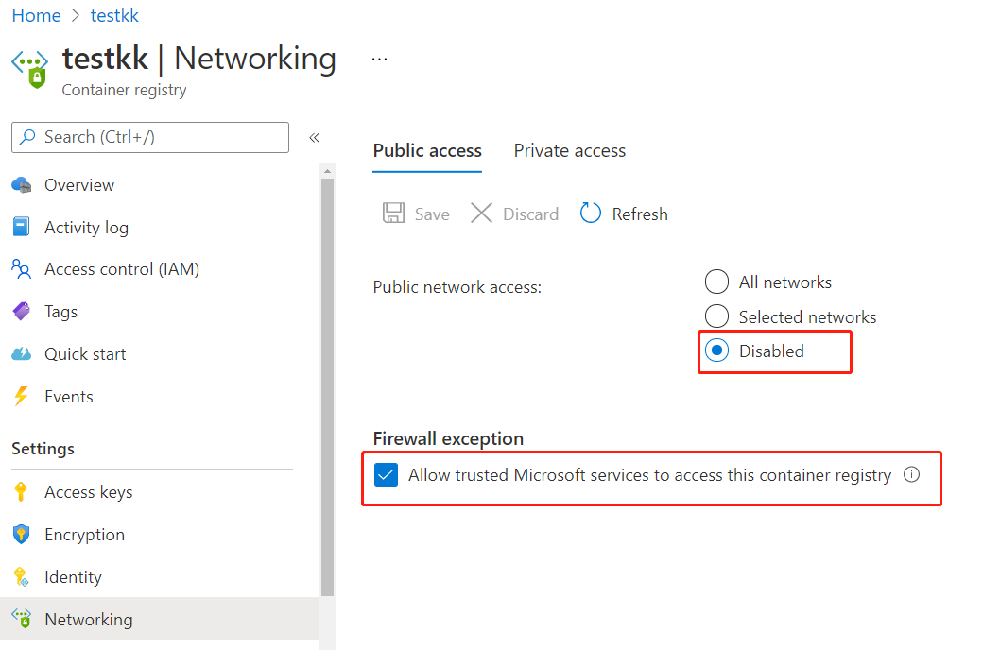

# Converting your data to FHIR

The `$convert-data` custom endpoint in the FHIR service is meant for converting health data from different legacy formats to FHIR. The `$convert-data` operation uses Liquid templates from the [FHIR Converter](https://github.com/microsoft/FHIR-Converter) project for the default FHIR data conversion mappings. You can customize these conversion templates as needed. Currently the `$convert-data` operation supports three types of data conversion: **HL7v2 to FHIR**, **C-CDA to FHIR**, and **JSON to FHIR** (JSON to FHIR templates are intended for custom conversion mapping).

> [!NOTE]
> The `$convert-data` endpoint can be used as a component within an ETL pipeline for the conversion of legacy health data formats into the FHIR format. However, the `$convert-data` operation is not an ETL pipeline in itself. We recommend you use an ETL engine based on Azure Logic Apps or Azure Data Factory for a complete workflow in preparing your legacy data for persistence in FHIR. The workflow might include: data reading and ingestion, data validation, making `$convert-data` API calls, data pre/post-processing, data enrichment, and data de-duplication.

## Using the `$convert-data` endpoint

The `$convert-data` operation is integrated into the FHIR service as a RESTful API action. Calling the `$convert-data` endpoint allows you to convert legacy health data into FHIR:

`POST <<FHIR service base URL>>/$convert-data`

The legacy health data is delivered to the FHIR service in the body of the `$convert-data` request. If the request is successful, the FHIR service will return a FHIR `Bundle` response with the legacy data converted into FHIR.

### Parameters Resource

A `$convert-data` API call packages the legacy health data inside a JSON-formatted [Parameters resource](http://hl7.org/fhir/parameters.html) in the body of the request – as described in the table below. 

| Parameter Name      | Description | Accepted values |
| ----------- | ----------- | ----------- |
| `inputData`      | Data payload to be converted to FHIR. | For `Hl7v2`: string <br> For `Ccda`: XML <br> For `Json`: JSON |
| `inputDataType`   | Type of data input. | ```HL7v2```, ``Ccda``, ``Json`` |
| `templateCollectionReference` | Reference to an [OCI image ](https://github.com/opencontainers/image-spec) template collection in [Azure Container Registry (ACR)](https://azure.microsoft.com/services/container-registry/). The reference is to an image containing Liquid templates to use for conversion. It can be a reference either to default templates or a custom template image that is registered within the FHIR service. See below to learn about customizing the templates, hosting them on ACR, and registering to the FHIR service. | For ***default/sample*** templates: <br> **HL7v2** templates: <br>```microsofthealth/fhirconverter:default``` <br>``microsofthealth/hl7v2templates:default``<br> **C-CDA** templates: <br> ``microsofthealth/ccdatemplates:default`` <br> **JSON** templates: <br> ``microsofthealth/jsontemplates:default`` <br><br> For ***custom*** templates: <br> `<RegistryServer>/<imageName>@<imageDigest>`, `<RegistryServer>/<imageName>:<imageTag>` |
| `rootTemplate` | The root template to use while transforming the data. | For **HL7v2**:<br> "ADT_A01", "ADT_A02", "ADT_A03", "ADT_A04", "ADT_A05", "ADT_A08", "ADT_A11",  "ADT_A13", "ADT_A14", "ADT_A15", "ADT_A16", "ADT_A25", "ADT_A26", "ADT_A27", "ADT_A28", "ADT_A29", "ADT_A31", "ADT_A47", "ADT_A60", "OML_O21", "ORU_R01", "ORM_O01", "VXU_V04", "SIU_S12", "SIU_S13", "SIU_S14", "SIU_S15", "SIU_S16", "SIU_S17", "SIU_S26", "MDM_T01", "MDM_T02"<br><br> For **C-CDA**:<br> "CCD", "ConsultationNote", "DischargeSummary", "HistoryandPhysical", "OperativeNote", "ProcedureNote", "ProgressNote", "ReferralNote", "TransferSummary" <br><br> For **JSON**: <br> "ExamplePatient", "Stu3ChargeItem" <br> |

> [!NOTE]
> JSON templates are sample templates for use in building your own conversion mappings – not "default" templates that adhere to any pre-defined health data message types. JSON itself is not specified as a health data format, unlike HL7v2 messages or C-CDA documents. Therefore, instead of "default" JSON templates, we provide you with some sample JSON templates that you can use as a starting guide for your own customized mappings.

> [!WARNING]
> Default templates are released under MIT License and are **not** supported by Microsoft Support.
>
> Default templates are provided only to help you get started with your data conversion workflow. These templates in their default state are not intended for production and may at any point get updated when we update versions of the FHIR service. In order to have consistent data conversion behavior across different versions of the FHIR service, you must 1) **host your own copy of templates** on an Azure Container Registry, 2) register the templates to the FHIR service, 3) use your registered templates in your API calls, and 4) verify conversion behavior. 

#### Sample Request

```json
{
    "resourceType": "Parameters",
    "parameter": [
        {
            "name": "inputData",
            "valueString": "MSH|^~\\&|SIMHOSP|SFAC|RAPP|RFAC|20200508131015||ADT^A01|517|T|2.3|||AL||44|ASCII\nEVN|A01|20200508131015|||C005^Whittingham^Sylvia^^^Dr^^^DRNBR^PRSNL^^^ORGDR|\nPID|1|3735064194^^^SIMULATOR MRN^MRN|3735064194^^^SIMULATOR MRN^MRN~2021051528^^^NHSNBR^NHSNMBR||Kinmonth^Joanna^Chelsea^^Ms^^CURRENT||19870624000000|F|||89 Transaction House^Handmaiden Street^Wembley^^FV75 4GJ^GBR^HOME||020 3614 5541^HOME|||||||||C^White - Other^^^||||||||\nPD1|||FAMILY PRACTICE^^12345|\nPV1|1|I|OtherWard^MainRoom^Bed 183^Simulated Hospital^^BED^Main Building^4|28b|||C005^Whittingham^Sylvia^^^Dr^^^DRNBR^PRSNL^^^ORGDR|||CAR|||||||||16094728916771313876^^^^visitid||||||||||||||||||||||ARRIVED|||20200508131015||"
        },
        {
            "name": "inputDataType",
            "valueString": "Hl7v2"
        },
        {
            "name": "templateCollectionReference",
            "valueString": "microsofthealth/fhirconverter:default"
        },
        {
            "name": "rootTemplate",
            "valueString": "ADT_A01"
        }
    ]
}
```

#### Sample Response

```json
{
  "resourceType": "Bundle",
  "type": "transaction",
  "entry": [
    {
      "fullUrl": "urn:uuid:9d697ec3-48c3-3e17-db6a-29a1765e22c6",
      "resource": {
        "resourceType": "Patient",
        "id": "9d697ec3-48c3-3e17-db6a-29a1765e22c6",
        ...
        ...}
      "request": {
        "method": "PUT",
        "url": "Location/50becdb5-ff56-56c6-40a1-6d554dca80f0"
      }
    }
  ]
}
```

## Customize templates

You can use the [FHIR Converter extension](https://marketplace.visualstudio.com/items?itemName=ms-azuretools.vscode-health-fhir-converter) for Visual Studio Code to customize templates as per your needs. The extension provides an interactive editing experience and makes it easy to download Microsoft-published templates and sample data. Refer to the extension documentation for more details.

## Host your own templates

It's recommended that you host your own copy of templates on ACR. There are four steps involved in hosting your own templates and using them in the `$convert-data` operation:

1. Push the templates to your Azure Container Registry.
2. Enable Managed Identity in your FHIR service instance.
3. Provide ACR access to the FHIR service Managed Identity.
4. Register the ACR server in the FHIR service.
5. Optionally configure ACR firewall for secure access.

### Push templates to Azure Container Registry

After creating an ACR instance, you can use the _FHIR Converter: Push Templates_ command in the [FHIR Converter extension](https://marketplace.visualstudio.com/items?itemName=ms-azuretools.vscode-health-fhir-converter) to push the customized templates to the ACR. Alternatively, you can use the [Template Management CLI tool](https://github.com/microsoft/FHIR-Converter/blob/main/docs/TemplateManagementCLI.md) for this purpose.

### Enable Managed Identity in the FHIR service

Browse to your instance of the FHIR service in Azure portal and select the **Identity** blade.
Change the status to **On** to enable managed identity in the FHIR service.

[  ](media/convert-data/fhir-mi-enabled.png#lightbox)

### Provide ACR access to the FHIR service

1. Select **Access control (IAM)**.

1. Select **Add > Add role assignment**. If the **Add role assignment** option is grayed out, ask your Azure administrator to assign you permission to perform this task.

   :::image type="content" source="../../../includes/role-based-access-control/media/add-role-assignment-menu-generic.png" alt-text="Screenshot that shows Access control (IAM) page with Add role assignment menu open.":::

1. On the **Role** tab, select the [AcrPull](../../role-based-access-control/built-in-roles.md#acrpull) role.

   [](../../../includes/role-based-access-control/media/add-role-assignment-page.png#lightbox)

1. On the **Members** tab, select **Managed identity**, and then click **Select members**.

1. Select your Azure subscription.

1. Select **System-assigned managed identity**, and then select the FHIR service.

1. On the **Review + assign** tab, select **Review + assign** to assign the role.

For more information about assigning roles in the Azure portal, see [Azure built-in roles](../../role-based-access-control/role-assignments-portal.md).

### Register the ACR server in FHIR service

You can register the ACR server using the Azure portal, or using CLI.

#### Registering the ACR server using Azure portal
Browse to the **Artifacts** blade under **Data transformation** in your FHIR service instance. You'll see the list of currently registered ACR servers. Select **Add**, and then select your registry server from the drop-down menu. You'll need to select **Save** for the registration to take effect. It may take a few minutes to apply the change.

#### Registering the ACR server using CLI
You can register up to 20 ACR servers in the FHIR service.

Install the Azure Health Data Services CLI if needed:

```azurecli
az extension add -n healthcareapis
```

Register the ACR servers to FHIR service following the examples below:

##### Register a single ACR server

```azurecli
az healthcareapis acr add --login-servers "fhiracr2021.azurecr.io" --resource-group fhir-test --resource-name fhirtest2021
```

##### Register multiple ACR servers

```azurecli
az healthcareapis acr add --login-servers "fhiracr2021.azurecr.io fhiracr2020.azurecr.io" --resource-group fhir-test --resource-name fhirtest2021
```
### Configure ACR firewall

Select **Networking** for the Container registry in your Azure Portal.

[  ](media/convert-data/networking-container-registry.png#lightbox)

Click the **Selected networks** button. 

Under the **Firewall** section, specify the IP address in the **Address range** box. Add IP ranges to allow access from the internet or your on-premises networks. 

In the table below, you'll find the IP address for the Azure region where the FHIR service is provisioned.

|**Azure Region**         |**Public IP Address** |
|:----------------------|:-------------------|
| Australia East       | 20.53.44.80       |
| Canada Central       | 20.48.192.84      |
| Central US           | 52.182.208.31     |
| East US              | 20.62.128.148     |
| East US 2            | 20.49.102.228     |
| East US 2 EUAP       | 20.39.26.254      |
| Germany North        | 51.116.51.33      |
| Germany West Central | 51.116.146.216    |
| Japan East           | 20.191.160.26     |
| Korea Central        | 20.41.69.51       |
| North Central US     | 20.49.114.188     |
| North Europe         | 52.146.131.52     |
| South Africa North   | 102.133.220.197   |
| South Central US     | 13.73.254.220     |
| Southeast Asia       | 23.98.108.42      |
| Switzerland North    | 51.107.60.95      |
| UK South             | 51.104.30.170     |
| UK West              | 51.137.164.94     |
| West Central US      | 52.150.156.44     |
| West Europe          | 20.61.98.66       |
| West US 2            | 40.64.135.77      |

> [!NOTE]
> The above steps are similar to the configuration steps described in the document **How to configure FHIR export settings**. For more information, see [Configure export settings](./configure-export-data.md).

For private network access (that is, a private link), you can also disable the public network access to ACR.
* Select the Networking blade for the Container registry in the portal.
* Select `Disabled`.
* Select **Firewall exception: Allow trusted Microsoft services to access this container registry**.

[  ](media/convert-data/configure-private-network-container-registry.png#lightbox)

### Verify

Make a call to the `$convert-data` API specifying your template reference in the `templateCollectionReference` parameter.

`<RegistryServer>/<imageName>@<imageDigest>`

## Next steps

In this article, you've learned about the `$convert-data` endpoint for converting health data to FHIR using the FHIR service in Azure Health Data Services. For information about how to export FHIR data from the FHIR service, see
 
>[!div class="nextstepaction"]
>[Export data](export-data.md)

FHIR&#174; is a registered trademark of [HL7](https://hl7.org/fhir/) and is used with the permission of HL7.
