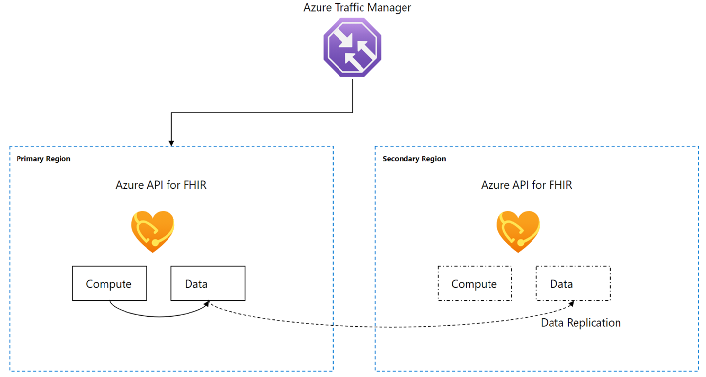
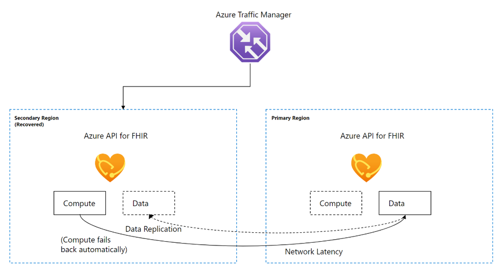

# Disaster recovery for Azure API for FHIR

The Azure API for FHIR® is a fully managed service based on Fast Healthcare Interoperability Resources (FHIR®) and enables you to create new systems of engagement for analytics, machine learning, and actionable intelligence with your health data.

To meet business continuity and disaster recovery (BCDR) compliance requirements, you can use the disaster recovery (DR) feature for Azure API for FHIR. The DR feature provides a Recovery Point Objective (RPO) of 15 minutes and a Recovery Time Objective (RTO) of 60 minutes.

 ## How to enable DR 
  
To enable the DR feature, create a one-time support ticket. By default, one Azure paired region is used as the secondary region. However, you can choose an Azure region where the Azure API for FHIR is supported. The Microsoft support team will enable the DR feature based on the support priority.

## How the DR process works

The DR process involves the following steps: 
* Data replication
* Automatic failover
* Impacted region recovery
* Manual failback

### Data replication in the secondary region

By default, the Azure API for FHIR offers data protection through backup and restore. When the disaster recovery feature is enabled, data replication begins. A data replica is automatically created and synchronized in the secondary Azure region. The initial data replication can take a few minutes to a few hours, or longer, depending on the amount of data. The secondary data replica is a replication of the primary data. It's used directly to recover the service, and it helps speed up the recovery process.

It is worth noting that the throughput RU/s in the secondary region is set to the same value as one in the primary region.

### Automatic failover

During a primary region outage, the Azure API for FHIR automatically fails over to the secondary region. The service is expected to resume in one hour or less, and with potential data loss of up to 15 minutes' worth of data. Changes aren't required by the customer unless Private Link, CMK, IoT and $export are used. For more information, see [Configuration changes during disaster recovery](#configuration-changes-in-dr).

### Impacted region recovery and data replication

After the impacted region recovers, it's automatically available as a secondary region and data replication restarts. The data recovery process can start at this point, or it can be delayed until the failback step is completed.

During the time when compute has failed back to the recovered region but data has not, there may be potential network latencies because compute and data reside in two different regions. The network latencies should disappear automatically as soon as the data fails back to the recovered region through a manual trigger.

### Manual failback

The compute environment fails back automatically to the recovered region. The database is switched back to the recovered region through a manually triggered scripting process by the Microsoft support team. In either case, no customer actions are required unless Private Link, CMK, IoT, and $export are used. For more information about, see [Configuration changes during disaster recovery](#configuration-changes-in-dr).

## Configuration changes in DR

Additional configurations and tests may be required when the following features are used. 

### Private link

You can enable the private link feature before or after the Azure API for FHIR has been provisioned. You can also provision private link before or after the DR feature has been enabled. Refer to the list below when you're ready to configure Private Link for DR.

* Configure Azure Private Link in the primary region. This step is not required in the secondary region. For more information, see [Configure private link](https://docs.microsoft.com/azure/healthcare-apis/fhir/configure-private-link)

* Create one Azure VNet in the primary region and another VNet in the secondary region. For information, see [Create a virtual network using the Azure portal](https://docs.microsoft.com/azure/virtual-network/quick-create-portal).

* In the primary region, VNet creates a VNet peering to the secondary region VNet. For more information, see [Virtual network peering](https://docs.microsoft.com/azure/virtual-network/virtual-network-peering-overview).

* Use the default settings, or you can tailor the configuration as needed. The importance is that the traffic can flow between the two virtual networks.

* When the private DNS is set up, the VNet in the secondary region needs to be manually set up as a "Virtual network links". The primary VNet should have already been added as part of the Private Link endpoint creation flow. For more information, see [Virtual network links](https://docs.microsoft.com/azure/dns/private-dns-virtual-network-links).

* Optionally, set up one VM in the primary region VNet and one in the secondary region VNet. You should be able to access the Azure API for FHIR from both VMs.

The private link feature should continue to work during a regional outage and after the failback has completed. For more information, see [Configure private link](https://docs.microsoft.com/azure/healthcare-apis/fhir/configure-private-link).

> [!NOTE]
> Configuring virtual networks and VNet peering does not affect data replication.

### CMK

 Your access to the Azure API for FHIR will be maintained if the key vault hosting the managed key in your subscription is accessible. There's a possible temporary downtime as key vault can take up to 20 minutes to re-establish its connection if there is a regional failover. For more information, see [Azure Key Vault availability and redundancy](https://docs.microsoft.com/azure/key-vault/general/disaster-recovery-guidance).  

### $export

The job that is running the export will be picked up from another region after 10 minutes without an update to the job status. Follow the guidance for Azure storage for recovering your storage account in the event of a regional outage to allow your FHIR server to access your storage again. For more information, see [Disaster recovery and storage account failover](https://docs.microsoft.com/azure/storage/common/storage-disaster-recovery-guidance). 

Ensure that you grant the same permissions to the system identity of the Azure API for FHIR. Also, if the storage account is configured with selected networks, see [How to export FHIR data](https://docs.microsoft.com/azure/healthcare-apis/fhir/export-data).

### IoMT Connector

Any existing connection won't function until the failed region is restored. You can create a new connection once the failover has completed and your FHIR server is accessible. This new connection will continue to function when failback occurs.

> [!NOTE]
> IoMT Connector is a preview feature and does not provide support for disaster recovery. 

## How to test DR

While not required, you can test the DR feature on a non-production environment, for example dev or in a QA environment. The compute will not be included in the DR test because doing so will disrupt the Azure API for FHIR service for other customers.

Consider the following steps.

* Prepare a test environment with test data. It's recommended that you use a service instance with small amounts of data to reduce the time to replicate the data.
 
* Create a support ticket and provide your Azure subscription and the service name for the Azure API for FHIR for your test environment.

* Come up with a test plan, as you would with any DR test.
 
* Wait until the Microsoft support team has enabled the DR feature and confirm that the environment is ready for test and the failover has taken place.

* Conduct your DR test and record the testing results, which it should include any data loss and network latency issues. 

* For failback, notify the Microsoft support team to complete the failback step.
 
* (Optional) Share any feedback with the Microsoft support team.

> [!NOTE]
> The DR test will double the cost of your test environment during the test. No extra cost will incur after the DR test is completed and the DR feature is disabled.

## Cost of disaster recovery

The disaster recovery feature incurs extra costs because data of the compute and data replica running in the environment in the secondary region. For more pricing details, refer to the [Azure API for FHIR pricing]( https://azure.microsoft.com/pricing/details/azure-api-for-fhir) web page.

> [!NOTE]
> The DR offering is subject to the [SLA for Azure API for FHIR](https://azure.microsoft.com/support/legal/sla/azure-api-for-fhir/v1_0/), 1.0.

## Next steps

In this article, you've learned how to enable DR for Azure API for FHIR and how to test the DR feature in a non-production environment. To learn about Azure API for FHIR's other supported features, see:

>[!div class="nextstepaction"]
>[FHIR supported features](fhir-features-supported.md)
