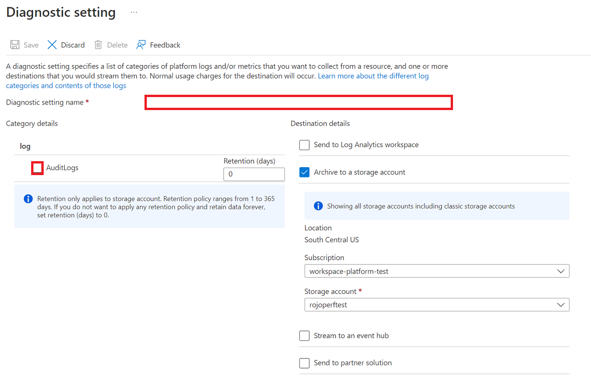

# View and enable audit logs in a FHIR service

> [!IMPORTANT]
> The Azure Healthcare APIs service is currently in preview. The [Supplemental Terms of Use for Microsoft Azure Previews](https://azure.microsoft.com/support/legal/preview-supplemental-terms/) include legal terms that apply to Azure features that are in beta, preview, or otherwise not yet released into general availability.

Access to diagnostic logs is essential for any healthcare service. Compliance with regulatory requirements like Health Insurance Portability and Accountability Act (HIPAA), is a must. In this article, you'll learn how to enable audit logs in a FHIR service in Azure Healthcare APIs. You'll also review some sample queries for these logs.

## Steps to enable audit logs

1. Select your FHIR service in the Azure portal.

2. Under **Monitoring**, select **Diagnostic settings**.

3. Select **+ Add diagnostic settings**.

   

4. Enter a name for the setting.

5. Select the method that you want to use to access your diagnostic logs:

   - **Send to Log Analytics workspace** is used for sending logs and metrics to a Log Analytics workspace in Azure Monitor. You need to create your Logs Analytics workspace before you can select this option.
   
   - **Archive to a storage account** is used for auditing or manual inspection. The storage account that you want to use needs to be already created.

   - **Stream to an event hub** is used for ingestion by a third-party service or custom analytic solution. You need to create an event hub namespace and event hub policy before you can configure this step.

   6. Select **AuditLogs**.

   

7. Select **Save**.

> [!NOTE]
> It might take up to 15 minutes for the first logs to appear in the Log Analytics workspace. If the FHIR service is moved from one resource group or subscription to another, update the settings after the move is complete.

## Audit log details

At this time, the FHIR service returns the following fields in the audit log:

|Field name|Type|Notes|
|----------|----|-----|
|`CallerIdentity` |Dynamic|A generic property bag that contains identity information.|
|`CallerIdentityIssuer` | String| The issuer.|
|`CallerIdentityObjectId` | String| The object ID.|
|`CallerIPAddress` | String| The caller's IP address.|
|`CorrelationId` | String| The correlation ID.|
|`FhirResourceType` | String| The resource type for which the operation was executed.|
|`LogCategory` | String| The log category. (We're currently returning `AuditLogs`.)|
|`Location` | String| The location of the server that processed the request. For example: South Central US.|
|`OperationDuration` | Int| The time it took to complete this request, in seconds.|
|`OperationName` | String| The type of operation. For example: `update` or `search-type`.|
|`RequestUri` | String| The request URI.|
|`ResultType` | String| The available values currently are `Started`, `Succeeded`, or `Failed`.|
|`StatusCode` | Int| The HTTP status code. For example: `200`.|
|`TimeGenerated` | DateTime| The date and time of the event.|
|`Properties` | String| The properties of `FhirResourceType`.|
|`SourceSystem` | String| The source system, which is always Azure in this case.|
|`TenantId` | String | The tenant ID.|
|`Type` | String| The typ of log, which is always `MicrosoftHealthcareApisAuditLog` in this case.|
|`_ResourceId` | String| Details about the resource.|		
		
## Sample queries

Here are a few basic Application Insights queries that you can use to explore your log data:

- Run the following query to view the *100 most recent* logs:

  `Insights
  MicrosoftHealthcareApisAuditLogs
  | limit 100`

- Run the following query to group operations by *FHIR resource type*:

  `Insights
  MicrosoftHealthcareApisAuditLogs 
  | summarize count() by FhirResourceType`

- Run the following query to get all the *failed results*:

  `Insights
  MicrosoftHealthcareApisAuditLogs 
  | where ResultType == "Failed"`	

## Conclusion

Having access to diagnostic logs is essential for monitoring a service and providing compliance reports. In this article, you learned how to enable audit logs for the FHIR service. 

> [!NOTE]
> Metrics will be added when the Azure Healthcare APIs service is generally available.

FHIR is a registered trademark of [HL7](https://www.hl7.org/fhir/index.html) and is used with the permission of HL7.

## Next steps

For an overview of the FHIR service, see:

>[!div class="nextstepaction"]
>[FHIR service overview](overview.md)	
