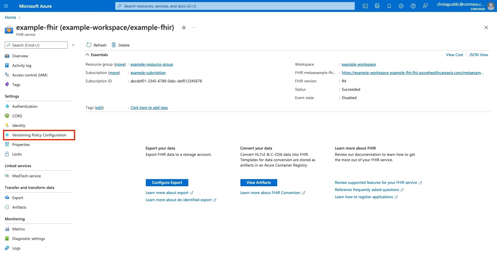
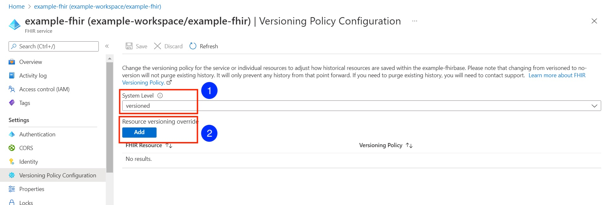
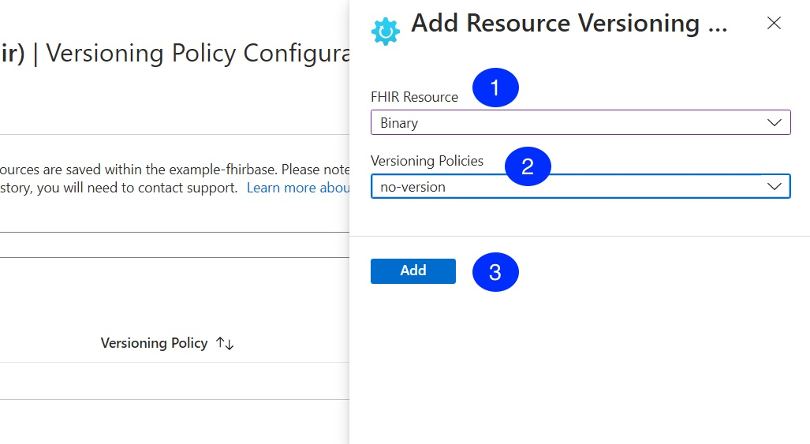

# Versioning policy and history management

The versioning policy in the Azure Health Data Services FHIR service is a configuration, which determines how history is stored for every resource type with the option for resource specific configuration. This policy is directly related to the concept of managing history for FHIR resources.

## History in FHIR

History in FHIR gives you the ability to see all previous versions of a resource. History in FHIR can be queried at the resource level, type level, or system level. The HL7 FHIR documentation has more information about the [history interaction](https://www.hl7.org/fhir/http.html#history). History is useful in scenarios where you want to see the evolution of a resource in FHIR or if you want to see the information of a resource at a specific point in time.

All past versions of a resource are considered obsolete and the current version of a resource should be used for normal business workflow operations. However, it can be useful to see the state of a resource as a point in time when a past decision was made.

## Versioning policy

Versioning policy in the FHIR service lets you decide how history is stored either at a FHIR service level or at a specific resource level. 

There are three different levels for versioning policy:

- `versioned`: History is stored for operation on resources. Resource version is incremented. This is the default.
- `version-update`: History is stored for operation on resources. Resource version is incremented. Updates require a valid `If-Match` header. For more information, see [VersionedUpdateExample.http](https://github.com/microsoft/fhir-server/blob/main/docs/rest/VersionedUpdateExample.http).
- `no-version`: History isn't created for resources. Resource version is incremented.

Versioning policy available to configure at as a system-wide setting and also to override at a resource level. The system-wide setting is used for all resources in your FHIR service, unless a specific resource level versioning policy has been added.

### Versioning policy comparison

| Policy Value     | History Behavior      | `meta.versionId` Update Behavior  | Default |
| ---------------- | --------------------- | -------------------------- | ------- |
| `versioned`      | History is stored     | If-Match not required      | Yes     |
| `version-update` | History is stored     | If-Match required          | No      |
| `no-version`     | History isn't stored  | If-Match not required      | No      |

> [!NOTE]
> Changing the versioning policy to `no-version` has no effect on existing resource history. If history needs to be removed for resources, use the [$purge-history](purge-history.md) operation.

## Configuring versioning policy

To configure versioning policy, select the **Versioning Policy Configuration** blade inside your FHIR service.

After you've browsed to Versioning Policy Configuration, you'll be able to configure the setting at both system level and the resource level (as an override of the system level). The system level configuration (annotated as 1) will apply to every resource in your FHIR service unless a resource specific override (annotated at 2) has been configured.

When configuring resource level configuration, you'll be able to select the FHIR resource type (annotated as 1) and the specific versioning policy for this specific resource (annotated as 2). Make sure to select the **Add** button (annotated as 3) to queue up this setting for saving.

**Make sure** to select **Save** after you've completed your versioning policy configuration.

## History Management

History in FHIR is important for end users to see how a resource has changed over time. It's also useful in coordination with audit logs to see the state of a resource before and after a user modified it. In general, it's recommended to keep history for a resource unless you know that the history isn't needed. Frequent updates of resources can result in a large amount of data storage, which can be undesired in FHIR services with a large amount of data.

Changing the versioning policy either at a system level or resource level won't remove the existing history for any resources in your FHIR service. If you're looking to reduce the history data size in your FHIR service, you must use the [$purge-history](purge-history.md) operation.

## Next steps

In this article, you learned how to purge the history for resources in the FHIR service. For more information about how to disable history and some concepts about history management, see

>[!div class="nextstepaction"]
>[Purge history operation](purge-history.md)

