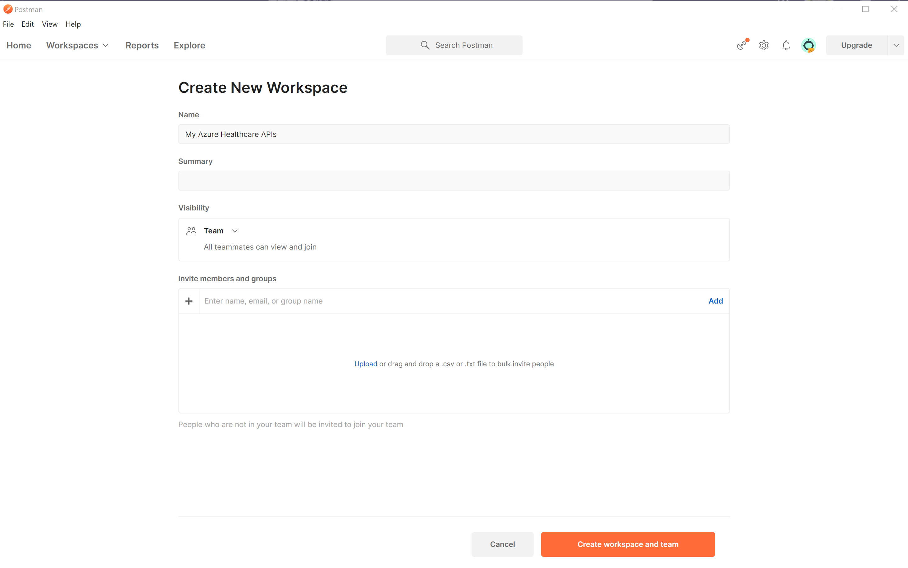
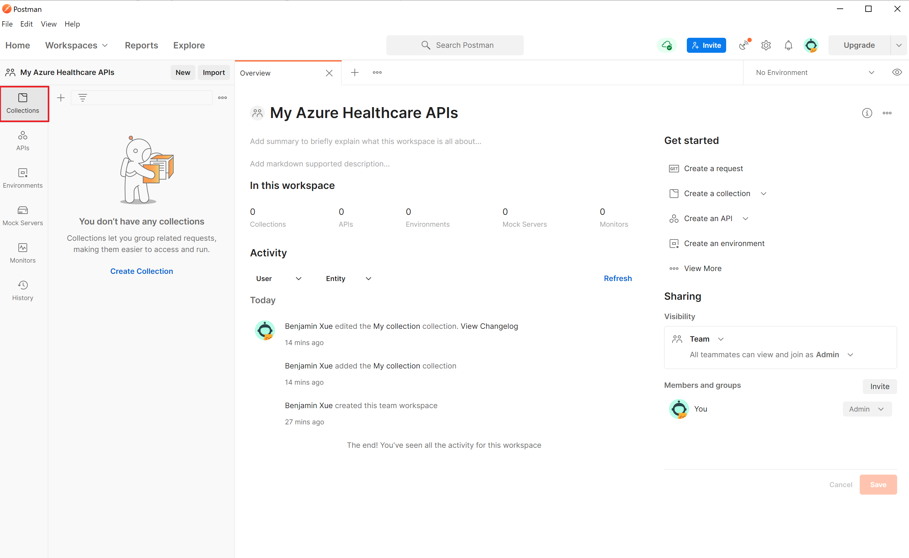
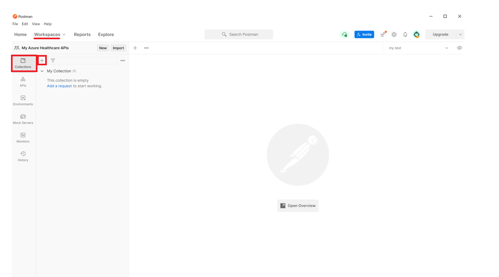
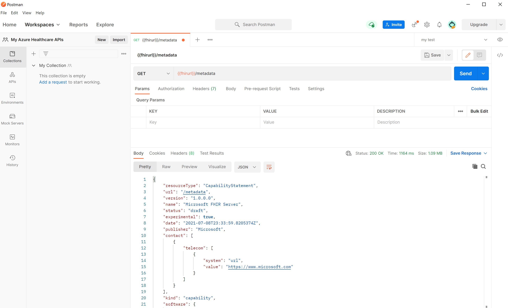
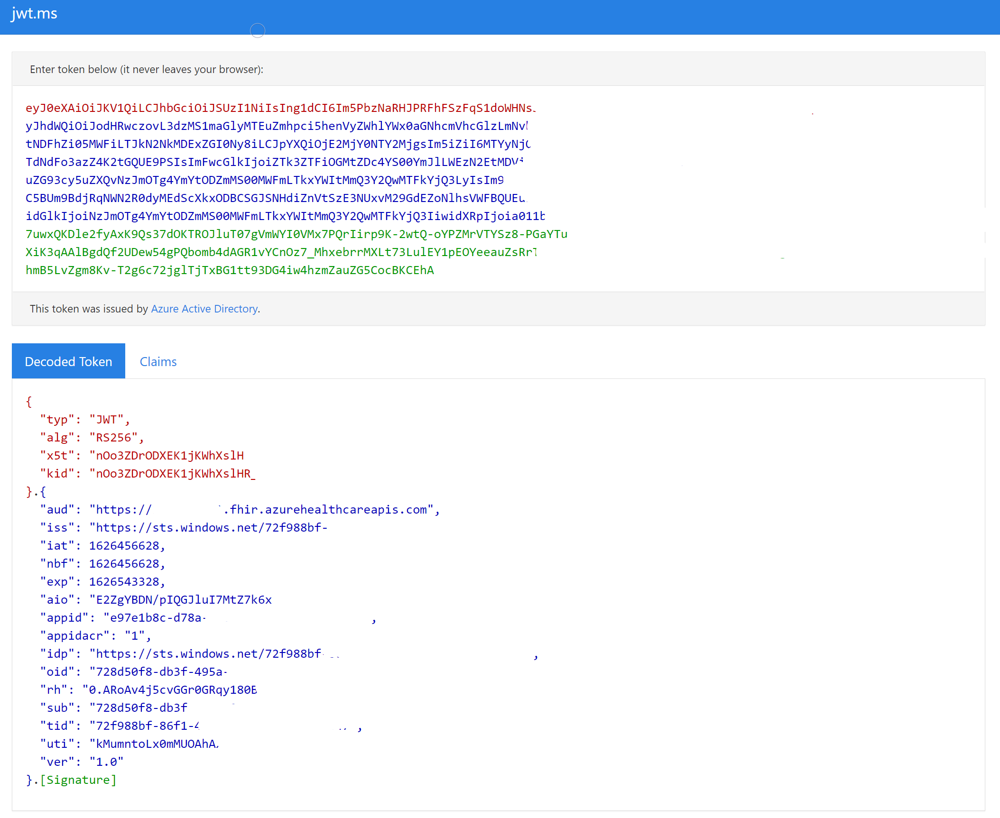
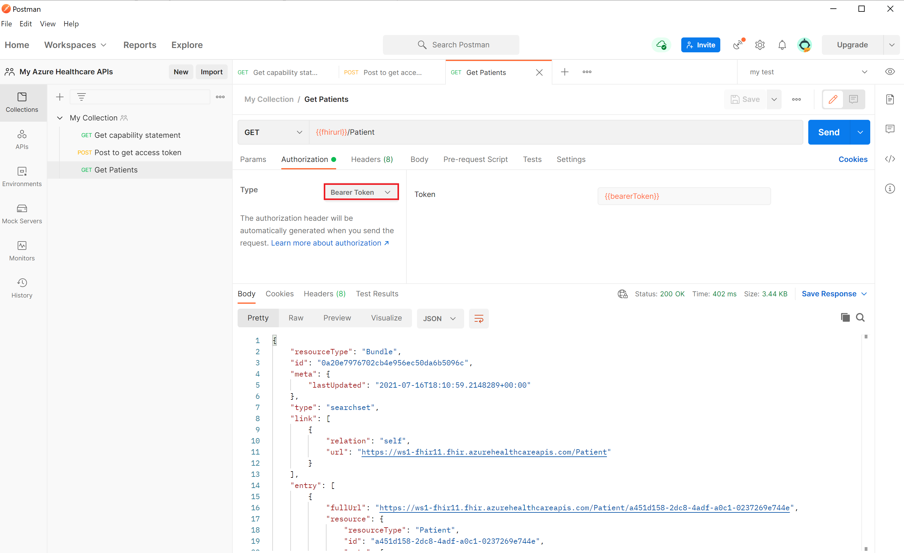
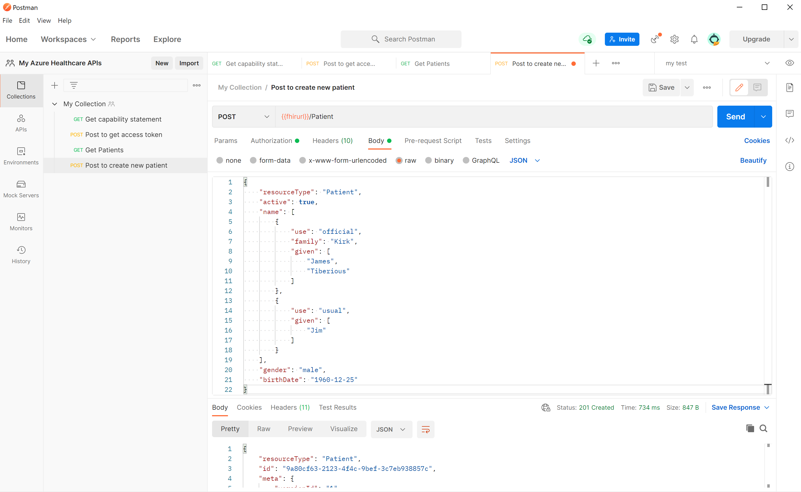
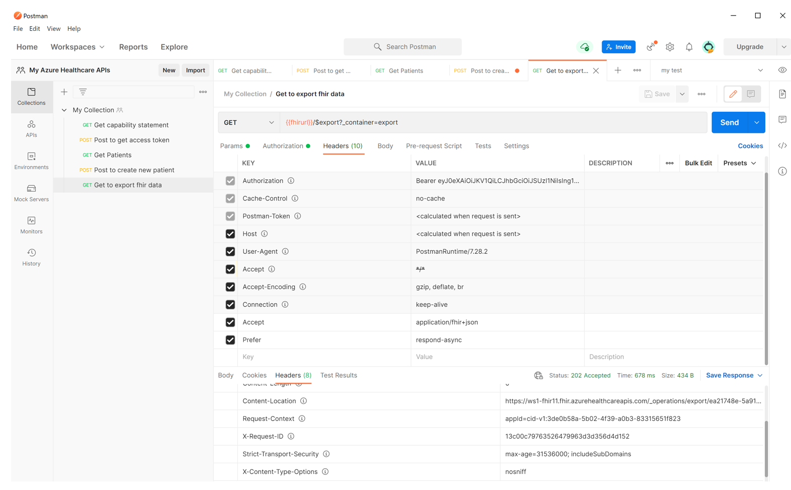

# Access the FHIR service using Postman

In this article, we will walk through the steps of accessing the Healthcare APIs FHIR service using [Postman](https://www.getpostman.com/).

## Prerequisites

* The FHIR service deployed in Azure. For information about how to deploy the FHIR service, see [Deploy a FHIR service](fhir-portal-quickstart.md).
* A registered client application to access the FHIR service. For information about how to register a client application, see [Register a service client application in Azure Active Directory](../register-application.md). 
* Permissions granted to the client application and your user account, for example, "FHIR Data Contributor", to access the FHIR service. For more information, see [Deploy a FHIR service within Azure Healthcare APIs](fhir-portal-quickstart.md).
* Postman installed locally. For more information about Postman, see [Get Started with Postman](https://www.getpostman.com/).

## Using Postman: create workspace, collection, and environment

If you are new to Postman, follow the steps below. Otherwise, you can skip this step.
 
Postman introduces the workspace concept to enable you and your team to share APIs, collections, environments, and other components. You can use the default “My workspace” or “Team workspace” or create a new workspace for you or your team.
 
[  ](media/postman/postman-create-new-workspace.png#lightbox)

Next, create a new collection where you can group all related REST API requests. In the workspace, select **Create Collections**. You can keep the default name **New collection** or rename it. The change is saved automatically.

[  ](media/postman/postman-create-a-new-collection.png#lightbox)

You can also import and export Postman collections. For more information, see [the Postman documentation](https://learning.postman.com/docs/getting-started/importing-and-exporting-data/).

[  ](media/postman/postman-import-data.png#lightbox)

## Create or update environment variables

While you can use the full url in the request, it is recommended that you store the url and other data in variables and use them.

To access the FHIR service, we'll need to create or update the following variables.

* **tenantid** – Azure tenant where the FHIR service is deployed in. It's located from the **Application registration overview** menu option.
* **subid** – Azure subscription where the FHIR service is deployed in. It's located from the **FHIR service overview** menu option.
* **clientid** – Application client registration ID.
* **clientsecret** – Application client registration secret.
* **fhirurl** – The FHIR service full URL. For example, `https://xxx.azurehealthcareapis.com`. It's located from the **FHIR service overview** menu option.
* **bearerToken** – The variable to store the Azure Active Directory (Azure AD) access token in the script. Leave it blank.

> [!NOTE]
> Ensure that you've configured the redirect URL, [https://www.getpostman.com/oauth2/callback](https://www.getpostman.com/oauth2/callback), in the client application registration.

[  ](media/postman/postman-environments-variable.png#lightbox)

## Connect to the FHIR server

Open Postman, select the **workspace**, **collection**, and **environment** you want to use. Select the `+` icon to create a new request. 

[  ](media/postman/postman-create-new-request.png#lightbox)

## Get capability statement

Enter `{{fhirurl}}/metadata` in the `GET`request, and hit `Send`. You should see the capability statement of the FHIR service.

[  ](media/postman/postman-capability-statement.png#lightbox)

[  ](media/postman/postman-save-request.png#lightbox)

## Get Azure AD access token

The FHIR service is secured by Azure AD. The default authentication can't be disabled. To access the FHIR service, you must get an Azure AD access token first. For more information, see [Microsoft identity platform access tokens](../../active-directory/develop/access-tokens.md).

Create a new `POST` request:

1. Enter in the request header:
   `https://login.microsoftonline.com/{{tenantid}}/oauth2/token`

2. Select the **Body** tab and select **x-www-form-urlencoded**. Enter the following values in the key and value section:
    - **grant_type**: `Client_Credentials`
    - **client_id**: `{{clientid}}`
    - **client_secret**: `{{clientsecret}}`
    - **resource**: `{{fhirurl}}`
    
3. Select the **Test** tab and enter in the text section: `pm.environment.set("bearerToken", pm.response.json().access_token);`
4. Select **Save** to save the settings.
5. Hit **Send**. You should see a response with the Azure AD access token, which is saved to the variable `accessToken` automatically. You can then use it in all FHIR service API requests.

  [  ](media/postman/postman-send-button.png#lightbox)

You can examine the access token using online tools such as [https://jwt.ms](https://jwt.ms). Select the **Claims** tab to see detailed descriptions for each claim in the token.

[  ](media/postman/postman-access-token-claims.png#lightbox)

## Get FHIR resource

After you've obtained an Azure AD access token, you can access the FHIR data. In a new `GET` request, enter `{{fhirurl}}/Patient`.

Select **Bearer Token** as authorization type.  Enter `{{bearerToken}}` in the **Token** section. Select **Send**. As a response, you should see a list of patients in your FHIR resource.

[  ](media/postman/postman-select-bearer-token.png#lightbox)

## Create or update your FHIR resource

After you've obtained an Azure AD access token, you can create or update the FHIR data. For example, you can create a new patient or update an existing patient.
 
Create a new request, change the method to “Post”, and enter the value in the request section.

`{{fhirurl}}/Patient`

Select **Bearer Token** as the authorization type.  Enter `{{bearerToken}}` in the **Token** section. Select the **Body** tab. Select the **raw** option and **JSON** as body text format. Copy and paste the text to the body section. 


```
{
    "resourceType": "Patient",
    "active": true,
    "name": [
        {
            "use": "official",
            "family": "Kirk",
            "given": [
                "James",
                "Tiberious"
            ]
        },
        {
            "use": "usual",
            "given": [
                "Jim"
            ]
        }
    ],
    "gender": "male",
    "birthDate": "1960-12-25"
}
```
Select **Send**. You should see a new patient in the JSON response.

[  ](media/postman/postman-send-create-new-patient.png#lightbox)

## Export FHIR data

After you've obtained an Azure AD access token, you can export FHIR data to an Azure storage account.

Create a new `GET` request: `{{fhirurl}}/$export?_container=export`

Select **Bearer Token** as authorization type.  Enter `{{bearerToken}}` in the **Token** section. Select **Headers** to add two new headers:

- **Accept**: `application/fhir+json`
- **Prefer**:  `respond-async`

Hit **Send**. You should notice a `202 Accepted` response. Select the **Headers** tab of the response and make a note of the value in the **Content-Location**. You can use the value to query the export job status.

[  ](media/postman/postman-202-accepted-response.png#lightbox)