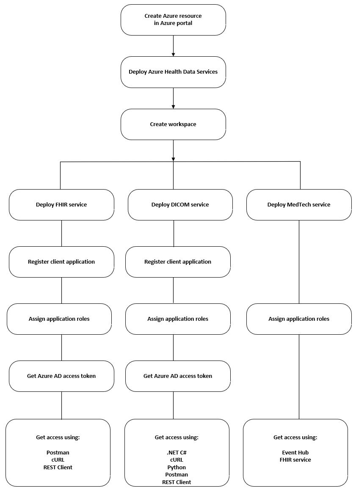

# Get started with Azure Health Data Services

This article outlines the basic steps to get started with Azure Health Data Services. Azure Health Data Services is a set of managed API services based on open standards and frameworks that enable workflows to improve healthcare and offer scalable and secure healthcare solutions. Using a set of managed API services and frameworks that’s dedicated to the healthcare industry is important and beneficial because health data collected from patients and healthcare consumers can be fragmented from across multiple systems, device types, and data formats.

To get started with Azure Health Data Services, you'll need to create a workspace in the Azure portal. The workspace is a logical container for all your healthcare service instances such as Fast Healthcare Interoperability Resources (FHIR®) services, Digital Imaging and Communications in Medicine (DICOM®) services, and MedTech service. The workspace also creates a compliance boundary (HIPAA, HITRUST) within which protected health information can travel.
Before you can create a workspace in the Azure portal, you must have an Azure account subscription. If you don’t have an Azure subscription, see [Create your free Azure account today](https://azure.microsoft.com/free/search/?OCID=AID2100131_SEM_c4b0772dc7df1f075552174a854fd4bc:G:s&ef_id=c4b0772dc7df1f075552174a854fd4bc:G:s&msclkid=c4b0772dc7df1f075552174a854fd4bc). 

## Deploy Health Data Services 

To get started with Azure Health Data Services, you must [create a resource](https://ms.portal.azure.com/#create/hub) in the Azure portal. To do this, enter **Azure Health Data Services** in the **Search services and marketplace** box.

After you've located the Azure Health Data Services resource, select **Create**.

## Create workspace

After you've deployed the Azure Health Data Services resource group, you can enter the workspace subscription and instance details. 

To be guided through these steps, see [Deploy Azure Health Data Services workspace using Azure portal](healthcare-apis-quickstart.md).

> [!Note] 
> You can provision multiple data services within a workspace, and by design, they work seamlessly with one another. With the workspace, you can organize all your Azure Health Data Services instances and manage certain configuration settings that are shared among all the underlying datasets and services where it's applicable. 

After your workspace has been deployed, you can provision a FHIR service, DICOM service, and MedTech service.

### FHIR service

FHIR service in Azure Health Data Services enables rapid exchange of data through FHIR APIs that's backed by a managed Platform-as-a Service (PaaS) offering in the cloud. It makes it easier for anyone working with health data to ingest, manage, and persist Protected Health Information PHI in the cloud.  For more information about the FHIR service and how to deploy the FHIR service, see [What is FHIR service?](./../healthcare-apis/fhir/overview.md) and [Deploy FHIR service within Azure Health Data Services](./../healthcare-apis/fhir/fhir-portal-quickstart.md).

### DICOM service

DICOM (Digital Imaging and Communications in Medicine) is the international standard to transmit, store, retrieve, print, process, and display medical imaging information, and is the primary medical imaging standard accepted across healthcare.

DICOM service is a managed service within Azure Health Data Services that ingests and persists DICOM objects at multiple thousands of images per second. It facilitates communication and transmission of imaging data with any DICOMweb™ enabled systems or applications via DICOMweb Standard APIs like [Store (STOW-RS)](./../healthcare-apis/dicom/dicom-services-conformance-statement.md#store-stow-rs), [Search (QIDO-RS)](./../healthcare-apis/dicom/dicom-services-conformance-statement.md#search-qido-rs), [Retrieve (WADO-RS)](./../healthcare-apis/dicom/dicom-services-conformance-statement.md#retrieve-wado-rs). For more information about the DICOM service, see [Get started with the DICOM service](./../healthcare-apis/dicom/get-started-with-dicom.md) and [Overview of the DICOM service](./../healthcare-apis/dicom/dicom-services-overview.md).

### MedTech service

MedTech service is an optional service of the Azure Health Data Services designed to ingest health data from multiple and disparate Internet of Medical Things (IoMT) devices and persisting the health data in a FHIR service.

MedTech service transforms device data into FHIR-based observation resources and then persists the transformed messages into Azure Health Data Services FHIR service. This allows for a unified approach to health data access, standardization, and trend capture enabling the discovery of operational and clinical insights, connecting new device applications, and enabling new research projects. For more information about the MedTech service, see [Get started with the MedTech service](./../healthcare-apis/iot/get-started-with-iot.md).

### Access Azure Health Data Services

After you've provisioned a FHIR service, DICOM service, or MedTech service, you can access them in your applications using tools like Postman, cURL, REST Client in Visual Studio Code, and with programming languages such as Python and C#. For more information, see [Access Azure Health Data Services](./../healthcare-apis/access-healthcare-apis.md).

## Next steps

This article described the basic steps to get started using Azure Health Data Services. For information about Azure Health Data Services, see

>[!div class="nextstepaction"]
>[What is Azure Health Data Services?](healthcare-apis-overview.md)

>[!div class="nextstepaction"]
>[Frequently asked questions about Azure Health Data Services](healthcare-apis-faqs.md)

