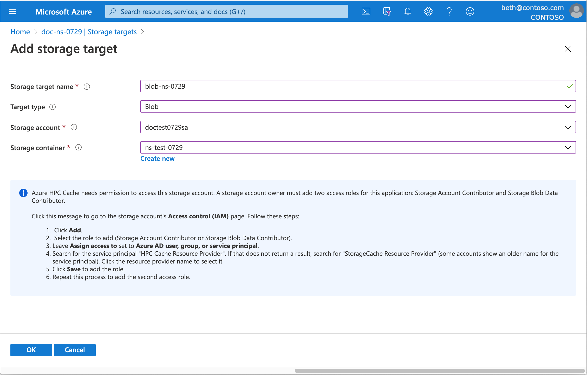
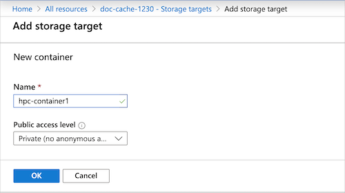
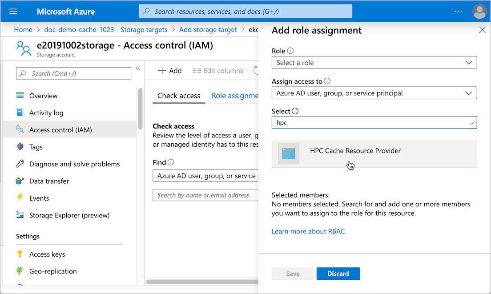
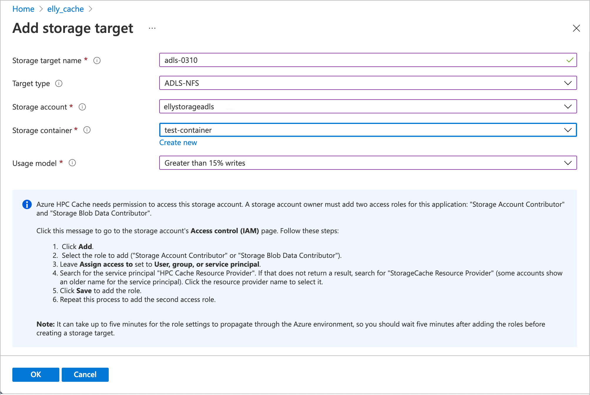

# Add storage targets

*Storage targets* are back-end storage for files that are accessed through an Azure HPC Cache. You can add NFS storage (like an on-premises hardware system), or store data in Azure Blob.

You can define up to 20 different storage targets for one cache. The cache presents all of the storage targets in one aggregated namespace.

The namespace paths are configured separately after you add the storage targets. In general, an NFS storage target can have up to ten namespace paths, or more for some large configurations. Read [NFS namespace paths](add-namespace-paths.md#nfs-namespace-paths) for details.

Remember that the storage exports must be accessible from your cache's virtual network. For on-premises hardware storage, you might need to set up a DNS server that can resolve hostnames for NFS storage access. Read more in [DNS access](hpc-cache-prerequisites.md#dns-access).

Add storage targets after creating your cache. Follow this process:

1. [Create the cache](hpc-cache-create.md)
1. Define a storage target (information in this article)
1. [Create the client-facing paths](add-namespace-paths.md) (for the [aggregated namespace](hpc-cache-namespace.md))

The procedure to add a storage target is slightly different depending on the type of storage it uses. Details for each are below.

Click the image below to watch a [video demonstration](https://azure.microsoft.com/resources/videos/set-up-hpc-cache/) of creating a cache and adding a storage target from the Azure portal.

[](https://azure.microsoft.com/resources/videos/set-up-hpc-cache/)

## Add a new Azure Blob storage target

A new Blob storage target needs an empty Blob container or a container that is populated with data in the Azure HPC Cache cloud file system format. Read more about pre-loading a Blob container in [Move data to Azure Blob storage](hpc-cache-ingest.md).

The Azure portal **Add storage target** page includes the option to create a new Blob container just before you add it.

> [!NOTE]
> For NFS-mounted blob storage, use the [ADLS-NFS storage target](#) type.

### [Portal](#tab/azure-portal)

From the Azure portal, open your cache instance and click **Storage targets** on the left sidebar.


The **Storage targets** page lists all existing targets and gives a link to add a new one.

Click the **Add storage target** button.



To define an Azure Blob container, enter this information.

* **Storage target name** - Set a name that identifies this storage target in the Azure HPC Cache.
* **Target type** - Choose **Blob**.
* **Storage account** - Select the account that you want to use.

  You will need to authorize the cache instance to access the storage account as described in [Add the access roles](#add-the-access-control-roles-to-your-account).

  For information about the kind of storage account you can use, read [Blob storage requirements](hpc-cache-prerequisites.md#blob-storage-requirements).

* **Storage container** - Select the Blob container for this target, or click **Create new**.

  

When finished, click **OK** to add the storage target.

> [!NOTE]
> If your storage account firewall is set to restrict access to only "selected networks," use the temporary workaround documented in [Work around Blob storage account firewall settings](hpc-cache-blob-firewall-fix.md).

### Add the access control roles to your account

Azure HPC Cache uses [Azure role-based access control (Azure RBAC)](../role-based-access-control/index.yml) to authorize the cache service to access your storage account for Azure Blob storage targets.

The storage account owner must explicitly add the roles [Storage Account Contributor](../role-based-access-control/built-in-roles.md#storage-account-contributor) and [Storage Blob Data Contributor](../role-based-access-control/built-in-roles.md#storage-blob-data-contributor) for the user "HPC Cache Resource Provider".

You can do this ahead of time, or by clicking a link on the page where you add a Blob storage target. Keep in mind that it can take up to five minutes for the role settings to propagate through the Azure environment, so you should wait a few minutes after adding the roles before creating a storage target.

Steps to add the Azure roles:

1. Open the **Access control (IAM)** page for the storage account. (The link in the **Add storage target** page automatically opens this page for the selected account.)

1. Click the **+** at the top of the page and choose **Add a role assignment**.

1. Select the role "Storage Account Contributor" from the list.

1. In the **Assign access to** field, leave the default value selected ("Azure AD user, group, or service principal").  

1. In the **Select** field, search for "hpc".  This string should match one service principal, named "HPC Cache Resource Provider". Click that principal to select it.

   > [!NOTE]
   > If a search for "hpc" doesn't work, try using the string "storagecache" instead. Users who participated in previews (before GA) might need to use the older name for the service principal.

1. Click the **Save** button at the bottom.

1. Repeat this process to assign the role "Storage Blob Data Contributor".  



### [Azure CLI](#tab/azure-cli)

### Prerequisite: Storage account access

[Set up Azure CLI for Azure HPC Cache](./az-cli-prerequisites.md).

Before you add a blob storage target, check that the cache has the correct roles to access the storage account, and that firewall settings will allow the storage target creation.

Azure HPC Cache uses [Azure role-based access control (Azure RBAC)](../role-based-access-control/index.yml) to authorize the cache service to access your storage account for Azure Blob storage targets.

The storage account owner must explicitly add the roles [Storage Account Contributor](../role-based-access-control/built-in-roles.md#storage-account-contributor) and [Storage Blob Data Contributor](../role-based-access-control/built-in-roles.md#storage-blob-data-contributor) for the user "HPC Cache Resource Provider".

Storage target creation will fail if the cache doesn't have these roles.

It can take up to five minutes for the role settings to propagate through the Azure environment, so you should wait a few minutes after adding the roles before creating a storage target.

Read [Add or remove Azure role assignments using Azure CLI](../role-based-access-control/role-assignments-cli.md) for detailed instructions.

Also check your storage account's firewall settings. If the firewall is set to restrict access to only "selected networks," the storage target creation might fail. Use the workaround documented in [Work around Blob storage account firewall settings](hpc-cache-blob-firewall-fix.md).

### Add a blob storage target with Azure CLI

Use the [az hpc-cache blob-storage-target add](/cli/azure/ext/hpc-cache/hpc-cache/blob-storage-target#ext-hpc-cache-az-hpc-cache-blob-storage-target-add) interface to define an Azure Blob storage target.

> [!NOTE]
> The Azure CLI commands currently require you to create a namespace path when you add a storage target. This is different from the process used with the Azure portal interface.

In addition to the standard resource group and cache name parameters, you must provide these options for the storage target:

* ``--name`` - Set a name that identifies this storage target in the Azure HPC Cache.

* ``--storage-account`` - The account identifier, in this form:
  /subscriptions/*<subscription_id>*/resourceGroups/*<storage_resource_group>*/providers/Microsoft.Storage/storageAccounts/*<account_name>*

  For information about the kind of storage account you can use, read [Blob storage requirements](hpc-cache-prerequisites.md#blob-storage-requirements).

* ``--container-name`` - Specify the name of the container to use for this storage target.

* ``--virtual-namespace-path`` - Set the client-facing file path for this storage target. Enclose paths in quotation marks. Read [Plan the aggregated namespace](hpc-cache-namespace.md) to learn more about the virtual namespace feature.

Example command:

```azurecli
az hpc-cache blob-storage-target add --resource-group "hpc-cache-group" \
    --cache-name "cache1" --name "blob-target1" \
    --storage-account "/subscriptions/<subscriptionID>/resourceGroups/myrgname/providers/Microsoft.Storage/storageAccounts/myaccountname" \
    --container-name "container1" --virtual-namespace-path "/blob1"
```

---

## Add a new NFS storage target

An NFS storage target has different settings from a Blob storage target. The usage model setting helps the cache to efficiently cache data from this storage system.


> [!NOTE]
> Before you create an NFS storage target, make sure your storage system is accessible from the Azure HPC Cache and meets permission requirements. Storage target creation will fail if the cache can't access the storage system. Read [NFS storage requirements](hpc-cache-prerequisites.md#nfs-storage-requirements) and [Troubleshoot NAS configuration and NFS storage target issues](troubleshoot-nas.md) for details.

### Choose a usage model
<!-- referenced from GUI - update aka.ms link to point at new article when published -->

When you create a storage target that uses NFS to reach its storage system, you need to choose a usage model for that target. This model determines how your data is cached.

Read [Understand usage models](cache-usage-models.md) for more details about all of these settings.

The built-in usage models let you choose how to balance fast response with the risk of getting stale data. If you want to optimize speed for reading files, you might not care whether the files in the cache are checked against the back-end files. On the other hand, if you want to make sure your files are always up to date with the remote storage, choose a model that checks frequently.

These three options cover most situations:

* **Read heavy, infrequent writes** - Speeds up read access to files that are static or rarely changed.

  This option caches files from client reads, but passes client writes through to the back-end storage immediately. Files stored in the cache are not automatically compared to the files on the NFS storage volume.

  Do not use this option if there is a risk that a file might be modified directly on the storage system without first writing it to the cache. If that happens, the cached version of the file will be out of sync with the back-end file.

* **Greater than 15% writes** - This option speeds up both read and write performance.

  Client reads and client writes are both cached. Files in the cache are assumed to be newer than files on the back-end storage system. Cached files are only automatically checked against the files on back-end storage every eight hours. Modified files in the cache are written to the back-end storage system after they have been in the cache for 20 minutes with no additional changes.

  Do not use this option if any clients mount the back-end storage volume directly, because there is a risk it will have stale files.

* **Clients write to the NFS target, bypassing the cache** - Choose this option if any clients in your workflow write data directly to the storage system without first writing to the cache, or if you want to optimize data consistency.

  Files that clients request are cached, but any changes to those files from the client are passed through to the back-end storage system immediately. Files in the cache are frequently checked against the back-end versions for updates. This verification maintains data consistency when files are changed directly on the storage system instead of through the cache.

For details about the other options, read [Understand usage models](cache-usage-models.md).

This table summarizes the differences among all of the usage models:

| Usage model | Caching mode | Back-end verification | Maximum write-back delay |
|--|--|--|--|
| Read heavy, infrequent writes | Read | Never | None |
| Greater than 15% writes | Read/write | 8 hours | 20 minutes |
| Clients bypass the cache | Read | 30 seconds | None |
| Greater than 15% writes, frequent back-end checking (30 seconds) | Read/write | 30 seconds | 20 minutes |
| Greater than 15% writes, frequent back-end checking (60 seconds) | Read/write | 60 seconds | 20 minutes |
| Greater than 15% writes, frequent write-back (Collaborating cloud workstation) | Read/write | 30 seconds | 30 seconds |
| Read heavy, checking the backing server every 3 hours (Read-only high verification time) | Read | 3 hours | None |

> [!NOTE]
> The **Back-end verification** value shows when the cache automatically compares its files with source files in remote storage. However, you can trigger a comparison by sending a client request that includes a readdirplus operation on the back-end storage system. Readdirplus is a standard NFS API (also called extended read) that returns directory metadata, which causes the cache to compare and update files.

### Create an NFS storage target

### [Portal](#tab/azure-portal)

From the Azure portal, open your cache instance and click **Storage targets** on the left sidebar.


The **Storage targets** page lists all existing targets and gives a link to add a new one.

Click the **Add storage target** button.


Provide this information for an NFS-backed storage target:

* **Storage target name** - Set a name that identifies this storage target in the Azure HPC Cache.

* **Target type** - Choose **NFS**.

* **Hostname** - Enter the IP address or fully qualified domain name for your NFS storage system. (Use a domain name only if your cache has access to a DNS server that can resolve the name.)

* **Usage model** - Choose one of the data caching profiles based on your workflow, described in [Choose a usage model](#choose-a-usage-model) above.

When finished, click **OK** to add the storage target.

### [Azure CLI](#tab/azure-cli)

[Set up Azure CLI for Azure HPC Cache](./az-cli-prerequisites.md).

Use the Azure CLI command [az hpc-cache nfs-storage-target add](/cli/azure/ext/hpc-cache/hpc-cache/nfs-storage-target#ext-hpc-cache-az-hpc-cache-nfs-storage-target-add) to create the storage target.

> [!NOTE]
> The Azure CLI commands currently require you to create a namespace path when you add a storage target. This is different from the process used with the Azure portal interface.

Supply these values in addition to the cache name and cache resource group:

* ``--name`` - Set a name that identifies this storage target in the Azure HPC Cache.
* ``--nfs3-target`` - The IP address of your NFS storage system. (You can use a fully qualified domain name here if your cache has access to a DNS server that can resolve the name.)
* ``--nfs3-usage-model`` - One of the data caching profiles, described in [Choose a usage model](#choose-a-usage-model), above.

  Verify the names of the usage models with the command [az hpc-cache usage-model list](/cli/azure/ext/hpc-cache/hpc-cache/usage-model#ext-hpc-cache-az-hpc-cache-usage-model-list).

* ``--junction`` - The junction parameter links the client-facing virtual file path with an export path on the storage system.

  An NFS storage target can have multiple virtual paths, as long as each path represents a different export or subdirectory on the same storage system. Create all of the paths for one storage system on one storage target.

  You can [add and edit namespace paths](add-namespace-paths.md) on a storage target at any time.

  The ``--junction`` parameter uses these values:

  * ``namespace-path`` - The client-facing virtual file path
  * ``nfs-export`` - The storage system export to associate with the client-facing path
  * ``target-path`` (optional) - A subdirectory of the export, if needed

  Example: ``--junction namespace-path="/nas-1" nfs-export="/datadisk1" target-path="/test"``

  Read [Configure aggregated namespace](hpc-cache-namespace.md) to learn more about the virtual namespace feature.

Example command:

```azurecli

az hpc-cache nfs-storage-target add --resource-group "hpc-cache-group" --cache-name "doc-cache0629" \
    --name nfsd1 --nfs3-target 10.0.0.4 --nfs3-usage-model WRITE_WORKLOAD_15 \
    --junction namespace-path="/nfs1/data1" nfs-export="/datadisk1" target-path=""
```

Output:
```azurecli

{- Finished ..
  "clfs": null,
  "id": "/subscriptions/<subscriptionID>/resourceGroups/hpc-cache-group/providers/Microsoft.StorageCache/caches/doc-cache0629/storageTargets/nfsd1",
  "junctions": [
    {
      "namespacePath": "/nfs1/data1",
      "nfsExport": "/datadisk1",
      "targetPath": ""
    }
  ],
  "location": "eastus",
  "name": "nfsd1",
  "nfs3": {
    "target": "10.0.0.4",
    "usageModel": "WRITE_WORKLOAD_15"
  },
  "provisioningState": "Succeeded",
  "resourceGroup": "hpc-cache-group",
  "targetType": "nfs3",
  "type": "Microsoft.StorageCache/caches/storageTargets",
  "unknown": null
}

```

---

## Add a new ADLS-NFS storage target (PREVIEW)

ADLS-NFS storage targets use Azure Blob containers that support the Network File System (NFS) 3.0 protocol.

> [!NOTE]
> NFS 3.0 protocol support for Azure Blob storage is in public preview. Availability is restricted, and features might change between now and when the feature becomes generally available. Do not use preview technology in production systems.
>
> Read [NFS 3.0 protocol support](../storage/blobs/network-file-system-protocol-support.md) for the latest information.

ADLS-NFS storage targets have some similarities with Blob storage targets and some with NFS storage targets. For example:

* Like a Blob storage target, you need to give Azure HPC Cache permission to [access your storage account](#add-the-access-control-roles-to-your-account).
* Like an NFS storage target, you need to set a cache [usage model](#choose-a-usage-model).
* Because NFS-enabled blob containers have an NFS-compatible hierarchical structure, you do not need to use the cache to ingest data, and the containers are readable by other NFS systems. You can pre-load data in an ADLS-NFS container, then add it to an HPC cache as storage target, and then access the data later from outside of an HPC cache. When you use a standard blob container as an HPC cache storage target, the data is written in a proprietary format and can only be accessed from other Azure HPC Cache-compatible products.

Before you can create an ADLS-NFS storage target, you must create an NFS-enabled storage account. Follow the tips in [Prerequisites for Azure HPC Cache](hpc-cache-prerequisites.md#nfs-mounted-blob-adls-nfs-storage-requirements-preview) and the instructions in [Mount Blob storage by using NFS](../storage/blobs/network-file-system-protocol-support-how-to.md). After your storage account is set up you can create a new container when you create the storage target.

To create an ADLS-NFS storage target, Open the **Add storage target** page in the Azure portal. (Additional methods are in development.)



Enter this information.

* **Storage target name** - Set a name that identifies this storage target in the Azure HPC Cache.
* **Target type** - Choose **ADLS-NFS**.
* **Storage account** - Select the account that you want to use. If your NFS-enabled storage account does not appear in the list, check that it conforms to the prerequisites and that the cache can access it.

  You will need to authorize the cache instance to access the storage account as described in [Add the access roles](#add-the-access-control-roles-to-your-account).

* **Storage container** - Select the NFS-enabled blob container for this target, or click **Create new**.

* **Usage model** - Choose one of the data caching profiles based on your workflow, described in [Choose a usage model](#choose-a-usage-model) above.

When finished, click **OK** to add the storage target.

<!-- **** -->

## View storage targets

You can use the Azure portal or the Azure CLI to show the storage targets already defined for your cache.

### [Portal](#tab/azure-portal)

From the Azure portal, open your cache instance and click **Storage targets**, which is under the Settings heading on the left sidebar. The storage targets page lists all existing targets and controls for adding or deleting them.

Click on a storage target's name to open its details page.

Read [Edit storage targets](hpc-cache-edit-storage.md) to learn more.

### [Azure CLI](#tab/azure-cli)

[Set up Azure CLI for Azure HPC Cache](./az-cli-prerequisites.md).

Use the [az hpc-cache storage-target list](/cli/azure/ext/hpc-cache/hpc-cache/storage-target#ext-hpc-cache-az-hpc-cache-storage-target-list) option to show the existing storage targets for a cache. Supply the cache name and the resource group (unless you have set it globally).

```azurecli
az hpc-cache storage-target list --resource-group "scgroup" --cache-name "sc1"
```

Use [az hpc-cache storage-target show](/cli/azure/ext/hpc-cache/hpc-cache/storage-target#ext-hpc-cache-az-hpc-cache-storage-target-list) to see details about a particular storage target. (Specify the storage target by name.)

Example:

```azurecli
$ az hpc-cache storage-target show --cache-name doc-cache0629 --name nfsd1

{
  "clfs": null,
  "id": "/subscriptions/<subscription_ID>/resourceGroups/scgroup/providers/Microsoft.StorageCache/caches/doc-cache0629/storageTargets/nfsd1",
  "junctions": [
    {
      "namespacePath": "/nfs1/data1",
      "nfsExport": "/datadisk1",
      "targetPath": ""
    }
  ],
  "location": "eastus",
  "name": "nfsd1",
  "nfs3": {
    "target": "10.0.0.4",
    "usageModel": "WRITE_WORKLOAD_15"
  },
  "provisioningState": "Succeeded",
  "resourceGroup": "scgroup",
  "targetType": "nfs3",
  "type": "Microsoft.StorageCache/caches/storageTargets",
  "unknown": null
}
$
```

---

## Next steps

After creating storage targets, continue with these tasks to get your cache ready to use:

* [Set up the aggregated namespace](add-namespace-paths.md)
* [Mount the Azure HPC Cache](hpc-cache-mount.md)
* [Move data to Azure Blob storage](hpc-cache-ingest.md)

If you need to update any settings, you can [edit a storage target](hpc-cache-edit-storage.md).