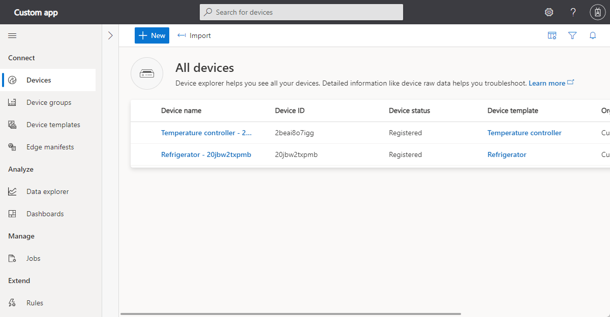
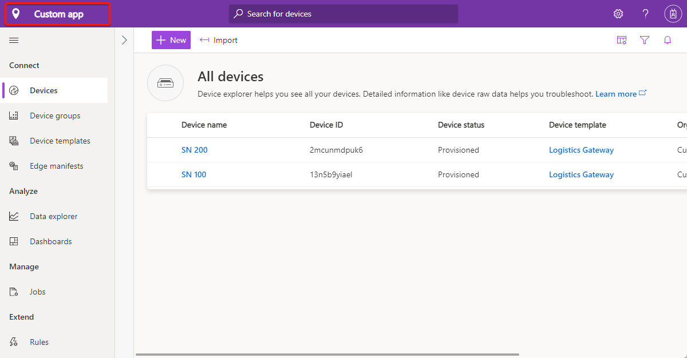
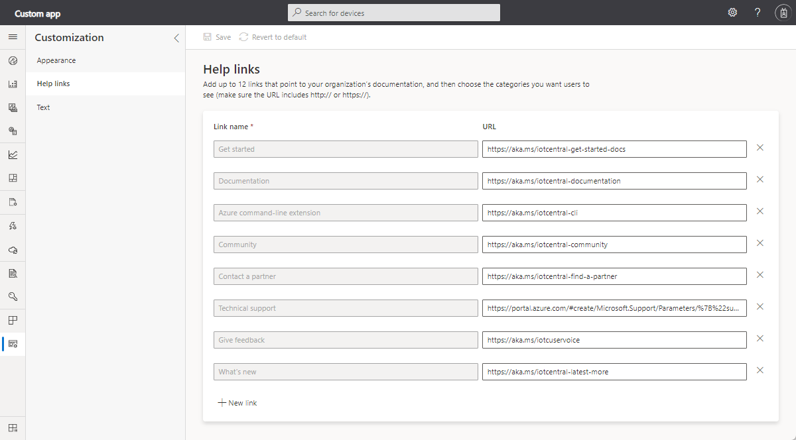
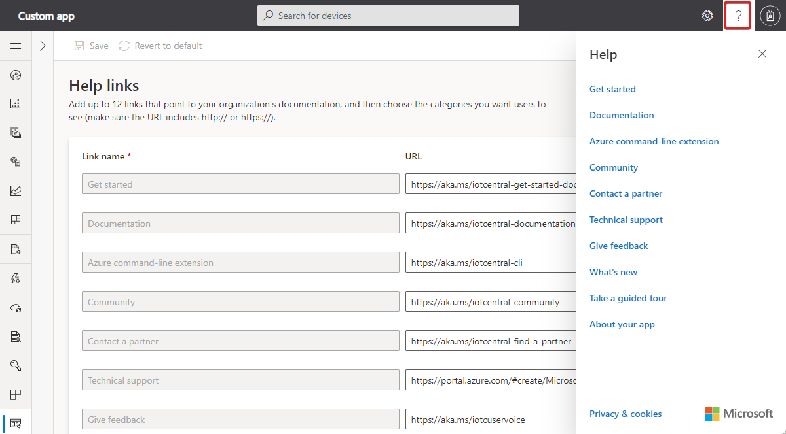

# Customize the Azure IoT Central UI

This article describes how you can customize the UI of your application by applying custom themes, changing the text, and modifying the help links to point to your own custom help resources.

The following screenshot shows a page using the standard theme:



The following screenshot shows a page using a custom screenshot with the customized UI elements highlighted:



## Create theme

To create a custom theme, navigate to the **Appearance** page in the **Customization** section under **Settings**:


On this page, you can customize the following aspects of your application:

### Application logo

A PNG image, no larger than 1 MB, with a transparent background. This logo displays to the left on the IoT Central application title bar.

If your logo image includes the name of your application, you can hide the application name text. For more information, see [Manage your application](howto-administer.md#change-application-name-and-url).

### Browser icon (favicon)

A PNG image, no larger than 32 x 32 pixels, with a transparent background. A web browser can use this image in the address bar, history, bookmarks, and browser tab.

### Browser colors

You can change the color of the page header and the color used for accenting buttons and other highlights. Use a six character hex color value in the format `##ff6347`. For more information about **HEX Value** color notation, see [HTML Colors](https://www.w3schools.com/html/html_colors.asp).

> [!NOTE]
> You can always revert back to the default options on the **Customize your application** page.

### Changes for operators

If an administrator creates a custom theme, then operators and other users of your application can no longer choose a theme in **Settings**.

## Replace help links

To provide custom help information to your operators and other users, you can modify the links on the application **Help** menu.

To modify the help links, navigate to the **Help links** page in the **Customization** section under **Settings**:



You can also add new entries to the help menu and remove default entries:



> [!NOTE]
> You can always revert back to the default help links on the **Customize help** page.

## Change Application text

To change the application text, navigate to the **Text** page in the **Customization** section under **Settings**.

On this page, you can customize the text of your application for all supported languages. You can change 'Device' related text to any word you prefer using the text customization file. After you upload the file, the application text automatically appears with the updated words. You can make further customizations by editing and overwriting the customization file.

Following example shows how to change the word `Device` to `Asset` for viewing the application in English:

1. Select **Add application text** and select the English language in the drop down.
1. Download the default text file. The file contains a JSON definition of the text strings you can change.
1. Open the file in a text editor and edit the right-hand side strings to replace the word `device` with `asset` as shown in in the following example:

      ```json
      {
          "Device": {
          "AllEntities": "All assets",
          "Approve": {
              "Confirmation": "Are you sure you want to approve this asset?",
              "Confirmation_plural": "Are you sure you want to approve these assets?"
          },
          "Block": {
              "Confirmation": "Are you sure you want to block this asset?",
              "Confirmation_plural": "Are you sure you want to block these assets?"
          },
          "ConnectionStatus": {
              "Connected": "Connected",
              "ConnectedAt": "Connected {{lastReportedTime}}",
              "Disconnected": "Disconnected",
              "DisconnectedAt": "Disconnected {{lastReportedTime}}"
          },
          "Create": {
              "Description": "Create a new asset with the given settings",
              "ID_HelpText": "Enter a unique identifier this asset will use to connect.",
              "Instructions": "To create a new asset, select an asset template, a name, and a unique ID. <1>Learn more <1></1></1>",
              "Name_HelpText": "Enter a user friendly name for this asset. If not specified, this will be the same as the asset ID.",
              "Simulated_Label": "Simulate this asset?",
              "Simulated_HelpText": "A simulated asset generates telemetry that enables you to test the behavior of your application before you connect a real asset.",
              "Title": "Create a new asset",
              "Unassigned_HelpText": "Choosing this will not assign the new asset to any asset template.",
              "HardwareId_Label": "Hardware type",
              "HardwareId_HelpText": "Optionally specify the manufacturer of the asset",
              "MiddlewareId_Label": "Connectivity solution",
              "MiddlewareId_HelpText": "Optionally choose what type of connectivity solution is installed on the asset"
          },
          "Delete": {
              "Confirmation": "Are you sure you want to delete this asset?",
              "Confirmation_plural": "Are you sure you want to delete these assets?",
              "Title": "Delete asset permanently?",
              "Title_plural": "Delete assets permanently?"
          },
          "Entity": "Asset",
          "Entity_plural": "Assets",
          "Import": {
              "Title": "Import assets from a file",
              "HelpText": "Choose the organization that can access the assets you’re importing, and then choose the file you’ll use to import. <1>Learn more <1></1></1>",
              "Action": "Import assets with an org assignment from a chosen file.",
              "Upload_Action": "Upload a .csv file",
              "Browse_HelpText": "You’ll use a CSV file to import assets. Click “Learn more” for samples and formatting guidelines."
          },
          "JoinToGateway": "Attach to gateway",
          "List": {
              "Description": "Grid displaying list of assets",
              "Empty": {
              "Text": "Assets will send data to IoT Central for you to monitor, store, and analyze. <1>Learn more <1></1></1>",
              "Title": "Create an Asset"
              }
          },
          "Migrate": {
              "Confirmation": "Migrating selected asset to another template. Select migration target.",
              "Confirmation_plural": "Migrating selected assets to another template. Select migration target."
          },
          "Properties": {
              "Definition": "Asset template",
              "DefinitionId": "Asset template ID",
              "Id": "Asset ID",
              "Name": "Asset name",
              "Scope": "Organization",
              "Simulated": "Simulated",
              "Status": "Asset status"
          },
          "Rename": "Rename asset",
          "Status": {
              "Blocked": "Blocked",
              "Provisioned": "Provisioned",
              "Registered": "Registered",
              "Unassociated": "Unassociated",
              "WaitingForApproval": "Waiting for approval"
          },
          "SystemAreas": {
              "Downstreamassets": "Downstream assets",
              "Module_plural": "Modules",
              "Properties": "Properties",
              "RawData": "Raw data"
          },
          "TemplateList": {
              "Empty": "No definitions found.",
              "FilterInstructions": "Filter templates"
          },
          "Unassigned": "Unassigned",
          "Unblock": {
              "Confirmation": "Are you sure you want to unblock this asset?",
              "Confirmation_plural": "Are you sure you want to unblock these assets?"
          }
          }
      }
      ```

1. Upload your edited customization file and select **Save** to see your new text in the application.

You can re-upload the customization file with further changes by selecting the relevant language from the list on the **Text** page in the **Customization** section.

## Next steps

Now that you've learned how to customize the UI in your IoT Central application, here are some suggested next steps:

- [Administer your application](./howto-administer.md)
- [Add tiles to your dashboard](howto-manage-dashboards.md)