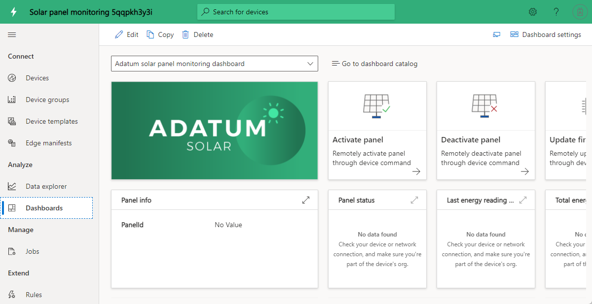
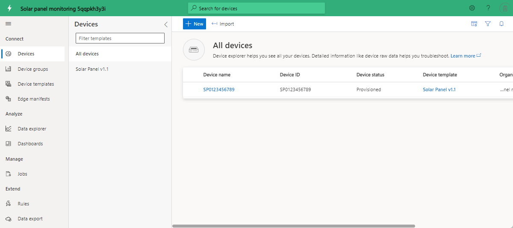
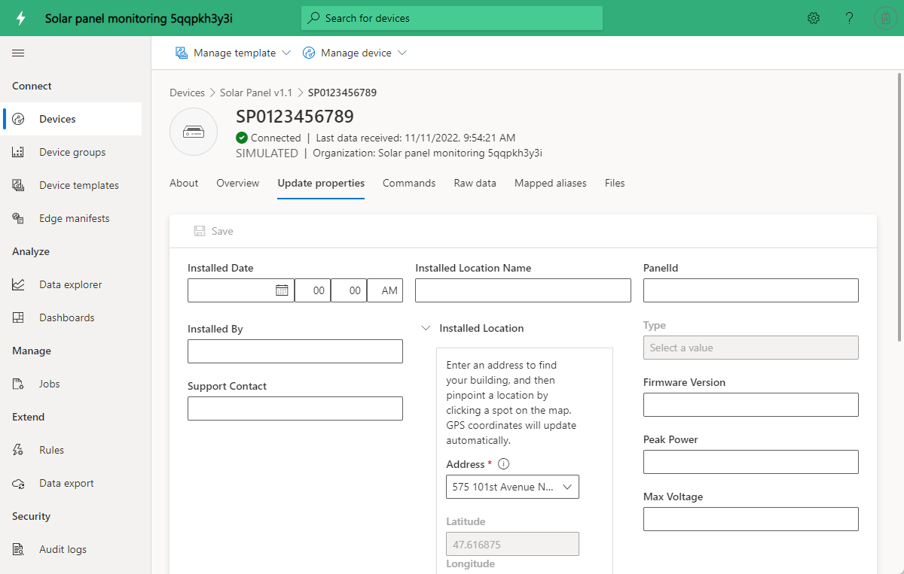
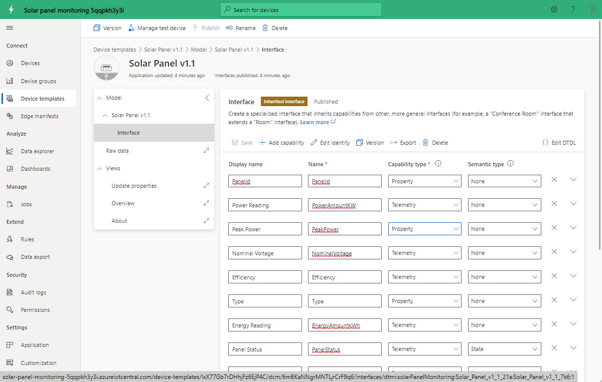

# Tutorial: Create and walk-through the solar panel monitoring app template 

[!INCLUDE [iot-central-pnp-original](../../../includes/iot-central-pnp-original-note.md)]

This tutorial guides you through the process of creating the solar panel monitoring application, which includes a sample device model with simulated data. In this tutorial, you'll learn:

> [!div class="checklist"]
> * Create the solar panel app for free
> * Application walk-through
> * Clean up resources

If you don’t have a subscription, [create a free trial account](https://azure.microsoft.com/free)

## Prerequisites
- None
- Azure subscription is recommended, but not required to try out

## Create a solar panel monitoring app 

You can create this application in three simple steps:

1. Open [Azure IoT Central home page](https://apps.azureiotcentral.com) and click **Build** to create a new application. 

2. Select **Energy** tab and click **Create app** under **Solar panel monitoring** application tile. 

    [!div class="mx-imgBorder"]
    
  
3. **Create app** will open **New application** form. Fill in the requested details as shown in the figure below:
    * **Application name**: Pick a name for your IoT Central application. 
    * **URL**: Pick an IoT Central URL, the platform will verify its uniqueness.
    * **7-day free trial**: If you already have an Azure subscription, default setting is recommended. If you don’t have an Azure subscription, start with free trial.
    * **Billing Info**: The application itself is free. The Directory, Azure subscription, and Region details are required to provision the resources for your app.
    * Click **Create** button at the bottom of the page and your app will be created in a minute or so.
        > [!div class="mx-imgBorder"]
        > 

### Verify the application and simulated data

The newly created solar panel app is your app and you can modify it anytime. Let’s ensure the app is deployed and working as expected before you modify it.

To verify the app creation and data simulation, go to the **Dashboard**. If you can see the tiles with some data, then your app deployment was successful. The data simulation may take a few minutes to generate the data, so give it 1-2 minutes. 

## Application walk-through
After you successfully deploy the app template, it comes with sample smart meter device, device model, and dashboard.

Adatum is a fictitious energy company, who monitors and manages solar panels. On the solar panel monitoring dashboard, you see solar panel properties, data, and sample commands. It enables operators and support teams to proactively perform the following activities before it turns into support incidents:
* Review the latest panel info and its installed location on the map
* Proactively check the panel status and connection status
* Review the energy generation and temperature trends to catch any anomalous patterns
* Track the total energy generation for planning and billing purposes
* Command and control operations such as activate panel and update firmware version. In the template, the command buttons show the possible functionalities and don't send real commands.

[!div class="mx-imgBorder"]

### Devices
The app comes with a sample solar panel device. You can see the device details by clicking on the **Devices** tab.

[!div class="mx-imgBorder"]

Click on the sample device **SP0123456789** link to see the device details. On the **Update Properties** page, you can update the writable properties of the device and visualize the updated values on the dashboard. 

[!div class="mx-imgBorder"]

### Device Template
Click on the **Device templates** tab to see the solar panel device model. The model has pre-define interface for Data, Property, Commands, and Views.

[!div class="mx-imgBorder"]

## Clean up resources
If you decide to not continue using this application, delete your application with the following these steps:

1. From the left-hand menu, open Administration tab
2. Select Application settings and click Delete button at the bottom of the page. 

    [!div class="mx-imgBorder"]
    

## Next steps
* Learn about solar panel app architecture refer to [the concept article](https://docs.microsoft.com/azure/iot-central/energy/concept-iot-central-solar-panel-app)
* Create solar panel application templates for free: [solar panel app](https://apps.azureiotcentral.com/build/new/solar-panel-monitoring)
* Learn more about IoT Central, see [IoT Central overview](https://docs.microsoft.com/azure/iot-central/)

