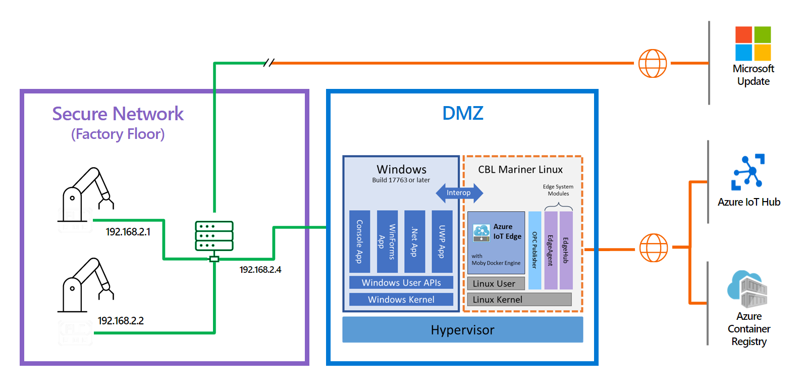

# Azure IoT Edge for Linux on Windows Industrial IoT & DMZ configuration

[!INCLUDE [iot-edge-version-all-supported](../../includes/iot-edge-version-all-supported.md)]

Industrial IoT is transcurring the era of IT and OT convergence. However, making traditional OT assets more intelligent with IT technologies also means a larger exposure to cyberattacks. This is one of the main reasons why multiple environments are designed using demilitarized zones or also known as DMZs. 

Suppose in a workflow you have a networking configuration divided into two different networks/zones. First, you have a Secure network or also defined as the offline network, which has no internet connectivity and is limited to internal access. Secondly, you have a demilitarized zone (DMZ), in which you may have a couple of devices that have limited internet connectivity. When moving the workflow to run on the EFLOW VM, you may have problems accessing the different networks since the EFLOW VM by default has only one NIC attached.

This article describes how to configure the Azure IoT Edge for Linux (EFLOW) VM to support multiple network interface cards (NICs) and connect to multiple networks. By enabling multiple NIC support, applications running on the EFLOW VM can communicate with devices connected to the offline network, and at the same time, use IoT Edge to send data to the cloud.

## Prerequisites
- A Windows device with EFLOW already set up. For more information on EFLOW installation and configuration, see [Create and provision an IoT Edge for Linux on Windows device using symmetric keys](./how-to-provision-single-device-linux-on-windows-symmetric.md).
- Virtual switch different from the default one used during EFLOW installation. For more information on creating a virtual switch, see [Create a virtual switch for Azure IoT Edge for Linux on Windows](./how-to-create-virtual-switch.md).

## Industrial Scenario 
Suppose you have an environment with some devices like PLCs or OPC UA compatible devices connected to the offline network, and you want to upload all the device's information to Azure using the OPC Publisher module running on the EFLOW VM.

Since the EFLOW host device and the PLC/OPC UA devices are physically connected to the offline network, we can leverage the [EFLOW multiple NIC support](./how-to-multiple-nic.md) to connect the EFLOW VM to the offline network. Then, using an External Virtual Switch, we can get the EFLOW VM connected to the offline network and directly communicate with all the other offline devices.

On the other end, the EFLOW host device is also physically connected to the DMZ (online network), with internet and Azure connectivity. Using an Internal/External Switch, we can get the EFLOW VM connected to Azure IoT Hub using IoT Edge modules and upload the information sent by the offline devices through the offline NIC.

We can summarize the described scenario:

- For the Secure network:
    - No internet connectivity, access restricted.
    - PLCs or UPC UA compatible devices connected.
    - EFLOW VM connected using an External virtual switch.

- For the DMZ:
    - Internet connectivity - Azure connection allowed.
    - EFLOW VM connected to Azure IoT Hub, using either an Internal/External virtual switch.
    - OPC Publisher running as a module inside the EFLOW VM used to publish data to Azure.

## Configure VM networking 

## Next steps
Follow the steps in [Install and provision Azure IoT Edge for Linux on a Windows device](how-to-provision-single-device-linux-on-windows-symmetric.md) to set up a device with IoT Edge for Linux on Windows.
