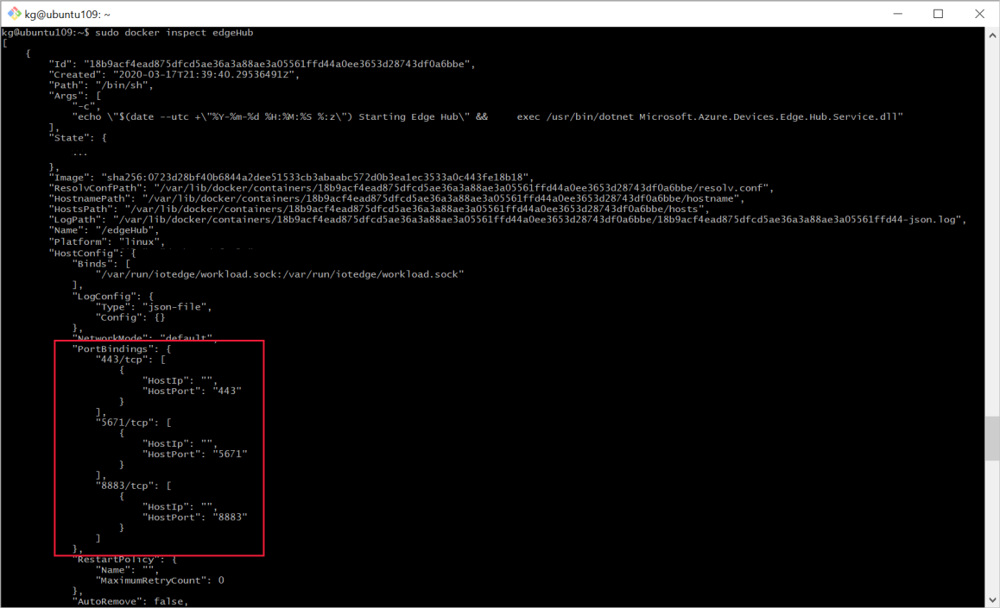

# How to configure container create options for IoT Edge modules

[!INCLUDE [iot-edge-version-all-supported](../../includes/iot-edge-version-all-supported.md)]

The **createOptions** parameter in the deployment manifest enables you to configure the module containers at runtime. This parameter expands your control over the modules and allows for tasks like allowing or restricting the module's access to the host device's resources, or configuring networking.

IoT Edge modules are implemented as Docker-compatible containers on your IoT Edge device. Docker offers many options for creating containers, and those options apply to IoT Edge modules, too. For more information, see [Docker container create options](https://docs.docker.com/engine/api/v1.32/#operation/ContainerCreate).

## Format create options

The IoT Edge deployment manifest accepts create options formatted as JSON. For example, take the create options that are automatically included for every edgeHub module:

```json
"createOptions": {
  "HostConfig": {
    "PortBindings": {
      "5671/tcp": [
        {
          "HostPort": "5671"
        }
      ],
      "8883/tcp": [
        {
          "HostPort": "8883"
        }
      ],
      "443/tcp": [
        {
          "HostPort": "443"
        }
      ]
    }
  }
}
```

This edgeHub example uses the **HostConfig.PortBindings** parameter to map exposed ports on the container to a port on the host device.

If you use the Azure IoT Tools extensions for Visual Studio or Visual Studio Code, you can write the create options in JSON format in the **deployment.template.json** file. Then, when you use the extension to build the IoT Edge solution or generate the deployment manifest, it will stringify the JSON for you in the format that the IoT Edge runtime expects. For example:

```json
"createOptions": "{\"HostConfig\":{\"PortBindings\":{\"5671/tcp\":[{\"HostPort\":\"5671\"}],\"8883/tcp\":[{\"HostPort\":\"8883\"}],\"443/tcp\":[{\"HostPort\":\"443\"}]}}}"
```

One tip for writing create options is to use the `docker inspect` command. As part of your development process, run the module locally using `docker run <container name>`. Once you have the module working the way you want it, run `docker inspect <container name>`. This command outputs the module details in JSON format. Find the parameters that you configured, and copy the JSON. For example:

[](./media/how-to-use-create-options/docker-inspect-edgehub-inline-and-expanded.png#lightbox)

## Common scenarios

Container create options enable many scenarios, but here are some that come up most often when building IoT Edge solutions:

* [Give modules access to host storage](how-to-access-host-storage-from-module.md)
* [Map host port to module port](#map-host-port-to-module-port)
* [Restrict module memory and CPU usage](#restrict-module-memory-and-cpu-usage)
* [GPU-optimize an IoT Edge module](#gpu-optimize-an-iot-edge-module)

### Map host port to module port

If your module needs to communicate with a service outside of the IoT Edge solution, and isn't using message routing to do so, then you need to map a host port to a module port.

>[!TIP]
>This port mapping is not required for module-to-module communication on the same device. If module A needs to query an API hosted on module B, it can do so without any port mapping. Module B needs to expose a port in its dockerfile, for example: `EXPOSE 8080`. Then module A can query the API using module B's name, for example: `http://ModuleB:8080/api`.

First, make sure that a port inside the module is exposed to listen for connections. You can do this using an [EXPOSE](https://docs.docker.com/engine/reference/builder/#expose) instruction in the dockerfile. For example, `EXPOSE 8080`. The expose instruction defaults to TCP protocol if not specified, or you can specify UDP.

Then, use the **PortBindings** setting in the **HostConfig** group of the [Docker container create options](https://docs.docker.com/engine/api/v1.32/#operation/ContainerCreate) to map the exposed port in the module to a port on the host device. For example, if you exposed port 8080 inside the module and want to map that to port 80 of the host device, the create options in the template.json file would look like the following example:

```json
"createOptions": {
  "HostConfig": {
    "PortBindings": {
      "8080/tcp": [
        {
          "HostPort": "80"
        }
      ]
    }
  }
}
```

Once stringified for the deployment manifest, the same configuration would look like the following example:

```json
"createOptions": "{\"HostConfig\":{\"PortBindings\":{\"8080/tcp\":[{\"HostPort\":\"80\"}]}}}"
```

### Restrict module memory and CPU usage

You can declare how much of the host resources a module can use. This control is helpful to ensure that one module can't consume too much memory or CPU usage and prevent other processes from running on the device. You can manage these settings with [Docker container create options](https://docs.docker.com/engine/api/v1.32/#operation/ContainerCreate) in the **HostConfig** group, including:

* **Memory**: Memory limit in bytes. For example, 268435456 bytes = 256 MB.
* **MemorySwap**: Total memory limit (memory + swap). For example, 536870912 bytes = 512 MB.
* **NanoCpus**: CPU quota in units of 10<sup>-9</sup> (1 billionth) CPUs. For example, 250000000 nanocpus = 0.25 CPU.

In the template.json format, these values would look like the following example:

```json
"createOptions": {
  "HostConfig": {
    "Memory": 268435456,
    "MemorySwap": 536870912,
    "NanoCpus": 250000000
  }
}
```

Once stringified for the final deployment manifest, these values would look like the following example:

```json
"createOptions":"{\"HostConfig\":{\"Memory\":268435456,\"MemorySwap\":536870912,\"CpuPeriod\":25000}}"
```

### GPU-optimize an IoT Edge module

If you're running your IoT Edge module on a GPU-optimized virtual machine, you can enable an IoT Edge module to connect to your GPU as well. To do this with an existing module, add some specifications to your `createOptions`:

```json
{
     "HostConfig": {
         "DeviceRequests": 
         [
             {
                 "Count": -1,
                 "Capabilities": [
                     [
                         "gpu"
                     ]
                 ]
             }
         ]
     }
 }
```

To confirm these settings were successfully added, use the Docker inspect command to see the new setting in a JSON printout.

```bash
sudo docker inspect <YOUR-MODULE-NAME>
```

To learn more about how your device and virtual machine connect to a GPU, see [Configure, connect, and verify an IoT Edge module for a GPU](configure-connect-verify-gpu.md).

## Next steps

For more examples of create options in action, see the following IoT Edge samples:

* [Custom Vision and Azure IoT Edge on a Raspberry Pi 3](https://github.com/Azure-Samples/custom-vision-service-iot-edge-raspberry-pi)
* [Azure IoT Edge blob storage sample](https://github.com/Azure-Samples/azure-iotedge-blobstorage-sample)
