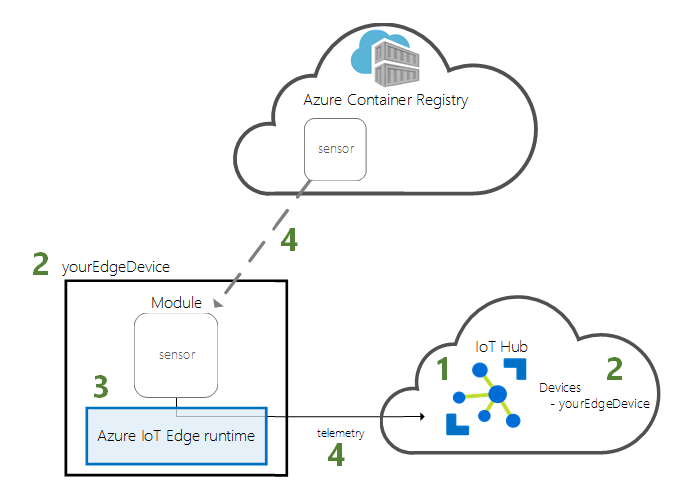
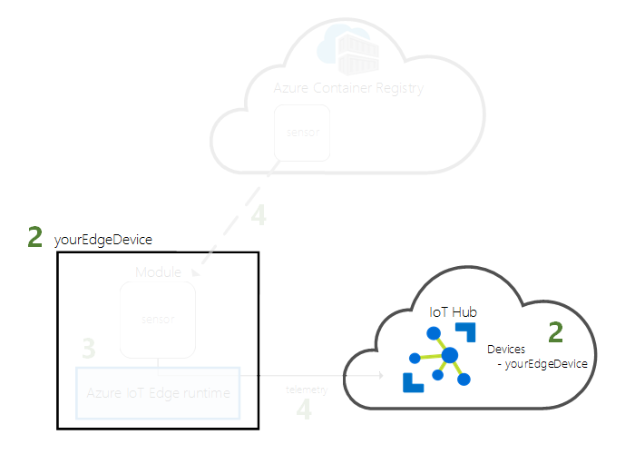
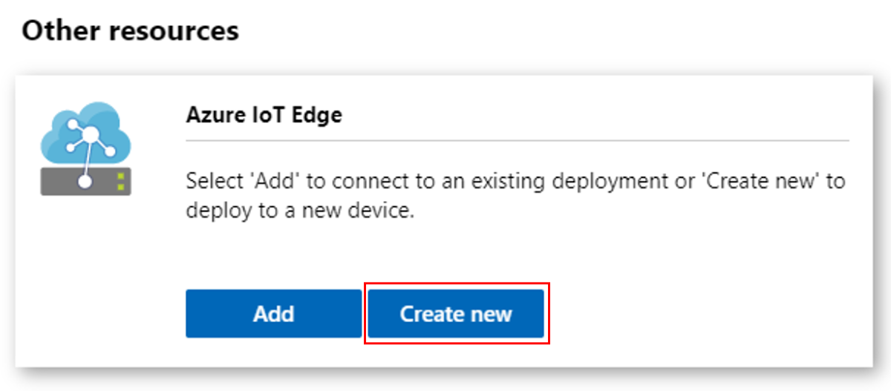
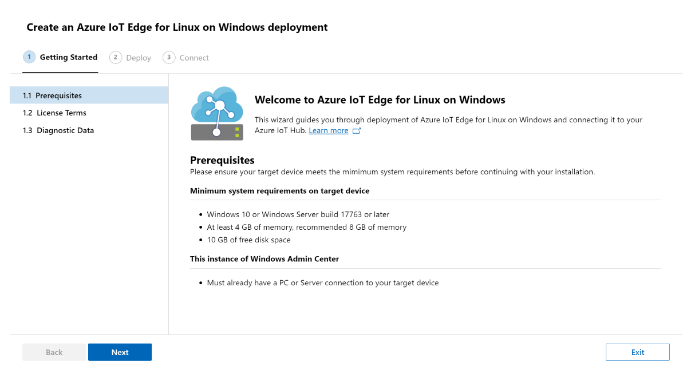
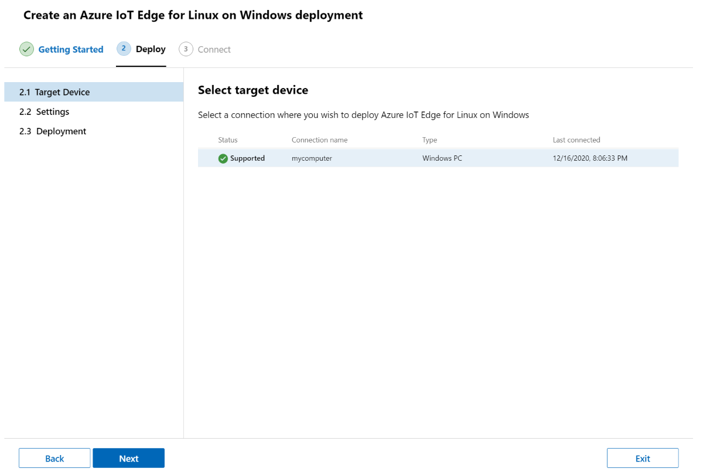
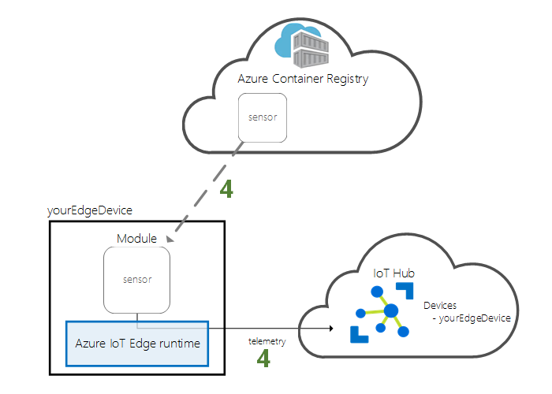

# Quickstart: Deploy your first IoT Edge module to a Windows device

Try out Azure IoT Edge in this quickstart by deploying containerized code to a Linux on Windows IoT Edge device. IoT Edge allows you to remotely manage code on your devices so that you can send more of your workloads to the edge. For this quickstart, we recommend using your own device to see how easy it is to use Azure IoT Edge for Linux on Windows.

In this quickstart you learn how to:

* Create an IoT hub.
* Register an IoT Edge device to your IoT hub.
* Install and start the IoT Edge for Linux on Windows runtime on your device.
* Remotely deploy a module to an IoT Edge device and send telemetry.



This quickstart walks you through how to set up your Azure IoT Edge for Linux on Windows device. Then, you deploy a module from the Azure portal to your device. The module used in this quickstart is a simulated sensor that generates temperature, humidity, and pressure data. The other Azure IoT Edge tutorials build upon the work you do here by deploying additional modules that analyze the simulated data for business insights.

If you don't have an active Azure subscription, create a [free account](https://azure.microsoft.com/free) before you begin.

## Prerequisites

Prepare your environment for the Azure CLI.

- Use [Azure Cloud Shell](/azure/cloud-shell/quickstart-powershell) using the PowerShell environment.

   [](https://shell.azure.com)   
- If you prefer, [install](/cli/azure/install-azure-cli) the Azure CLI to run CLI reference commands.
   - If you're using a local install, sign in with Azure CLI by using the [az login](/cli/azure/reference-index#az-login) command.  To finish the authentication process, follow the steps displayed in your terminal.  See [Sign in with Azure CLI](/cli/azure/authenticate-azure-cli) for additional sign-in options.
  - When you're prompted, install Azure CLI extensions on first use.  For more information about extensions, see [Use extensions with Azure CLI](/cli/azure/azure-cli-extensions-overview).
  - Run [az version](/cli/azure/reference-index?#az_version) to find the version and dependent libraries that are installed. To upgrade to the latest version, run [az upgrade](/cli/azure/reference-index?#az_upgrade).

Cloud resources:

* A resource group to manage all the resources you use in this quickstart.

   ```azurecli-interactive
   az group create --name IoTEdgeResources --location westus2
   ```

IoT Edge device:

* In this quickstart, you will be using your own device to set up the IoT Edge device.

> [!NOTE]
> Your device needs to be a Windows PC or server, version 1809 or later.

1. [Download Windows Admin Center](https://aka.ms/WACDownloadEFLOW).
2. Follow the installation wizard to set up Windows Admin Center on your device.
3. Once you are in Windows Admin Center, on the top right of the screen, select the **Settings Gear Icon**  
4. From the Settings Menu, Under Gateway, select **Extensions**
5. From the list of **Available extensions** select **Azure IoT Edge**
6. **Install** the extension


## Create an IoT hub

Start the quickstart by creating an IoT hub with Azure CLI.


The free level of IoT Hub works for this quickstart. If you've used IoT Hub in the past and already have a hub created, you can use that IoT hub.

The following code creates a free **F1** hub in the resource group `IoTEdgeResources`. Replace `{hub_name}` with a unique name for your IoT hub. It might take a few minutes to create an IoT Hub.

   ```azurecli-interactive
   az iot hub create --resource-group IoTEdgeResources --name {hub_name} --sku F1 --partition-count 2
   ```

   If you get an error because there's already one free hub in your subscription, change the SKU to **S1**. If you get an error that the IoT Hub name isn't available, it means that someone else already has a hub with that name. Try a new name.

## Register an IoT Edge device

Register an IoT Edge device with your newly created IoT hub.



Create a device identity for your simulated device so that it can communicate with your IoT hub. The device identity lives in the cloud, and you use a unique device connection string to associate a physical device to a device identity.

Since IoT Edge devices behave and can be managed differently than typical IoT devices, declare this identity to be for an IoT Edge device with the `--edge-enabled` flag.

1. In the Azure Cloud Shell, enter the following command to create a device named **myEdgeDevice** in your hub.

   ```azurecli-interactive
   az iot hub device-identity create --device-id myEdgeDevice --edge-enabled --hub-name {hub_name}
   ```

   If you get an error about iothubowner policy keys, make sure that your Cloud Shell is running the latest version of the azure-iot extension.

2. View the connection string for your device, which links your physical device with its identity in IoT Hub. It contains the name of your IoT hub, the name of your device, and then a shared key that authenticates connections between the two.

   ```azurecli-interactive
   az iot hub device-identity connection-string show --device-id myEdgeDevice --hub-name {hub_name}
   ```

3. Copy the value of the `connectionString` key from the JSON output and save it. This value is the device connection string. You'll use this connection string to configure the IoT Edge runtime in the next section.

   

## Install and start the IoT Edge runtime
1. Open up Windows Admin Center on your device.

2. You will see the local host connection representing the PC where you are running Windows Admin Center.

      :::image type="content" source="media/quickstart/EFLOW/WACStartPage.png" alt-text="Screenshot - Windows Admin Start Page":::

   

3. Select **Add**.

   

4. Locate the Azure IoT Edge tile, and select **Create new**. This will start the installation wizard.



5. Proceed through the installation wizard to accept the EULA and choose **Next**



6. Choose the **Optional diagnostic data** if you would like to help us, and click **Next: Deploy**


7. On **Select target device** screen, select your desired target device to validate that it meets the minimum requirements. Once confirmed, choose **Next** to continue



8. ​Accept the default settings by choosing **Next**

9. This will present the deployment screen and proceed through the process of downloading the package, installing the package, configuring the host and final setting up the Linux VM​.  A successful deployment will look as follows:


10. Click **Next: Connect** to continue to the final step to connect your Azure IoT Edge device for deployment to your Azure IoT Hub device instance.

11. Copy the connection string from your device in Azure IoT Hub and paste it into the device connection string field. Then choose **Provisioning with the selected method**​.


12. Once provisioning is complete, select **Finish** to complete and return to the Windows Admin Center start screen. You should now be able to see your device listed as an Azure IoT Edge for Linux on Windows Device.


Select your Azure IoT Edge device to view its dashboard​. You should see that the workloads from your device twin in Azure IoT Hub have been deployed.
​
Your IoT Edge device is now configured. It's ready to run cloud-deployed modules.


## Deploy a module

Manage your Azure IoT Edge device from the cloud to deploy a module that sends telemetry data to IoT Hub.



[!INCLUDE [iot-edge-deploy-module](../../includes/iot-edge-deploy-module.md)]

## View generated data

In this quickstart, you created a new IoT Edge device and installed the IoT Edge runtime on it. Then, you used the Azure portal to deploy an IoT Edge module to run on the device without having to make changes to the device itself.

In this case, the module that you pushed generates sample environment data that you can use for testing later. The simulated sensor is monitoring both a machine and the environment around the machine. For example, this sensor might be in a server room, on a factory floor, or on a wind turbine. The message includes ambient temperature and humidity, machine temperature and pressure, and a timestamp. The IoT Edge tutorials use the data created by this module as test data for analytics.

Confirm that the module deployed from the cloud is running on your IoT Edge device.

```powershell
iotedge list
```

   

View the messages being sent from the temperature sensor module to the cloud.

```powershell
iotedge logs SimulatedTemperatureSensor -f
```

   >[!TIP]
   >IoT Edge commands are case-sensitive when referring to module names.

   

You can also watch the messages arrive at your IoT hub by using the [Azure IoT Hub extension for Visual Studio Code](https://marketplace.visualstudio.com/items?itemName=vsciot-vscode.azure-iot-toolkit).

## Clean up resources

If you want to continue on to the IoT Edge tutorials, you can use the device that you registered and set up in this quickstart. Otherwise, you can delete the Azure resources that you created to avoid charges.

If you created your virtual machine and IoT hub in a new resource group, you can delete that group and all the associated resources. Double check the contents of the resource group to make sure that there's nothing you want to keep. If you don't want to delete the whole group, you can delete individual resources instead.

> [!IMPORTANT]
> Deleting a resource group is irreversible.

Remove the **IoTEdgeResources** group. It might take a few minutes to delete a resource group.

```azurecli-interactive
az group delete --name IoTEdgeResources
```

You can confirm the resource group is removed by viewing the list of resource groups.

```azurecli-interactive
az group list
```

### Clean Removal of Azure IoT Edge for Linux on Windows
You can uninstall Azure IoT Edge for Linux on Windows on your device through the dashboard extension in Windows Admin Center.
1. Connect to the Azure IoT Edge for Linux on Windows device connection in Windows Admin Center. The Azure dashboard tool extension will load.
2. Select **Uninstall**. Once Azure IoT Edge for Linux on Windows is removed, Windows Admin Center will navigate to the start page and remove the Azure IoT Edge device connection entry from the list.

You can also uninstall Windows Admin Center by searching for **Windows Admin Center** in your PC's search bar and right-clicking to select **uninstall**.

## Next steps

In this quickstart, you created an IoT Edge device and used the Azure IoT Edge cloud interface to deploy code onto the device. Now, you have a test device generating raw data about its environment.

The next step is to set up your local development environment so that you can start creating IoT Edge modules that run your business logic.

> [!div class="nextstepaction"]
> [Start developing IoT Edge modules for Windows devices](tutorial-develop-for-windows.md)
