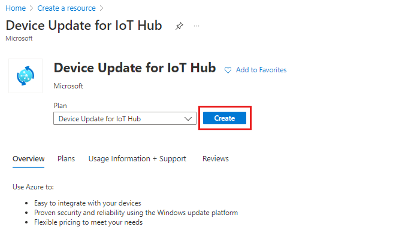

# Device Update for IoT Hub Resource Management

To get started with Device Update you'll need to create a Device Update account, instance and set access control roles. 

[Learn More](device-update-resources.md) about Device update account and instance.

[Learn More](device-update-control-access.md) about Device update access control roles. 

## Create a device update account

1. Go to [Azure portal](https://portal.azure.com)
2. Click Create a Resource and search for "Device Update for IoT Hub"

3. Click Create -> Device Update for IoT Hub
4. Specify the Azure Subscription to be associated with your Device Update Account and Resource Group
5. Specify a Name and Location for your Device Update Account
6. Click "Next: Review + create>"
7. Review the details and then select "Create"

## Create a device update instance 

An instance of Device Update is associated with a single IoT hub. Select the IoT hub that will be used with Device Update. We will create a new Shared Access policy during this step to ensure Device Update uses only the required permissions to work with IoT Hub (registry write and service connect). This policy ensures that access is only limited to Device Update.

To create a Device Update instance after an account has been created.

1. Go to the Instance Management "Instances" page
2. Specify an instance name and select the IoT Hub
3. Click "Create"

### Configure IoT Hub 

In order for Device Update to receive change notifications from IoT Hub, Device Update integrates with the "Built-In" Event Hub. Clicking the "Configure IoT Hub" button configures the required message routes and access policy required to communicate with IoT devices. 

To configure IoT Hub

1. Go to the Instance Management "Instances" page
2. Select the Instance that has been created for you and then click "Configure IoT Hub"
3. Select "I agree to make these changes"
4. Click "Update"

#### Message Routes that are configured

|   Route Name    | Routing Query  | Description  |
| :--------- | :---- |:---- |
|  DeviceUpdate.DigitalTwinChanges | true |Listens for Digital Twin Changes Events  |
|  DeviceUpdate.DeviceLifeCycle | opType = 'deleteDeviceIdentity'  | Listens for Devices that have been deleted |
|  DeviceUpdate.TelemetryModelInformation | iothub-interface-id = "urn:azureiot:ModelDiscovery:ModelInformation:1 | Listens for new devices types |
|  DeviceUpdate.DeviceTwinEvents| (opType = 'updateTwin' OR opType = 'replaceTwin') AND IS_DEFINED($body.tags.ADUGroup) | Listens for new Device Update Groups |

### Configure access control roles

In order for other users to have access to Device Update, users must be granted access to this resource. 

1. Go to Access control (IAM)
2. Click "Add" within "Add a role assignment"
3. Under "Select a Role", select a Device Update role from the given options
     - Device Update Administrator
     - Device Update Reader
     - Device Update Content Administrator
     - Device Update Content Reader
     - Device Update Deployments Administrator
     - Device Update Deployments Reader
4. Assign access to a user or Azure AD group
5. Click Save
6. You can now go to IoT Hub and go to Device Update

