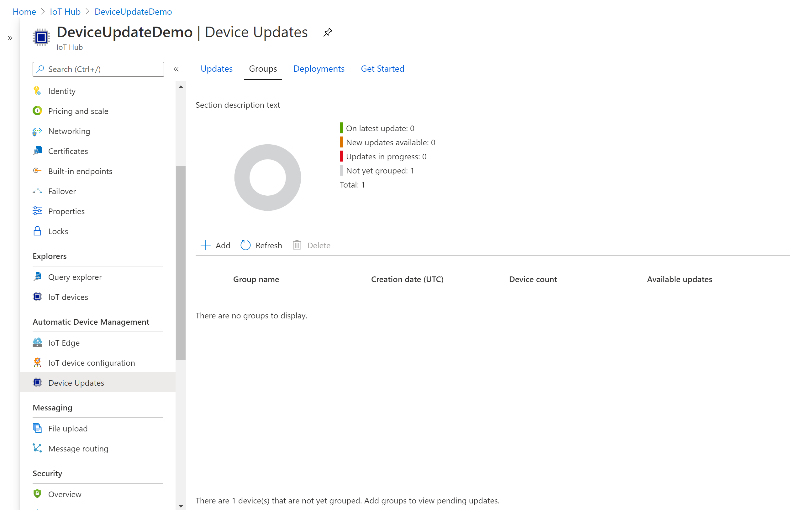
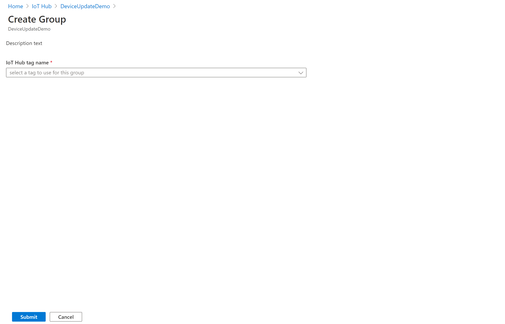
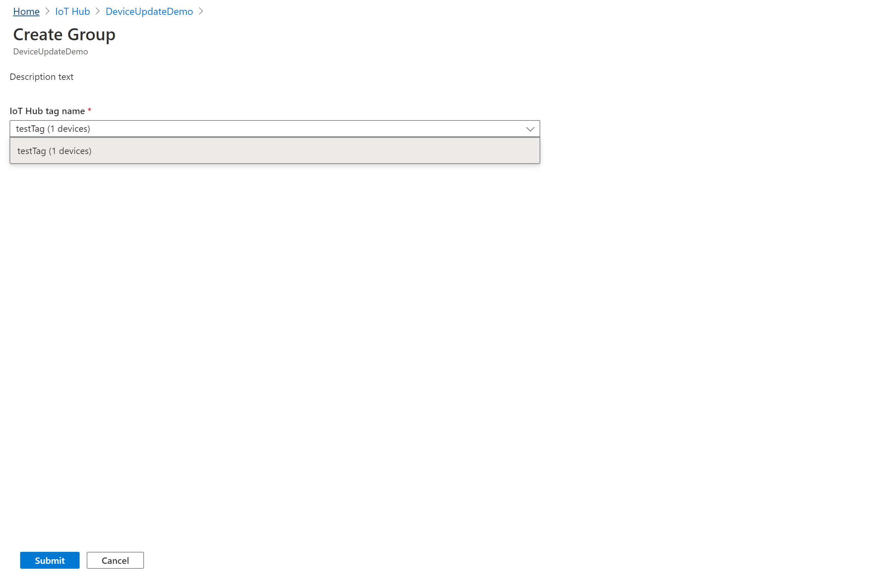
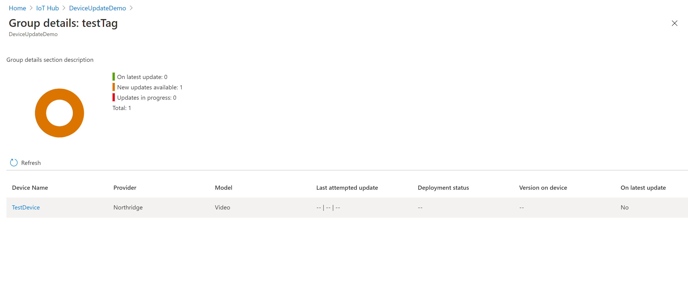
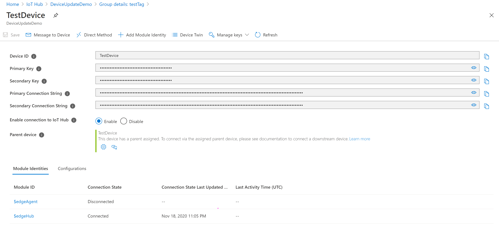

# Create Groups
en Groups_tag_Device_twin and release/v0.3.0-private-preview and committing changes  Groups_tag_Device_twin

## Prerequisites

* Access to an IoT Hub with Device Update for IoT Hub enabled.
* At least one update has been successfully imported for the provisioned device.
* An IoT device (or simulator) provisioned within the IoT Hub, running either Azure RTOS or Ubuntu 18.04 x64.

## Add a tag to your devices  

**NOTE**: Tags can only be successfully added to your device after it has been connected to Device Update

Device Update for IoT Hub allows deploying an update to a group of IoT devices. To create a group, the first step is to add a tag to the target set of devices in IoT Hub. The below documentation describes how to add and update a tag.

### 1. Programmatically update Device Twin

You can update the Device Twin with the appropriate Tag using RegistryManager after enrolling the device with Device Update. [Learn More](../iot-hub/iot-hub-csharp-csharp-twin-getstarted.md) about how to add tags using a sample .NET app. Learn more about [tag properties](../iot-hub/iot-hub-devguide-device-twins.md#tags-and-properties-format).

### Device Update Tag Format

```markdown
"tags": {
        "ADUGroup": "<CustomTagValue>"
        }
```

### 2. Using Jobs

It is possible to schedule a Job on multiple devices to add or update an Device Update tag following [these](../iot-hub/iot-hub-devguide-jobs.md) examples. [Learn more](iot-hub-csharp-csharp-schedule-jobs.md).

**Note**: This action goes against your current IOT Hub messages quota and it is recommended to change only upto 50,000 device twin Tags at a time otherwise you may need to buy additional IoT Hub units if you exceed your daily IoT Hub message quota. Details can be found at [Quotas and throttling](../iot-hub/iot-hub-devguide-quotas-throttling.md#quotas-and-throttling).

### 3. Direct Twin Updates

Tags can also be added or updated in device twin directly.

1. Log into Azure Portal using [this](https://portal.azure.com/?feature.canmodifystamps=true&Microsoft_Azure_Iothub=aduprod) link and navigate to your IoT Hub.

2. From 'IoT Devices' or 'IoT Edge' on the left navigation pane find your IoT device and navigate to the Device Twin.

3. In the Device Twin, delete any existing Device Update tag value by setting them to null.

4. Add a new Device Update tag value as shown below. [Example](../iot-hub/iot-hub-devguide-device-twins.md#device-twins) device twin JSON document with tags.

```JSON
    "tags": {
            "ADUGroup": "<CustomTagValue>"
            }
```

### Limitations

* You can add any value to your tag except for ‘Uncategorized’ which is a reserved value.
* Tag value cannot exceed 255 characters.
* Tag value can contain alphanumeric characters and the following special characters ".","-","_","~".
* Tag and Group names are case sensitive.
* A device can only have one tag with the name ADUGroup, any subsequent additions of a tag with that name will override the existing value for tag name ADUGroup.

Groups_tag_Device_twin

* One device can only belong to one Group.

## Create a group by selecting an existing IoT Hub tag

1. Go to the [Azure Portal](https://ms.portal.azure.com/?feature.canmodifystamps=true&Microsoft_Azure_Iothub=aduprod&microsoft_azure_marketplace_ItemHideKey=Microsoft_Azure_ADUHidden&feature.devicetwin=true#home).

2. Select the IoT Hub you previously connected to your Device Update instance.

3. Select the Device Updates option under Automatic Device Management from the left-hand navigation bar.

4. Select the Groups tab at the top of the page. You will be able to see the number of devices connected to Device Update that are not grouped yet.


5. Select the Add button to create a new group.


6. Select an IoT Hub tag from the list and then select Create update group.


7. Once the group is created you will see that the update compliance chart and groups list are updated.  Update compliance chart shows the count of devices in various states of compliance: On latest update, New updates available, Updates in Progress and Devices not yet Grouped. [Learn More](../iot-hub/device-update-compliance.md) about update compliance.


8. You should see your newly created group and any available updates for the devices in the new group. You can deploy the update to the new group from this view by clicking on the update name. See Next Step: Deploy Update for more details.

## View Device details for the group you created

1. Navigate to your newly created group and click on the group name.

2. A list of devices that are part of the group will be shown along with their device update properties. In this view you can also see the update compliance information for all devices that are members of the group. Update compliance chart shows the count of devices in various states of compliance: On latest update, New updates available and Updates in Progress.


3. You can also click on each individual device within a group to be redirected to the device details page in IoT Hub.


[Next Step: Deploy Update](../iot-hub/deploy-update.md)
