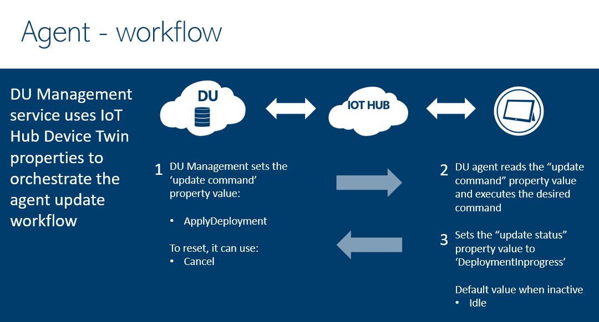
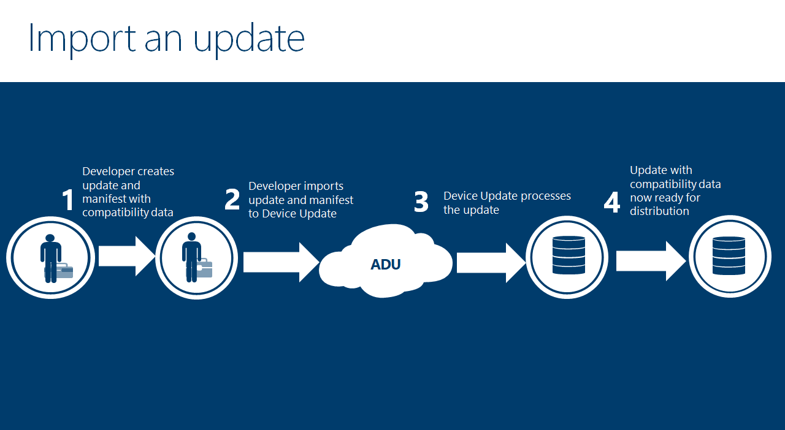
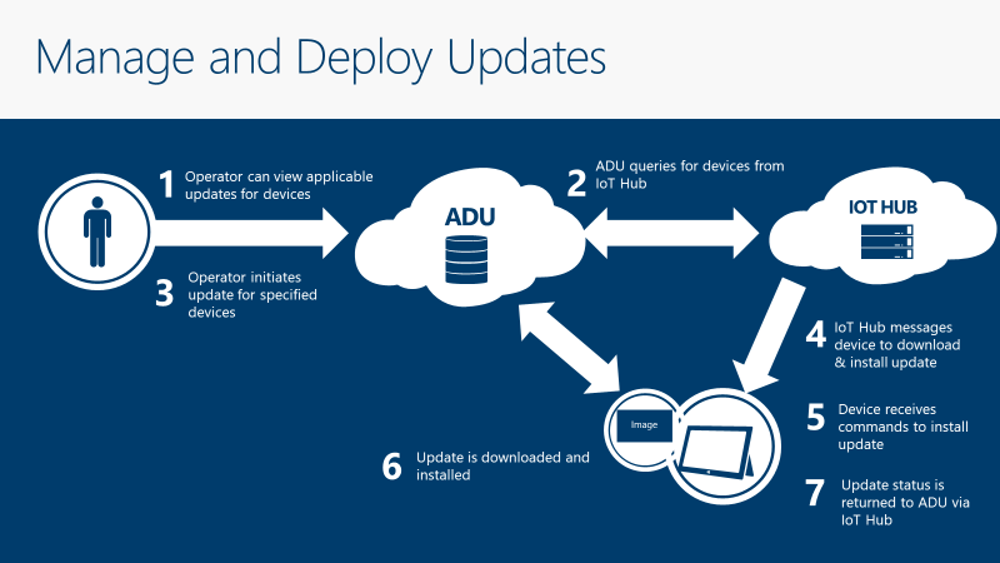

# Device Update for IoT Hub Overview

Device Update for IoT Hub is a service that enables you to deploy over-the-air updates (OTA) for your IoT devices.

## What is Device Update for IoT Hub

Device Update for IoT Hub is a service that enables you to deploy over-the-air
updates (OTA) for your IoT devices. Device Update lets you focus on your solution,
ensuring your devices are up to date with the latest security fixes or
application updates without having to build and maintain your own update
solution. Device Update is a reliable and scalable solution that is based on the Windows
Update platform and integrated with Azure IoT Hub to support devices globally.
Device Update provides controls on how to manage the deployment of updates, so you are
always in control of when and how devices are updated. Finally, Device Update also
provides reporting capabilities so you can always see the state of your devices.

### Support for a wide range of IoT devices

Device Update for IoT Hub integrates with the Azure IoT device SDK to enable your
devices to receive updates. Both a Device Update Agent Simulator binary and Raspberry Pi reference Yocto images are provided.
Device Update for IoT Hub also supports updating Azure IoT Edge devices. A Device Update Agent will be provided for Ubuntu Server 18.04 amd64
platform. Device Update for IoT Hub will also provide open-source code if you are not
running one of the above platforms so you can port it to the distribution you
are running.

Device Update works with IoT Plug and Play (PnP) and can manage any device that supports
the required PnP interfaces. For more information, see [Device Update for IoT Hub and
IoT Plug and Play](device-update-plug-and-play.md).

### Support for a wide range of update artifacts

Device Update for IoT Hub supports two forms of updates – image-based
and package-based.

Package-based updates are targeted updates that alter only a specific component
or application on the device. Thus, leading to lower consumption of
bandwidth and helps reduce the time to download and install the update. Package
updates typically allow for less downtime of devices when applying an update and
avoid the overhead of creating images.

Image updates provide a higher level of confidence in the end-state
of the device. It is typically easier to replicate the results of an
image-update between a pre-production environment and a production environment,
since it doesn’t pose the same challenges as packages and their dependencies.
Due to their atomic nature, one can also adopt an A/B failover model easily.

There is no one right answer, and you might choose differently based on
your specific use cases. Device Update for IoT Hub supports both image and package
form of updating, allowing you to choose the right updating model
for your device environment.

### Secure updates

Once updates are published to Device Update, they are then scanned for malware. More metadata is generated that allows
the device to verify the integrity of the updates it receives. Device Update uses IoT Hub
to securely communicate to the device to initiate an update. The device
then downloads the update from a Device Update-specified location or a Gateway.

## Device Update workflows

Device Update functionality can be broken down into three areas: Agent Integration,
Importing, and Management. The following is a quick overview of the various areas of
functionality.

### Device Update Agent

When an update command is received on a device, it will execute the requested
phase of updating (either Download, Install and Apply). During each phase,
status is returned to Device Update via IoT Hub so you can view the current status of a
deployment. If there are no updates in progress, the status is returned as “Idle”. A deployment can be canceled at any time.

[Learn More]()

### Importing

Importing is the ability to import your update into Device Update. Device Update supports rolling out a single update per device, making it ideal for
full-image updates that update an entire OS partition at once, or an apt Manifest that describes all the packages you might want to update
on your device. To import updates into Device Update, you first create an import manifest 
describing the update, then upload both the update file(s) and the import 
manifest to an Internet-accessible location. After that, you can use the Azure portal or call the Device Update Import
REST API to initiate the asynchronous process where Device Update uploads the files, processes
them, and makes them available for distribution to IoT devices.

**NOTE:** For sensitive content, protect the download using a shared access
signature (SAS), such as an ad-hoc SAS for Azure Blob Storage.

[Learn more about
SAS](https://docs.microsoft.com/azure/storage/common/storage-sas-overview)

[Learn More]()

### Management

When content is imported, Device Update automatically adds the device into a **Device
Class** of devices with the same compatibility. Device Update uses these device classes to
match devices to available content that is compatible with them. After importing
content into Device Update, you can view compatible updates for your devices and device
classes.

Device Update supports the concept of **Groups** via tags in IoT Hub. Deploying an update
out to a test group first is a good way to reduce the risk of issues during a
production rollout.

In Device Update, deployments are called. Deployments**, which are a way of connecting the
right content to a specific set of compatible devices. Device Update orchestrates the
process of sending commands to each device, instructing them to download and
install the updates and getting status back.

[Learn More]()

## Device Update for IoT Hub Quickstart

[Getting Started Using Ubuntu (18.04 x64) Simulator Reference Agent](device-update-simulator.md)
