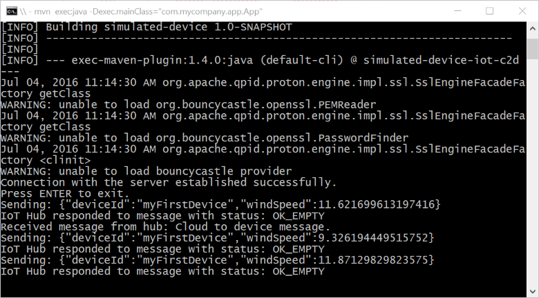
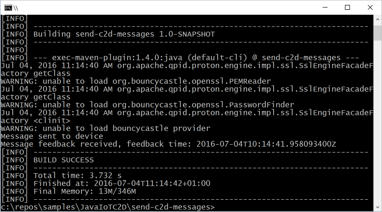

# Send cloud-to-device messages with IoT Hub (Java)

[!INCLUDE [iot-hub-selector-c2d](../../includes/iot-hub-selector-c2d.md)]

Azure IoT Hub is a fully managed service that helps enable reliable and secure bi-directional communications between millions of devices and a solution back end. 

This article shows you how to:

* Send cloud-to-device messages, from your solution backend, to a single device through IoT Hub

* Receive cloud-to-device messages on a device

* Request delivery acknowledgment (*feedback*), from your solution backend, for messages sent to a device from IoT Hub

[!INCLUDE [iot-hub-basic](../../includes/iot-hub-basic-whole.md)]

At the end of this article, you run two Java console apps:

* **SimulatedDevice**: a modified version of the app created in [Send telemetry from a device to an IoT hub](../iot-develop/quickstart-send-telemetry-iot-hub.md?pivots=programming-language-csharp), which connects to your IoT hub and receives cloud-to-device messages.

* **SendCloudToDevice**: sends a cloud-to-device message to the device app through IoT Hub and then receives its delivery acknowledgment.

> [!NOTE]
> IoT Hub has SDK support for many device platforms and languages (C, Java, Python, and JavaScript) through the [Azure IoT device SDKs](iot-hub-devguide-sdks.md).

To learn more about cloud-to-device messages, see [Send cloud-to-device messages from an IoT hub](iot-hub-devguide-messages-c2d.md).

## Prerequisites

* A complete working version of the [Send telemetry from a device to an IoT hub](../iot-develop/quickstart-send-telemetry-iot-hub.md?pivots=programming-language-java) quickstart or the [Configure message routing with IoT Hub](tutorial-routing.md) article. This cloud-to-device article builds on the quickstart.

* [Java SE Development Kit 8](/java/azure/jdk/). Make sure you select **Java 8** under **Long-term support** to get to downloads for JDK 8.

* [Maven 3](https://maven.apache.org/download.cgi)

* Make sure that port 8883 is open in your firewall. The device sample in this article uses MQTT protocol, which communicates over port 8883. This port may be blocked in some corporate and educational network environments. For more information and ways to work around this issue, see [Connecting to IoT Hub (MQTT)](../iot/iot-mqtt-connect-to-iot-hub.md#connecting-to-iot-hub).

## Receive messages in the simulated device app

In this section, modify your device app to receive cloud-to-device messages from the IoT hub.

1. Using a text editor, open the simulated-device\src\main\java\com\mycompany\app\App.java file.

2. Add the following **MessageCallback** class as a nested class inside the **App** class. The **execute** method is invoked when the device receives a message from IoT Hub. In this example, the device always notifies the IoT hub that it has completed the message:

    ```java
    private static class AppMessageCallback implements MessageCallback {
      public IotHubMessageResult execute(Message msg, Object context) {
        System.out.println("Received message from hub: "
          + new String(msg.getBytes(), Message.DEFAULT_IOTHUB_MESSAGE_CHARSET));

        return IotHubMessageResult.COMPLETE;
      }
    }
    ```

3. Modify the **main** method to create an **AppMessageCallback** instance and call the **setMessageCallback** method before it opens the client as follows:

    ```java
    client = new DeviceClient(connString, protocol);

    MessageCallback callback = new AppMessageCallback();
    client.setMessageCallback(callback, null);
    client.open();
    ```

4. To build the **simulated-device** app using Maven, execute the following command at the command prompt in the simulated-device folder:

    ```cmd/sh
    mvn clean package -DskipTests
    ```

The `execute` method in the `AppMessageCallback` class returns `IotHubMessageResult.COMPLETE`. This status notifies IoT Hub that the message has been successfully processed and that the message can be safely removed from the device queue. The device should return this value when its processing successfully completes regardless of the protocol it's using.

With AMQP and HTTPS, but not MQTT, the device can also:

* Abandon a message, which results in IoT Hub retaining the message in the device queue for future consumption.
* Reject a message, which permanently removes the message from the device queue.

If something happens that prevents the device from completing, abandoning, or rejecting the message, IoT Hub will, after a fixed timeout period, queue the message for delivery again. For this reason, the message processing logic in the device app must be *idempotent*, so that receiving the same message multiple times produces the same result.

For more information about the cloud-to-device message lifecycle and how IoT Hub processes cloud-to-device messages, see [Send cloud-to-device messages from an IoT hub](iot-hub-devguide-messages-c2d.md).

> [!NOTE]
> If you use HTTPS instead of MQTT or AMQP as the transport, the **DeviceClient** instance checks for messages from IoT Hub infrequently (a minimum of every 25 minutes). For more information about the differences between MQTT, AMQP, and HTTPS support, see [Cloud-to-device communications guidance](iot-hub-devguide-c2d-guidance.md) and [Choose a communication protocol](iot-hub-devguide-protocols.md).

## Get the IoT hub connection string

In this article you create a backend service to send cloud-to-device messages through your IoT Hub. To send cloud-to-device messages, your service needs the **service connect** permission. By default, every IoT Hub is created with a shared access policy named **service** that grants this permission.

[!INCLUDE [iot-hub-include-find-service-connection-string](../../includes/iot-hub-include-find-service-connection-string.md)]

## Send a cloud-to-device message

In this section, you create a Java console app that sends cloud-to-device messages to the simulated device app. You need the device ID from your device and your IoT hub connection string.

1. Create a Maven project called **send-c2d-messages** using the following command at your command prompt. Note this command is a single, long command:

    ```cmd/sh
    mvn archetype:generate -DgroupId=com.mycompany.app -DartifactId=send-c2d-messages -DarchetypeArtifactId=maven-archetype-quickstart -DinteractiveMode=false
    ```

2. At your command prompt, navigate to the new send-c2d-messages folder.

3. Using a text editor, open the pom.xml file in the send-c2d-messages folder and add the following dependency to the **dependencies** node. Adding the dependency enables you to use the **iothub-java-service-client** package in your application to communicate with your IoT hub service:

    ```xml
    <dependency>
      <groupId>com.microsoft.azure.sdk.iot</groupId>
      <artifactId>iot-service-client</artifactId>
      <version>1.7.23</version>
    </dependency>
    ```

    > [!NOTE]
    > You can check for the latest version of **iot-service-client** using [Maven search](https://search.maven.org/#search%7Cga%7C1%7Ca%3A%22iot-service-client%22%20g%3A%22com.microsoft.azure.sdk.iot%22).

4. Save and close the pom.xml file.

5. Using a text editor, open the send-c2d-messages\src\main\java\com\mycompany\app\App.java file.

6. Add the following **import** statements to the file:

    ```java
    import com.microsoft.azure.sdk.iot.service.*;
    import java.io.IOException;
    import java.net.URISyntaxException;
    ```

7. Add the following class-level variables to the **App** class, replacing **{yourhubconnectionstring}** and **{yourdeviceid}** with the values you noted earlier:

    ```java
    private static final String connectionString = "{yourhubconnectionstring}";
    private static final String deviceId = "{yourdeviceid}";
    private static final IotHubServiceClientProtocol protocol =    
        IotHubServiceClientProtocol.AMQPS;
    ```

8. Replace the **main** method with the following code. This code connects to your IoT hub, sends a message to your device, and then waits for an acknowledgment that the device received and processed the message:

    ```java
    public static void main(String[] args) throws IOException,
        URISyntaxException, Exception {
      ServiceClient serviceClient = ServiceClient.createFromConnectionString(
        connectionString, protocol);

      if (serviceClient != null) {
        serviceClient.open();
        FeedbackReceiver feedbackReceiver = serviceClient
          .getFeedbackReceiver();
        if (feedbackReceiver != null) feedbackReceiver.open();

        Message messageToSend = new Message("Cloud to device message.");
        messageToSend.setDeliveryAcknowledgement(DeliveryAcknowledgement.Full);

        serviceClient.send(deviceId, messageToSend);
        System.out.println("Message sent to device");

        FeedbackBatch feedbackBatch = feedbackReceiver.receive(10000);
        if (feedbackBatch != null) {
          System.out.println("Message feedback received, feedback time: "
            + feedbackBatch.getEnqueuedTimeUtc().toString());
        }

        if (feedbackReceiver != null) feedbackReceiver.close();
        serviceClient.close();
      }
    }
    ```

    > [!NOTE]
    > For simplicity, this article does not implement a retry policy. In production code, you should implement retry policies (such as exponential backoff) as suggested in the article [Transient Fault Handling](/azure/architecture/best-practices/transient-faults).

9. To build the **simulated-device** app using Maven, execute the following command at the command prompt in the simulated-device folder:

    ```cmd/sh
    mvn clean package -DskipTests
    ```

## Run the applications

You're now ready to run the applications.

1. At a command prompt in the simulated-device folder, run the following command to begin sending telemetry to your IoT hub and to listen for cloud-to-device messages sent from your hub:

    ```cmd/sh
    mvn exec:java -Dexec.mainClass="com.mycompany.app.App"
    ```

    

2. At a command prompt in the send-c2d-messages folder, run the following command to send a cloud-to-device message and wait for a feedback acknowledgment:

    ```cmd/sh
    mvn exec:java -Dexec.mainClass="com.mycompany.app.App"
    ```

    

## Next steps

In article, you learned how to send and receive cloud-to-device messages.

* To learn more about cloud-to-device messages, see [Send cloud-to-device messages from an IoT hub](iot-hub-devguide-messages-c2d.md).

* To learn more about IoT Hub message formats, see [Create and read IoT Hub messages](iot-hub-devguide-messages-construct.md).
