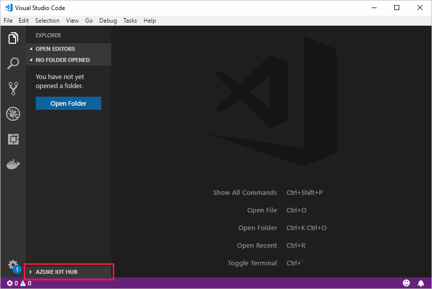

# Create an IoT hub using the Azure IoT Tools for Visual Studio Code

[!INCLUDE [iot-hub-resource-manager-selector](../../includes/iot-hub-resource-manager-selector.md)]

This article shows you how to use the [Azure IoT Tools for Visual Studio Code](https://marketplace.visualstudio.com/items?itemName=vsciot-vscode.azure-iot-tools) to create an Azure IoT hub. 

[!INCLUDE [updated-for-az](../../includes/updated-for-az.md)]

To complete this article, you need the following:

- An Azure subscription. If you don't have an Azure subscription, create a [free account](https://azure.microsoft.com/free/?WT.mc_id=A261C142F) before you begin.

- [Visual Studio Code](https://code.visualstudio.com/)

- [Azure IoT Tools](https://marketplace.visualstudio.com/items?itemName=vsciot-vscode.azure-iot-tools) installed for Visual Studio Code.

## Create an IoT hub and device in an IoT Project

The following steps show how you can create an IoT Hub and register a device to the hub within an IoT Project in Visual Studio (VS) Code.

Instead of provisioning an Azure IoT Hub and device from the Azure portal. You can do it in VS Code without leaving the development environment. The steps in this section show how to do this.

1. In the new opened project window, click `F1` to open the command palette, type and select **Azure IoT Device Workbench: Provision Azure Services...**. Follow the step-by-step guide to finish provisioning your Azure IoT Hub and creating the IoT Hub device.

   :::image type="content" source="media/iot-hub-create-use-iot-toolkit/provision.png" alt-text="A screenshot that shows you how to open the command palette in VS Code." lightbox="media/iot-hub-create-use-iot-toolkit/provision.png":::

    > [!NOTE]
    > If you have not signed in Azure. Follow the pop-up notification for signing in.

1. Select the subscription you want to use.

   :::image type="content" source="media/iot-hub-create-use-iot-toolkit/select-subscription.png" alt-text="A screenshot that shows you how to choose your Azure subscription in VS Code." lightbox="media/iot-hub-create-use-iot-toolkit/select-subscription.png":::

1. Then select and existing resource group or create a new [resource group](../azure-resource-manager/management/overview.md#terminology).

   :::image type="content" source="media/iot-hub-create-use-iot-toolkit/select-resource-group.png" alt-text="A screenshot that shows you how to choose a resource group or create a new one in VS Code." lightbox="media/iot-hub-create-use-iot-toolkit/select-resource-group.png":::

1. In the resource group you specified, follow the prompts to select an existing IoT Hub or create a new Azure IoT Hub.

   :::image type="content" source="media/iot-hub-create-use-iot-toolkit/iot-hub-provision.png" alt-text="A screenshot that shows you the first prompt in choosing an existing IoT Hub in VS Code." lightbox="media/iot-hub-create-use-iot-toolkit/iot-hub-provision.png":::

   :::image type="content" source="media/iot-hub-create-use-iot-toolkit/select-iot-hub.png" alt-text="A screenshot that shows you the second prompt in choosing an existing IoT Hub in VS Code." lightbox="media/iot-hub-create-use-iot-toolkit/select-iot-hub.png":::

   :::image type="content" source="media/iot-hub-create-use-iot-toolkit/iot-hub-selected.png" alt-text="A screenshot that shows you the third prompt in choosing an existing IoT Hub in VS Code." lightbox="media/iot-hub-create-use-iot-toolkit/iot-hub-selected.png":::

1. In the output window, you will see the Azure IoT Hub provisioned.

   :::image type="content" source="media/iot-hub-create-use-iot-toolkit/iot-hub-provisioned.png" alt-text="A screenshot that shows you the output window in VS Code." lightbox="media/iot-hub-create-use-iot-toolkit/iot-hub-provisioned.png":::

1. Select or create a new IoT Hub Device in the Azure IoT Hub you provisioned.

   :::image type="content" source="media/iot-hub-create-use-iot-toolkit/iot-device-provision.png" alt-text="A screenshot that shows you the fourth prompt in choosing an existing IoT Hub in VS Code." lightbox="media/iot-hub-create-use-iot-toolkit/iot-device-provision.png":::

   :::image type="content" source="media/iot-hub-create-use-iot-toolkit/select-iot-device.png" alt-text="A screenshot that shows you an example of an existing IoT Hub in VS Code." lightbox="media/iot-hub-create-use-iot-toolkit/select-iot-device.png":::

1. Now you have Azure IoT Hub provisioned and device created in it. Also the device connection string will be saved in VS Code.

   :::image type="content" source="media/iot-hub-create-use-iot-toolkit/provision-done.png" alt-text="A screenshot that shows you IoT Hub details in the output window in VS Code." lightbox="media/iot-hub-create-use-iot-toolkit/provision-done.png":::

## Create an IoT hub without an IoT Project

The following steps show how you can create an IoT Hub without an IoT Project in Visual Studio Code.

1. In Visual Studio Code, open the **Explorer** view.

2. At the bottom of the Explorer, expand the **Azure IoT Hub** section. 

   

3. Click on the **...** in the **Azure IoT Hub** section header. If you don't see the ellipsis, hover over the header. 

4. Choose **Create IoT Hub**.

5. A pop-up will show in the bottom-right corner to let you sign in to Azure for the first time.

6. Select Azure subscription. 

7. Select resource group.

8. Select location.

9. Select pricing tier.

10. Enter a globally unique name for your IoT Hub.

11. Wait a few minutes until the IoT Hub is created.

## Next steps

Now you have deployed an IoT hub using the Azure IoT Tools for Visual Studio Code. To explore further, check out the following articles:

* [Use the Azure IoT Tools for Visual Studio Code to send and receive messages between your device and an IoT Hub](iot-hub-vscode-iot-toolkit-cloud-device-messaging.md).

* [Use the Azure IoT Tools for Visual Studio Code for Azure IoT Hub device management](iot-hub-device-management-iot-toolkit.md)

* [See the Azure IoT Hub for VS Code wiki page](https://github.com/microsoft/vscode-azure-iot-toolkit/wiki).
