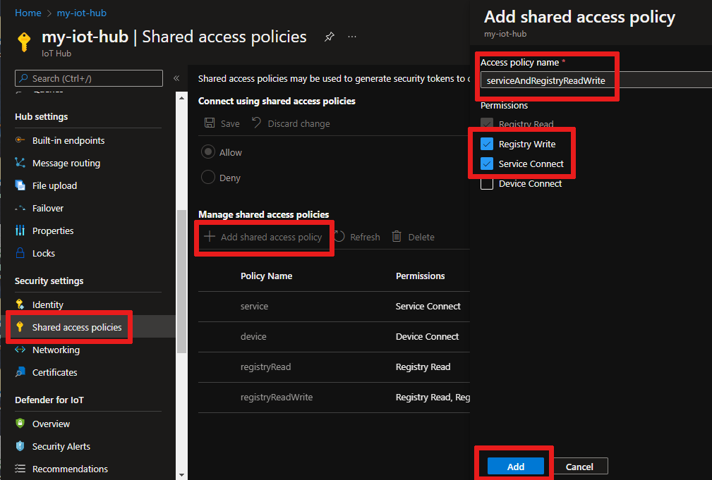
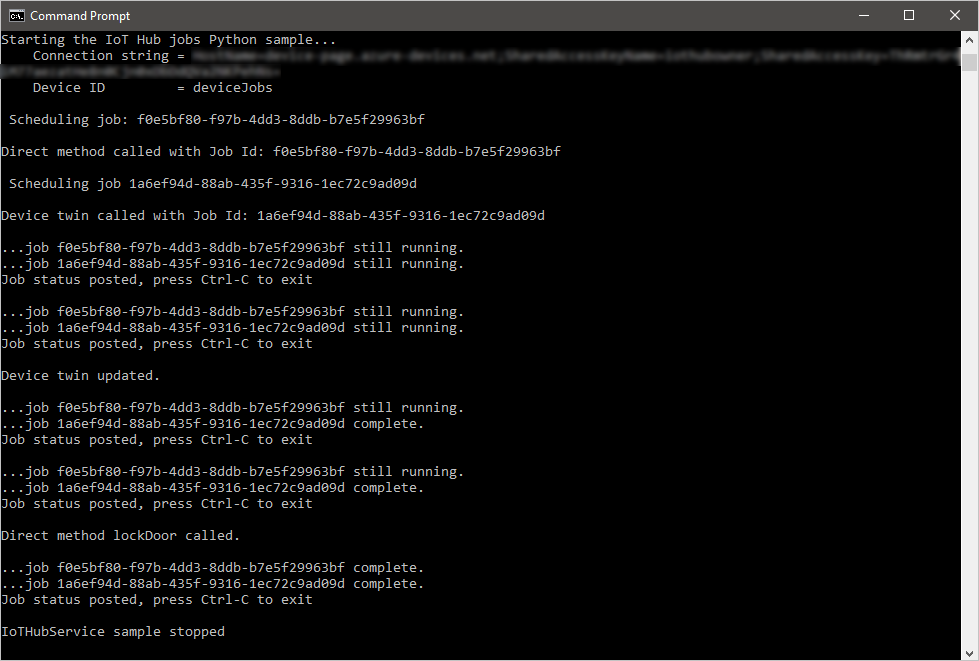
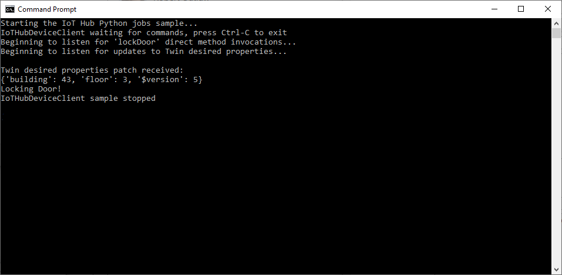

# Schedule and broadcast jobs (Python)

[!INCLUDE [iot-hub-selector-schedule-jobs](../../includes/iot-hub-selector-schedule-jobs.md)]

Azure IoT Hub is a fully managed service that enables a back-end app to create and track jobs that schedule and update millions of devices.  Jobs can be used for the following actions:

* Update desired properties
* Update tags
* Invoke direct methods

Conceptually, a job wraps one of these actions and tracks the progress of execution against a set of devices, which is defined by a device twin query.  For example, a back-end app can use a job to invoke a reboot method on 10,000 devices, specified by a device twin query and scheduled at a future time.  That application can then track progress as each of those devices receive and execute the reboot method.

Learn more about each of these capabilities in these articles:

* Device twin and properties: [Get started with device twins](iot-hub-python-twin-getstarted.md) and [Tutorial: How to use device twin properties](tutorial-device-twins.md)

* Direct methods: [IoT Hub developer guide - direct methods](iot-hub-devguide-direct-methods.md) and [Quickstart: direct methods](./quickstart-control-device.md?pivots=programming-language-python)

[!INCLUDE [iot-hub-basic](../../includes/iot-hub-basic-whole.md)]

This article shows you how to:

* Create a Python simulated device app that has a direct method, which enables **lockDoor**, which can be called by the solution back end.

* Create a Python console app that calls the **lockDoor** direct method in the simulated device app using a job and updates the desired properties using a device job.

At the end of this article, you have two Python apps:

**simDevice.py**, which connects to your IoT hub with the device identity and receives a **lockDoor** direct method.

**scheduleJobService.py**, which calls a direct method in the simulated device app and updates the device twin's desired properties using a job.

[!INCLUDE [iot-hub-include-python-sdk-note](../../includes/iot-hub-include-python-sdk-note.md)]

## Prerequisites

* An IoT Hub. Create one with the [CLI](iot-hub-create-using-cli.md) or the [Azure portal](iot-hub-create-through-portal.md).

* A registered device. Register one in the [Azure portal](iot-hub-create-through-portal.md#register-a-new-device-in-the-iot-hub).

[!INCLUDE [iot-hub-include-python-v2-installation-notes](../../includes/iot-hub-include-python-v2-installation-notes.md)]

## Create a simulated device app

In this section, you create a Python console app that responds to a direct method called by the cloud, which triggers a simulated **lockDoor** method.

1. At your command prompt, run the following command to install the **azure-iot-device** package:

    ```cmd/sh
    pip install azure-iot-device
    ```

2. Using a text editor, create a new **simDevice.py** file in your working directory.

3. Add the following `import` statements and variables at the start of the **simDevice.py** file. Replace `deviceConnectionString` with the connection string of the device you created above:

    ```python
    import time
    from azure.iot.device import IoTHubDeviceClient, MethodResponse

    CONNECTION_STRING = "{deviceConnectionString}"
    ```

4. Define the following function, which will instantiate a client and configure it to respond to the **lockDoor** method, as well as receive device twin updates:

    ```python
    def create_client():
        # Instantiate the client
        client = IoTHubDeviceClient.create_from_connection_string(CONNECTION_STRING)

        # Define behavior for responding to the lockDoor direct method
        def method_request_handler(method_request):
            if method_request.name == "lockDoor":
                print("Locking Door!")

                resp_status = 200
                resp_payload = {"Response": "lockDoor called successfully"}
                method_response = MethodResponse.create_from_method_request(
                    method_request=method_request,
                    status=resp_status,
                    payload=resp_payload
                )
                client.send_method_response(method_response)

        # Define behavior for receiving a twin patch
        def twin_patch_handler(twin_patch):
            print("")
            print("Twin desired properties patch received:")
            print(twin_patch)

        # Set the handlers on the client
        try:
            print("Beginning to listen for 'lockDoor' direct method invocations...")
            client.on_method_request_received = method_request_handler
            print("Beginning to listen for updates to the Twin desired properties...")
            client.on_twin_desired_properties_patch_received = twin_patch_handler
        except:
            # If something goes wrong while setting the handlers, clean up the client
            client.shutdown()
            raise
    ```

5. Add the following code to run the sample:

    ```python
    def main():
        print ("Starting the IoT Hub Python jobs sample...")
        client = create_client()

        print ("IoTHubDeviceClient waiting for commands, press Ctrl-C to exit")
        try:
            while True:
                time.sleep(100)
        except KeyboardInterrupt:
            print("IoTHubDeviceClient sample stopped!")
        finally:
            # Graceful exit
            print("Shutting down IoT Hub Client")
            client.shutdown()


    if __name__ == '__main__':
        main()
    ```

6. Save and close the **simDevice.py** file.

> [!NOTE]
> To keep things simple, this article does not implement any retry policy. In production code, you should implement retry policies (such as an exponential backoff), as suggested in the article, [Transient Fault Handling](/azure/architecture/best-practices/transient-faults).
>

## Get the IoT hub connection string

In this article, you create a backend service that invokes a direct method on a device and updates the device twin. The service needs the **service connect** permission to call a direct method on a device. The service also needs the **registry read** and **registry write** permissions to read and write the identity registry. There is no default shared access policy that contains only these permissions, so you need to create one.

To create a shared access policy that grants **service connect**, **registry read**, and **registry write** permissions and to get a connection string for this policy, follow these steps:

1. Open your IoT hub in the [Azure portal](https://portal.azure.com). The easiest way to get to your IoT hub is to select **Resource groups**, select the resource group where your IoT hub is located, and then select your IoT hub from the list of resources.

2. On the left-side pane of your IoT hub, select **Shared access policies**.

3. From the top menu above the list of policies, select **Add**.

4. On the **Add a shared access policy** pane, enter a descriptive name for your policy; for example: *serviceAndRegistryReadWrite*. Under **Permissions**, select **Service connect** and **Registry write** (**Registry read** is automatically selected when you select **Registry write**). Then select **Create**.

    

5. Back on the **Shared access policies** pane, select your new policy from the list of policies.

6. Under **Shared access keys**, select the copy icon for the **Connection string -- primary key** and save the value.

    

For more information about IoT Hub shared access policies and permissions, see [Access control and permissions](./iot-hub-dev-guide-sas.md#access-control-and-permissions).

## Schedule jobs for calling a direct method and updating a device twin's properties

In this section, you create a Python console app that initiates a remote **lockDoor** on a device using a direct method and also updates the device twin's desired properties.

1. At your command prompt, run the following command to install the **azure-iot-hub** package:

    ```cmd/sh
    pip install azure-iot-hub
    ```

2. Using a text editor, create a new **scheduleJobService.py** file in your working directory.

3. Add the following `import` statements and variables at the start of the **scheduleJobService.py** file. Replace the `{IoTHubConnectionString}` placeholder with the IoT hub connection string you copied previously in [Get the IoT hub connection string](#get-the-iot-hub-connection-string). Replace the `{deviceId}` placeholder with the device ID (the name) of your new device you previously registered:

    ```python
    import os
    import sys
    import datetime
    import time
    import threading
    import uuid
    import msrest

    from azure.iot.hub import IoTHubJobManager, IoTHubRegistryManager
    from azure.iot.hub.models import JobProperties, JobRequest, Twin, TwinProperties, CloudToDeviceMethod

    CONNECTION_STRING = "{IoTHubConnectionString}"
    DEVICE_ID = "{deviceId}"

    METHOD_NAME = "lockDoor"
    METHOD_PAYLOAD = "{\"lockTime\":\"10m\"}"
    UPDATE_PATCH = {"building":43,"floor":3}
    TIMEOUT = 60
    WAIT_COUNT = 5

    # Create IoTHubJobManager
    iothub_job_manager = IoTHubJobManager.from_connection_string(CONNECTION_STRING)

    ```

4. Add the following methods to run the jobs that call the direct method and device twin:

    ```python
    def device_method_job(job_id, device_id, execution_time):
        print ( "" )
        print ( "Scheduling job: " + str(job_id) )

        job_request = JobRequest()
        job_request.job_id = job_id
        job_request.type = "scheduleDeviceMethod"
        job_request.start_time = datetime.datetime.utcnow().isoformat()
        job_request.cloud_to_device_method = CloudToDeviceMethod(method_name=METHOD_NAME, payload=METHOD_PAYLOAD)
        job_request.max_execution_time_in_seconds = execution_time
        job_request.query_condition = "DeviceId in ['{}']".format(device_id)

        new_job_response = iothub_job_manager.create_scheduled_job(job_id, job_request)

    def device_twin_job(job_id, device_id, execution_time):
        print ( "" )
        print ( "Scheduling job " + str(job_id) )

        job_request = JobRequest()
        job_request.job_id = job_id
        job_request.type = "scheduleUpdateTwin"
        job_request.start_time = datetime.datetime.utcnow().isoformat()
        job_request.update_twin = Twin(etag="*", properties=TwinProperties(desired=UPDATE_PATCH))
        job_request.max_execution_time_in_seconds = execution_time
        job_request.query_condition = "DeviceId in ['{}']".format(device_id)

        new_job_response = iothub_job_manager.create_scheduled_job(job_id, job_request)

   ```

5. Add the following code to schedule the jobs and update job status. Also include the `main` routine:

    ```python
    def iothub_jobs_sample_run():
        try:
            method_job_id = uuid.uuid4()
            device_method_job(method_job_id, DEVICE_ID, TIMEOUT)

            print ( "" )
            print ( "Direct method called with Job Id: " + str(method_job_id) )

            twin_job_id = uuid.uuid4()
            device_twin_job(twin_job_id, DEVICE_ID, TIMEOUT)

            print ( "" )
            print ( "Device twin called with Job Id: " + str(twin_job_id) )

            while True:
                print ( "" )

                method_job_status = iothub_job_manager.get_scheduled_job(method_job_id)
                print ( "...job " + str(method_job_id) + " " + method_job_status.status )

                twin_job_status = iothub_job_manager.get_scheduled_job(twin_job_id)
                print ( "...job " + str(twin_job_id) + " " + twin_job_status.status )

                print ( "Job status posted, press Ctrl-C to exit" )
                time.sleep(WAIT_COUNT)

        except msrest.exceptions.HttpOperationError as ex:
            print ( "" )
            print ( "Http error {}".format(ex.response.text) )
            return
        except Exception as ex:
            print ( "" )
            print ( "Unexpected error {}".format(ex) )
            return
        except KeyboardInterrupt:
            print ( "" )
            print ( "IoTHubService sample stopped" )

    if __name__ == '__main__':
        print ( "Starting the IoT Hub jobs Python sample..." )
        print ( "    Connection string = {0}".format(CONNECTION_STRING) )
        print ( "    Device ID         = {0}".format(DEVICE_ID) )

        iothub_jobs_sample_run()
    ```

7. Save and close the **scheduleJobService.py** file.

## Run the applications

You are now ready to run the applications.

1. At the command prompt in your working directory, run the following command to begin listening for the reboot direct method:

    ```cmd/sh
    python simDevice.py
    ```

2. At another command prompt in your working directory, run the following command to trigger the jobs to lock the door and update the twin:

    ```cmd/sh
    python scheduleJobService.py
    ```

3. You see the device responses to the direct method and device twins update in the console.

    

    

## Next steps

In this article, you used a job to schedule a direct method to a device and the update of the device twin's properties.

To continue getting started with IoT Hub and device management patterns such as end-to-end image-based update in  [Device Update for Azure IoT Hub tutorial using the Raspberry Pi 3 B+ Reference Image](../iot-hub-device-update/device-update-raspberry-pi.md).
